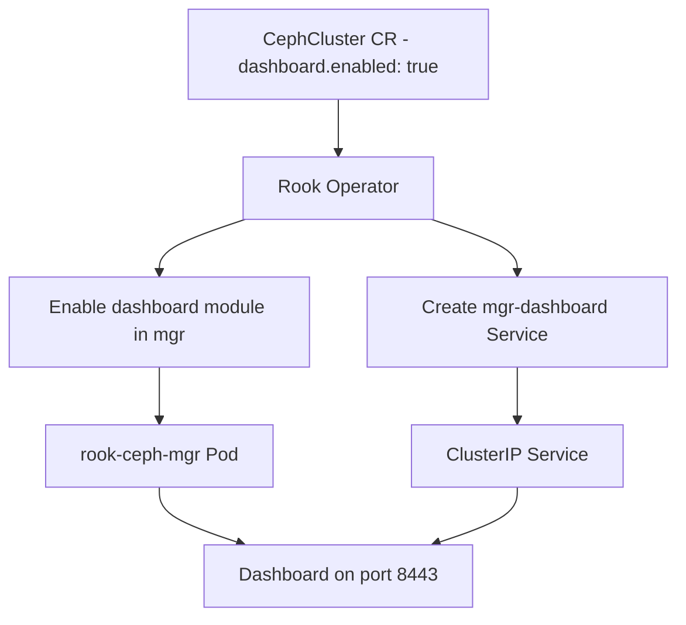

# How to Enable the Ceph Dashboard in Rook

Author: [nawazdhandala](https://www.github.com/nawazdhandala)

Tags: Rook, Ceph, Kubernetes, Dashboard, Monitoring, Manager

Description: Step-by-step guide to enabling and configuring the Ceph Dashboard in a Rook deployment, including SSL configuration and custom port settings.

---

## How the Ceph Dashboard Works in Rook

The Ceph Dashboard is a module within the Ceph Manager (`mgr`). Rook enables it by setting the `dashboard.enabled: true` flag in the CephCluster CR and loading the `dashboard` module into the mgr. The dashboard runs inside the `rook-ceph-mgr` pod and is exposed through a Kubernetes Service.



## Enabling the Dashboard

Add the `dashboard` section to your CephCluster CR:

```yaml
apiVersion: ceph.rook.io/v1
kind: CephCluster
metadata:
  name: rook-ceph
  namespace: rook-ceph
spec:
  # ... other fields ...
  dashboard:
    # Enable the Ceph Dashboard
    enabled: true
    # Use HTTPS (recommended for production)
    ssl: true
    # Optional: use a custom port (default 8443 for HTTPS, 7000 for HTTP)
    # port: 8443
    # Optional: provide a custom TLS secret
    # urlPrefix: /ceph-dashboard
```

Apply the change:

```bash
kubectl apply -f ceph-cluster.yaml
```

If the cluster is already running, patch the CephCluster directly:

```bash
kubectl -n rook-ceph patch cephcluster rook-ceph \
  --type=merge \
  -p '{"spec":{"dashboard":{"enabled":true,"ssl":true}}}'
```

## Verifying the Dashboard Service

After enabling, verify the dashboard service was created:

```bash
kubectl -n rook-ceph get svc rook-ceph-mgr-dashboard
```

```text
NAME                      TYPE        CLUSTER-IP       PORT(S)    AGE
rook-ceph-mgr-dashboard   ClusterIP   10.96.200.150    8443/TCP   2m
```

Check that the dashboard module is active in the mgr:

```bash
kubectl -n rook-ceph exec deploy/rook-ceph-tools -- ceph mgr module ls | grep dashboard
```

## Using HTTP Instead of HTTPS

For testing environments, disable SSL to use plain HTTP on port 7000:

```yaml
spec:
  dashboard:
    enabled: true
    ssl: false
    port: 7000
```

The service will then listen on port 7000 without TLS.

## Custom SSL Certificate

By default, the dashboard uses a self-signed certificate generated by Ceph. To use your own certificate, create a Kubernetes TLS secret and reference it:

```bash
# Create the secret from your cert/key files
kubectl -n rook-ceph create secret tls rook-ceph-dashboard-tls \
  --cert=dashboard.crt \
  --key=dashboard.key
```

Reference the secret in the CephCluster CR:

```yaml
spec:
  dashboard:
    enabled: true
    ssl: true
    # Reference to the TLS secret
    # (As of Rook v1.14, this is done via ceph mgr commands)
```

Configure the custom cert via the toolbox:

```bash
kubectl -n rook-ceph exec -it deploy/rook-ceph-tools -- bash

# Set custom SSL key and certificate
ceph dashboard set-ssl-certificate -i /tmp/dashboard.crt
ceph dashboard set-ssl-certificate-key -i /tmp/dashboard.key

# Restart the dashboard module to pick up the new cert
ceph mgr module disable dashboard
ceph mgr module enable dashboard
```

## Configuring Dashboard URL Prefix

If you expose the dashboard behind a reverse proxy with a path prefix:

```bash
kubectl -n rook-ceph exec deploy/rook-ceph-tools -- \
  ceph dashboard set-url-prefix /ceph-dashboard
```

## Setting the Admin Password

Retrieve the auto-generated admin password:

```bash
kubectl -n rook-ceph get secret rook-ceph-dashboard-password \
  -o jsonpath='{.data.password}' | base64 --decode && echo
```

Set a custom password:

```bash
kubectl -n rook-ceph exec deploy/rook-ceph-tools -- \
  ceph dashboard ac-user-set-password admin --force-password 'YourSecurePassword!'
```

## Disabling the Dashboard

To disable the dashboard:

```bash
kubectl -n rook-ceph patch cephcluster rook-ceph \
  --type=merge \
  -p '{"spec":{"dashboard":{"enabled":false}}}'
```

The operator removes the dashboard service and disables the mgr module.

## Checking Dashboard Module Status

From the toolbox, verify the dashboard module is loaded and active:

```bash
kubectl -n rook-ceph exec deploy/rook-ceph-tools -- ceph mgr module ls
```

```text
{
    "always_on_modules": [
        "balancer",
        "crash",
        "devicehealth",
        ...
    ],
    "enabled_modules": [
        "dashboard",
        "pg_autoscaler",
        "rook"
    ],
    ...
}
```

Get the dashboard URL from Ceph:

```bash
kubectl -n rook-ceph exec deploy/rook-ceph-tools -- ceph mgr services
```

```text
{
    "dashboard": "https://10.96.200.150:8443/",
    "prometheus": "http://10.96.201.100:9283/"
}
```

## Summary

Enabling the Ceph Dashboard in Rook requires a single flag in the CephCluster CR: `dashboard.enabled: true`. The operator loads the mgr dashboard module and creates a Service exposing it on port 8443 (HTTPS) or 7000 (HTTP). For production use, enable SSL and optionally provide a custom certificate. The auto-generated admin password is stored in the `rook-ceph-dashboard-password` Secret. Use the toolbox to manage SSL certificates, set URL prefixes, and change passwords via `ceph dashboard` commands.
