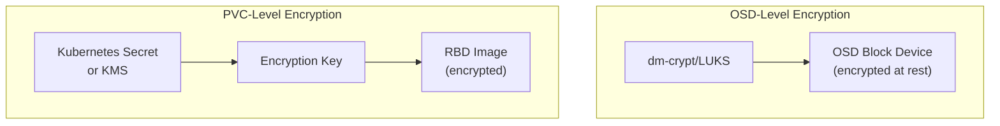

# How to Set Up Rook-Ceph Encryption at Rest

Author: [nawazdhandala](https://www.github.com/nawazdhandala)

Tags: Rook, Ceph, Kubernetes, Encryption, Security, Storage

Description: Enable encryption at rest for Rook-Ceph storage using OSD-level dm-crypt encryption and per-PVC CSI encryption with Kubernetes Key Management Service integration.

---

## How Rook-Ceph Encryption Works

Rook-Ceph supports two levels of encryption at rest:

1. **OSD-level encryption**: Entire OSD devices are encrypted using dm-crypt/LUKS when the OSD is provisioned. All data on the disk is encrypted transparently.
2. **RBD image-level encryption**: Individual PVCs are encrypted using the CSI driver with keys stored in Kubernetes Secrets or a KMS (Key Management System).



## Option 1 - OSD-Level Encryption

OSD-level encryption encrypts the entire OSD device at provisioning time. This is the most comprehensive approach.

Enable OSD encryption in the CephCluster spec:

```yaml
apiVersion: ceph.rook.io/v1
kind: CephCluster
metadata:
  name: rook-ceph
  namespace: rook-ceph
spec:
  storage:
    useAllNodes: false
    useAllDevices: false
    encryptedDevice: true
    nodes:
      - name: storage-node-1
        devices:
          - name: sdb
      - name: storage-node-2
        devices:
          - name: sdb
      - name: storage-node-3
        devices:
          - name: sdb
```

The `encryptedDevice: true` flag tells Rook to use dm-crypt/LUKS when initializing new OSD devices. Existing OSDs are not retroactively encrypted.

Verify OSD encryption is active:

```bash
kubectl -n rook-ceph exec -it rook-ceph-osd-prepare-<node>-<hash> -- \
  lsblk -o NAME,FSTYPE,MOUNTPOINT
```

Encrypted OSDs show `crypto_LUKS` as their FSTYPE.

## Option 2 - PVC-Level RBD Encryption

PVC-level encryption encrypts individual volumes using keys managed separately from OSD encryption. This works with existing unencrypted OSDs.

### Using Kubernetes Secrets as Key Store

Create an encryption key secret:

```bash
kubectl -n rook-ceph create secret generic rook-csi-rbd-encrypted-provisioner \
  --from-literal=userID=csi-rbd-provisioner \
  --from-literal=userKey="$(kubectl -n rook-ceph get secret rook-csi-rbd-provisioner -o jsonpath='{.data.userKey}' | base64 -d)" \
  --from-literal=encryptionPassphrase="$(openssl rand -base64 32)"
```

Create an encrypted StorageClass:

```yaml
apiVersion: storage.k8s.io/v1
kind: StorageClass
metadata:
  name: rook-ceph-block-encrypted
provisioner: rook-ceph.rbd.csi.ceph.com
parameters:
  clusterID: rook-ceph
  pool: replicapool
  imageFormat: "2"
  imageFeatures: layering
  encrypted: "true"
  csi.storage.k8s.io/provisioner-secret-name: rook-csi-rbd-provisioner
  csi.storage.k8s.io/provisioner-secret-namespace: rook-ceph
  csi.storage.k8s.io/controller-expand-secret-name: rook-csi-rbd-provisioner
  csi.storage.k8s.io/controller-expand-secret-namespace: rook-ceph
  csi.storage.k8s.io/node-stage-secret-name: rook-csi-rbd-node
  csi.storage.k8s.io/node-stage-secret-namespace: rook-ceph
reclaimPolicy: Delete
allowVolumeExpansion: true
```

The `encrypted: "true"` parameter enables LUKS encryption for each provisioned RBD image.

### Using HashiCorp Vault as KMS

For production, store encryption keys in a KMS rather than Kubernetes Secrets.

Create a Vault connection ConfigMap:

```yaml
apiVersion: v1
kind: ConfigMap
metadata:
  name: rook-ceph-csi-kms-config
  namespace: rook-ceph
data:
  config.json: |
    {
      "vault-1": {
        "encryptionKMSType": "vault",
        "vaultAddress": "https://vault.vault.svc.cluster.local:8200",
        "vaultAuthPath": "/v1/auth/kubernetes/login",
        "vaultRole": "rook-ceph-csi",
        "vaultSecretEngineType": "kv",
        "vaultBackendPath": "secret/",
        "vaultCAFromSecret": "vault-ca-cert",
        "vaultClientCertFromSecret": "vault-client-cert",
        "vaultClientCertKeyFromSecret": "vault-client-cert"
      }
    }
```

Update the StorageClass to reference the KMS:

```yaml
apiVersion: storage.k8s.io/v1
kind: StorageClass
metadata:
  name: rook-ceph-block-vault-encrypted
provisioner: rook-ceph.rbd.csi.ceph.com
parameters:
  clusterID: rook-ceph
  pool: replicapool
  imageFormat: "2"
  imageFeatures: layering
  encrypted: "true"
  encryptionKMSID: vault-1
  csi.storage.k8s.io/provisioner-secret-name: rook-csi-rbd-provisioner
  csi.storage.k8s.io/provisioner-secret-namespace: rook-ceph
  csi.storage.k8s.io/controller-expand-secret-name: rook-csi-rbd-provisioner
  csi.storage.k8s.io/controller-expand-secret-namespace: rook-ceph
  csi.storage.k8s.io/node-stage-secret-name: rook-csi-rbd-node
  csi.storage.k8s.io/node-stage-secret-namespace: rook-ceph
reclaimPolicy: Delete
allowVolumeExpansion: true
```

## Verifying PVC Encryption

Create a PVC using the encrypted StorageClass:

```yaml
apiVersion: v1
kind: PersistentVolumeClaim
metadata:
  name: encrypted-pvc
spec:
  accessModes:
    - ReadWriteOnce
  storageClassName: rook-ceph-block-encrypted
  resources:
    requests:
      storage: 5Gi
```

Check that the underlying RBD image has LUKS encryption:

```bash
PV_NAME=$(kubectl get pvc encrypted-pvc -o jsonpath='{.spec.volumeName}')
IMAGE_NAME=$(kubectl get pv $PV_NAME -o jsonpath='{.spec.csi.volumeAttributes.imageName}')
kubectl -n rook-ceph exec -it deploy/rook-ceph-tools -- \
  rbd info replicapool/$IMAGE_NAME
```

The image features should include `encryption` in the output.

## Enabling Ceph Manager Messenger Encryption

Also enable wire encryption for Ceph daemon communication:

```yaml
spec:
  network:
    connections:
      requireMsgr2: true
      encryption:
        enabled: true
```

## Summary

Rook-Ceph supports encryption at rest at two layers. OSD-level encryption with `encryptedDevice: true` encrypts entire disks using dm-crypt/LUKS at OSD provisioning time. PVC-level encryption with `encrypted: "true"` in the StorageClass encrypts individual RBD images using keys from Kubernetes Secrets or a KMS like HashiCorp Vault. For production, KMS-based key management ensures keys are rotatable, auditable, and not stored in etcd. Combine both layers for defense-in-depth encryption.
