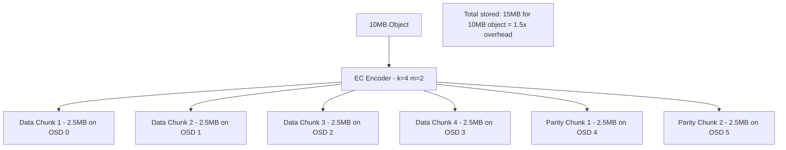

# How to Use Erasure Coding in Rook-Ceph

Author: [nawazdhandala](https://www.github.com/nawazdhandala)

Tags: Rook, Ceph, Kubernetes, ErasureCoding, Storage, Efficiency

Description: Learn how to configure erasure-coded storage pools in Rook-Ceph for improved storage efficiency compared to replication, with concrete k+m configuration examples.

---

## What Erasure Coding Is

Erasure coding (EC) is an alternative to replication that uses mathematical encoding to achieve fault tolerance with less raw storage overhead. Instead of keeping N full copies of data, EC splits each object into `k` data chunks and `m` coding (parity) chunks. The object can be reconstructed from any `k` chunks out of the total `k+m` chunks.



With 3-way replication, the same 10MB object requires 30MB of raw storage (3x overhead). EC 4+2 achieves similar fault tolerance (tolerates 2 OSD failures) at only 1.5x overhead.

## EC Configuration Parameters

| Config | Data Chunks | Coding Chunks | Min OSDs | Survives | Overhead |
|--------|-------------|---------------|----------|----------|----------|
| EC 2+1 | 2 | 1 | 3 | 1 OSD | 1.5x |
| EC 2+2 | 2 | 2 | 4 | 2 OSDs | 2x |
| EC 4+2 | 4 | 2 | 6 | 2 OSDs | 1.5x |
| EC 8+3 | 8 | 3 | 11 | 3 OSDs | 1.375x |
| EC 4+1 | 4 | 1 | 5 | 1 OSD | 1.25x |

## Creating an Erasure-Coded Block Pool

EC is most appropriate for object storage and large sequential data. For RBD (block storage), EC pools are supported but typically used in combination with a replicated metadata pool:

```yaml
apiVersion: ceph.rook.io/v1
kind: CephBlockPool
metadata:
  name: ec-data-pool
  namespace: rook-ceph
spec:
  failureDomain: host
  erasureCoded:
    # 4 data chunks
    dataChunks: 4
    # 2 coding chunks (can survive 2 OSD failures)
    codingChunks: 2
  # Optional: enable compression on the EC pool
  parameters:
    compression_mode: "passive"
```

## Erasure-Coded Object Storage Pool

EC is ideal for the data pool in a CephObjectStore (where objects are large and sequential):

```yaml
apiVersion: ceph.rook.io/v1
kind: CephObjectStore
metadata:
  name: my-store
  namespace: rook-ceph
spec:
  # Metadata pool uses replication (small, random I/O)
  metadataPool:
    failureDomain: host
    replicated:
      size: 3
  # Data pool uses EC (large objects, sequential I/O)
  dataPool:
    failureDomain: host
    erasureCoded:
      dataChunks: 4
      codingChunks: 2
  preservePoolsOnDelete: true
  gateway:
    port: 80
    instances: 2
```

## Erasure-Coded CephFilesystem Data Pool

CephFS supports EC for data pools (metadata pool must still use replication):

```yaml
apiVersion: ceph.rook.io/v1
kind: CephFilesystem
metadata:
  name: myfs
  namespace: rook-ceph
spec:
  # Metadata pool must be replicated
  metadataPool:
    replicated:
      size: 3
  dataPools:
    # Standard replicated pool for small files
    - name: replicated
      failureDomain: host
      replicated:
        size: 3
    # EC pool for large files (use CephFS data placement to route files here)
    - name: ec-data
      failureDomain: host
      erasureCoded:
        dataChunks: 4
        codingChunks: 2
  metadataServer:
    activeCount: 1
    activeStandby: true
```

## Verifying the EC Pool

After applying the CR, verify the pool configuration in Ceph:

```bash
kubectl -n rook-ceph exec deploy/rook-ceph-tools -- \
  ceph osd pool get ec-data-pool all | grep -E "erasure|k=|m=|size"
```

List the erasure code profile:

```bash
kubectl -n rook-ceph exec deploy/rook-ceph-tools -- \
  ceph osd erasure-code-profile get ec-data-pool-profile
```

```text
k=4
m=2
plugin=jerasure
technique=reed_sol_van
```

## Creating a Custom EC Profile

For specialized configurations, create an EC profile before the pool:

```bash
kubectl -n rook-ceph exec deploy/rook-ceph-tools -- bash -c "
  # Create a custom EC profile
  ceph osd erasure-code-profile set my-custom-ec \
    k=6 \
    m=3 \
    plugin=jerasure \
    technique=reed_sol_van \
    ruleset-failure-domain=host

  # Create a pool using the custom profile
  ceph osd pool create my-ec-pool erasure my-custom-ec

  # Set application on the pool
  ceph osd pool application enable my-ec-pool rgw
"
```

## EC Limitations and Tradeoffs

**Strengths of EC:**
- Significantly better storage efficiency (1.5x vs 3x for comparable durability)
- Ideal for large object workloads (video, backups, ML datasets)
- Supported by all Ceph storage types (RBD, CephFS, RGW)

**Limitations of EC:**
- Higher CPU overhead for encode/decode operations
- Partial writes require read-modify-write cycles (slower for small random writes)
- OSD recovery after failure requires reading from all surviving shards
- EC pools cannot be used for Ceph monitor data
- Performance for small, random I/O is significantly worse than replication

## When to Use EC vs Replication

Use replication for:
- Databases and transactional workloads
- CephFS metadata pools
- Small-file workloads
- Low-latency requirements

Use erasure coding for:
- Object storage (S3/RGW)
- Large file archives
- Video storage and streaming
- Backup data
- Any workload where storage cost matters more than write latency

## Summary

Erasure coding in Rook-Ceph is configured via the `erasureCoded` spec in CephBlockPool, CephObjectStore, and CephFilesystem data pools. An EC 4+2 pool provides the same fault tolerance as 3-way replication (survives 2 simultaneous OSD failures) at only 1.5x storage overhead instead of 3x. The tradeoff is higher CPU usage and worse small-random-write performance. Use EC for object storage and large sequential workloads, keep replication for databases and small-file workloads that need low latency.
