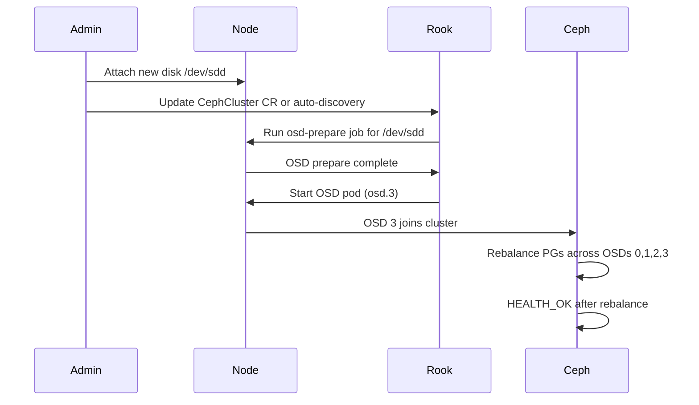

# How to Expand a Rook-Ceph Cluster by Adding OSDs

Author: [nawazdhandala](https://www.github.com/nawazdhandala)

Tags: Rook, Ceph, Kubernetes, OSD, Scaling, Capacity

Description: Learn how to expand Rook-Ceph cluster capacity by adding new OSD disks to existing nodes, including disk preparation and rebalancing verification.

---

## How OSD Addition Works in Rook

When you add new disks to a node and update the CephCluster CR (or when Rook's device discovery finds them), the operator runs a new OSD prepare job for each eligible device. After the OSD pod starts, Ceph automatically rebalances data across all OSDs to distribute load and restore optimal placement.



## Prerequisites

- CephCluster is in `HEALTH_OK` state before adding OSDs
- The new disks are clean (no filesystem or partition signatures)
- Nodes have the new disks physically or virtually attached

Verify current cluster state:

```bash
kubectl -n rook-ceph exec deploy/rook-ceph-tools -- ceph status
kubectl -n rook-ceph exec deploy/rook-ceph-tools -- ceph osd stat
```

## Step 1 - Prepare the New Disks

On each node with a new disk, wipe any existing signatures:

```bash
# SSH to the node or use a privileged pod
sudo wipefs -a /dev/sdd
sudo sgdisk --zap-all /dev/sdd
lsblk -f /dev/sdd
```

Verify the disk shows no FSTYPE:

```text
NAME  FSTYPE LABEL UUID MOUNTPOINT
sdd
```

## Step 2 - Update the CephCluster CR

### Using useAllDevices: true (Automatic Discovery)

If your CephCluster already has `useAllDevices: true`, Rook automatically discovers and provisions OSDs on new clean disks. The operator periodically scans for new devices. Trigger immediate discovery by restarting the operator:

```bash
kubectl -n rook-ceph rollout restart deployment/rook-ceph-operator
```

### Using deviceFilter (Regex Match)

If using a `deviceFilter`, ensure the new disk name matches the pattern:

```yaml
spec:
  storage:
    useAllNodes: true
    useAllDevices: false
    deviceFilter: "^sd[b-z]"
```

A new disk named `/dev/sdd` matches `^sd[b-z]` and will be discovered automatically.

### Using Explicit Device List

Add the new device to the specific node's device list in the CephCluster CR:

```yaml
spec:
  storage:
    useAllNodes: false
    nodes:
      - name: "node1"
        devices:
          - name: "sdb"
          - name: "sdc"
          # Add the new disk
          - name: "sdd"
      - name: "node2"
        devices:
          - name: "sdb"
          - name: "sdc"
          # Add new disks to node2 as well
          - name: "sdd"
          - name: "sde"
```

Apply the updated CR:

```bash
kubectl apply -f ceph-cluster.yaml
```

## Step 3 - Monitor OSD Prepare Jobs

Watch for new OSD prepare jobs to run:

```bash
kubectl -n rook-ceph get jobs -l app=rook-ceph-osd-prepare -w
```

Each new disk gets its own prepare job. When complete, the new OSD pods start:

```bash
kubectl -n rook-ceph get pods -l app=rook-ceph-osd -w
```

## Step 4 - Verify New OSDs Are In the Cluster

From the toolbox, check that the new OSDs have joined:

```bash
kubectl -n rook-ceph exec deploy/rook-ceph-tools -- ceph osd tree
```

New OSDs appear with `up` and `in` status:

```text
ID  CLASS  WEIGHT   TYPE NAME       STATUS  REWEIGHT  PRI-AFF
-1         3.63866  root default
-3         1.21289      host node1
 0    ssd  0.30322          osd.0      up   1.00000  1.00000
 1    ssd  0.30322          osd.1      up   1.00000  1.00000
 2    ssd  0.30322          osd.2      up   1.00000  1.00000
 3    ssd  0.30322          osd.3      up   1.00000  1.00000  <- New OSD
```

## Step 5 - Monitor Data Rebalancing

After new OSDs join, Ceph begins rebalancing. Monitor the progress:

```bash
kubectl -n rook-ceph exec deploy/rook-ceph-tools -- ceph status
```

During rebalancing, the status shows:

```text
  data:
    pgs:     96 active+clean
             14 active+remapped+backfilling
```

Check rebalancing progress specifically:

```bash
kubectl -n rook-ceph exec deploy/rook-ceph-tools -- \
  ceph progress
```

```text
Global Recovery Progress:
    [==========          ] (remaining: 3 min)
```

Wait until all PGs return to `active+clean` before doing any maintenance.

## Step 6 - Verify Balance After Rebalancing

Check that data is evenly spread across all OSDs:

```bash
kubectl -n rook-ceph exec deploy/rook-ceph-tools -- ceph osd df tree
```

The `%USE` column should be relatively balanced across all OSDs. An imbalance greater than 20% between OSDs may indicate a CRUSH map issue.

## Controlling Rebalancing Speed

If rebalancing impacts application performance, throttle it:

```bash
# Slow down recovery (lower = slower, 0 = pause)
kubectl -n rook-ceph exec deploy/rook-ceph-tools -- \
  ceph osd set-recovery-ratio 0.2

# Resume normal recovery speed
kubectl -n rook-ceph exec deploy/rook-ceph-tools -- \
  ceph osd set-recovery-ratio 1
```

You can also set the number of concurrent recovery operations:

```bash
kubectl -n rook-ceph exec deploy/rook-ceph-tools -- \
  ceph config set global osd_recovery_max_active 3
```

## Summary

Expanding a Rook-Ceph cluster by adding OSDs requires three steps: preparing the new disks (wiping signatures), updating the CephCluster CR to include the new devices, and monitoring the automatic rebalancing. With `useAllDevices: true` or a matching `deviceFilter`, Rook discovers new clean disks automatically after an operator restart. After new OSD pods start, Ceph rebalances data automatically - monitor with `ceph status` and `ceph progress` until all PGs return to `active+clean`. Throttle recovery if it impacts production workload performance.
