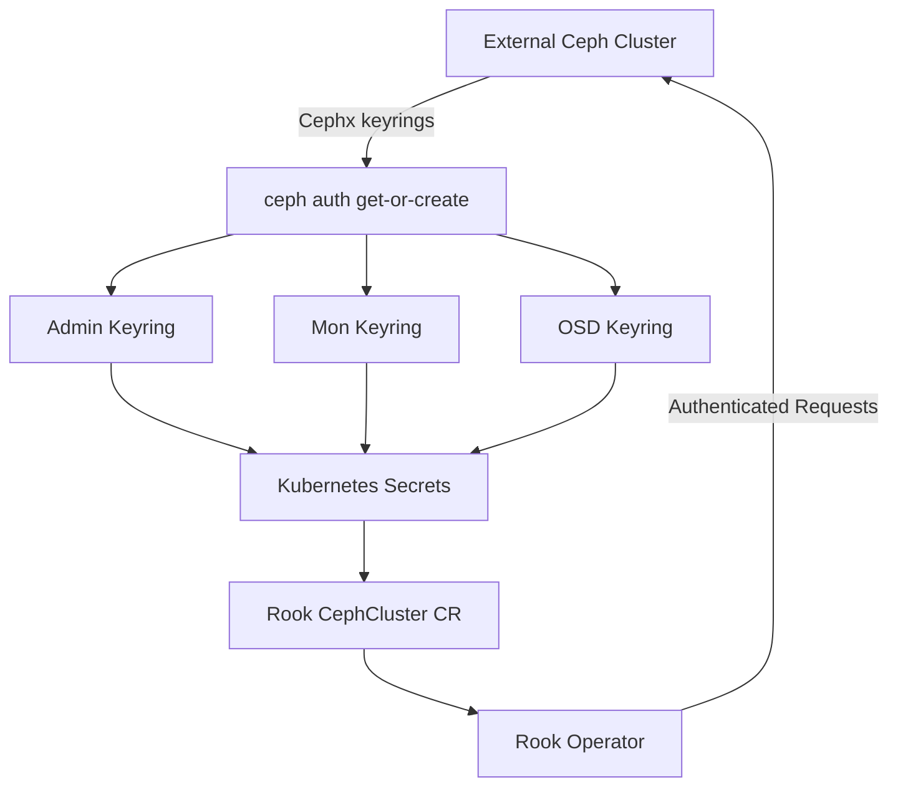

# How to Configure Authentication for External Ceph Clusters in Rook

Author: [OneUptime](https://www.github.com/oneuptime)

Tags: Rook, Ceph, Kubernetes, Storage

Description: Learn how to configure Ceph authentication credentials and Kubernetes secrets so Rook can securely connect to an external Ceph cluster.

---

## Introduction

When connecting Rook to an existing external Ceph cluster, authentication is the critical first step. Ceph uses the CAPS (Cephx) authentication system, and Rook must be provided with a client key that has the appropriate capabilities to manage pools, images, and filesystems on behalf of Kubernetes workloads.

This guide walks through generating the required Ceph keyrings, creating Kubernetes secrets, and validating that Rook can authenticate with the external cluster.

## Prerequisites

- A running external Ceph cluster (Quincy or newer recommended)
- `ceph` CLI access on the Ceph admin host
- Rook Ceph operator installed in the Kubernetes cluster
- `kubectl` access to the Kubernetes cluster

## Authentication Architecture



## Step 1: Generate Required Ceph Users and Keyrings

On the external Ceph admin host, create dedicated Ceph users for Rook:

```bash
# Create admin user for Rook with full cluster management capabilities
ceph auth get-or-create client.rook-ceph-op \
  mon 'profile rbd, allow r' \
  osd 'profile rbd' \
  mgr 'allow rw' \
  -o /tmp/rook-ceph-op.keyring

# Create user for CSI RBD provisioner
ceph auth get-or-create client.rook-csi-rbd-provisioner \
  mon 'profile rbd' \
  osd 'profile rbd' \
  -o /tmp/rook-csi-rbd-provisioner.keyring

# Create user for CSI RBD node plugin
ceph auth get-or-create client.rook-csi-rbd-node \
  mon 'profile rbd' \
  osd 'profile rbd' \
  -o /tmp/rook-csi-rbd-node.keyring

# Create user for CSI CephFS provisioner
ceph auth get-or-create client.rook-csi-cephfs-provisioner \
  mon 'allow r' \
  mgr 'allow rw' \
  osd 'allow rw tag cephfs metadata=*, allow rw tag cephfs data=*' \
  mds 'allow rw' \
  -o /tmp/rook-csi-cephfs-provisioner.keyring

# Create user for CSI CephFS node plugin
ceph auth get-or-create client.rook-csi-cephfs-node \
  mon 'allow r' \
  osd 'allow rw tag cephfs *=*' \
  mds 'allow rw' \
  -o /tmp/rook-csi-cephfs-node.keyring
```

## Step 2: Extract Keyring Values

Extract the base64-encoded key strings needed for Kubernetes secrets:

```bash
# Extract key for each user
ROOK_OP_KEY=$(ceph auth get-key client.rook-ceph-op)
RBD_PROV_KEY=$(ceph auth get-key client.rook-csi-rbd-provisioner)
RBD_NODE_KEY=$(ceph auth get-key client.rook-csi-rbd-node)
CEPHFS_PROV_KEY=$(ceph auth get-key client.rook-csi-cephfs-provisioner)
CEPHFS_NODE_KEY=$(ceph auth get-key client.rook-csi-cephfs-node)

# Print keys (save these securely)
echo "rook-ceph-op: $ROOK_OP_KEY"
echo "rbd-provisioner: $RBD_PROV_KEY"
echo "rbd-node: $RBD_NODE_KEY"
echo "cephfs-provisioner: $CEPHFS_PROV_KEY"
echo "cephfs-node: $CEPHFS_NODE_KEY"
```

Retrieve the monitor endpoints and cluster FSID:

```bash
# Get monitor addresses
ceph mon dump | grep -E '^[0-9]'

# Get cluster FSID
ceph fsid
```

## Step 3: Create Kubernetes Secrets for External Cluster Credentials

Create the `rook-ceph-external` namespace and populate secrets:

```bash
kubectl create namespace rook-ceph-external
```

```yaml
# external-cluster-secrets.yaml
apiVersion: v1
kind: Secret
metadata:
  name: rook-ceph-mon
  namespace: rook-ceph-external
stringData:
  # Comma-separated list of monitor IP:port pairs
  mon_host: "192.168.1.10:6789,192.168.1.11:6789,192.168.1.12:6789"
  # Cluster FSID from `ceph fsid`
  fsid: "a945d810-3d4c-4a29-b71e-3dd7ffb6c8d2"
---
apiVersion: v1
kind: Secret
metadata:
  name: rook-ceph-admin-keyring
  namespace: rook-ceph-external
stringData:
  keyring: |
    [client.rook-ceph-op]
        key = AQCxxxxxxxxxxxxxxxxxxxxxxxxxxxxxxxxxxxx==
        caps mon = "profile rbd, allow r"
        caps osd = "profile rbd"
        caps mgr = "allow rw"
```

```yaml
# csi-secrets.yaml
apiVersion: v1
kind: Secret
metadata:
  name: rook-csi-rbd-node
  namespace: rook-ceph-external
stringData:
  userID: rook-csi-rbd-node
  userKey: AQCxxxxxxxxxxxxxxxxxxxxxxxxxxxxxxxxxxxx==
---
apiVersion: v1
kind: Secret
metadata:
  name: rook-csi-rbd-provisioner
  namespace: rook-ceph-external
stringData:
  userID: rook-csi-rbd-provisioner
  userKey: AQCxxxxxxxxxxxxxxxxxxxxxxxxxxxxxxxxxxxx==
---
apiVersion: v1
kind: Secret
metadata:
  name: rook-csi-cephfs-node
  namespace: rook-ceph-external
stringData:
  adminID: rook-csi-cephfs-node
  adminKey: AQCxxxxxxxxxxxxxxxxxxxxxxxxxxxxxxxxxxxx==
---
apiVersion: v1
kind: Secret
metadata:
  name: rook-csi-cephfs-provisioner
  namespace: rook-ceph-external
stringData:
  adminID: rook-csi-cephfs-provisioner
  adminKey: AQCxxxxxxxxxxxxxxxxxxxxxxxxxxxxxxxxxxxx==
```

```bash
kubectl apply -f external-cluster-secrets.yaml
kubectl apply -f csi-secrets.yaml
```

## Step 4: Use the Import Script (Recommended)

Rook provides an official script to automatically generate all required secrets from the external cluster:

```bash
# On the external Ceph admin node, run the import script bundled with Rook
# Download the script from the Rook repository matching your version
curl -sL https://raw.githubusercontent.com/rook/rook/v1.14.0/deploy/examples/create-external-cluster-resources.py \
  -o create-external-cluster-resources.py

# Run the script to generate all secrets
python3 create-external-cluster-resources.py \
  --rbd-data-pool-name replicapool \
  --namespace rook-ceph-external \
  --format bash

# The script outputs a shell script - review and pipe to bash
python3 create-external-cluster-resources.py \
  --rbd-data-pool-name replicapool \
  --namespace rook-ceph-external \
  --format bash | bash
```

## Step 5: Deploy the External CephCluster CR

```yaml
# external-cluster.yaml
apiVersion: ceph.rook.io/v1
kind: CephCluster
metadata:
  name: rook-ceph-external
  namespace: rook-ceph-external
spec:
  external:
    enable: true
  # Reference to the mon secret created above
  dataDirHostPath: /var/lib/rook
  # Disable the crashcollector for external clusters
  crashCollector:
    disable: true
  # Disable health checker for read-only external access
  healthCheck:
    daemonHealth:
      mon:
        disabled: false
        interval: 45s
```

```bash
kubectl apply -f external-cluster.yaml
```

## Step 6: Verify Authentication

```bash
# Check that the CephCluster is connected
kubectl get cephcluster -n rook-ceph-external

# Check operator logs for authentication errors
kubectl logs -n rook-ceph deploy/rook-ceph-operator | grep -i "external\|auth\|error" | tail -20

# Verify the cluster phase is "Connected"
kubectl describe cephcluster rook-ceph-external -n rook-ceph-external | grep -A5 "Status:"
```

Expected output:

```
NAME                  DATADIRHOSTPATH   MONCOUNT   AGE   PHASE       MESSAGE
rook-ceph-external    /var/lib/rook                5m    Connected   Cluster connected successfully
```

## Troubleshooting Authentication Errors

```bash
# Check if secrets are properly created
kubectl get secrets -n rook-ceph-external

# Decode a secret to verify contents
kubectl get secret rook-csi-rbd-provisioner -n rook-ceph-external -o jsonpath='{.data.userKey}' | base64 -d

# Verify Ceph user exists on the external cluster
ceph auth get client.rook-csi-rbd-provisioner

# Test connectivity from within the cluster using toolbox
kubectl -n rook-ceph exec -it deploy/rook-ceph-tools -- ceph -s \
  --conf /etc/ceph/external.conf \
  --keyring /etc/ceph/external.keyring
```

## Security Best Practices

- Use dedicated Ceph users per workload type (RBD, CephFS) rather than the admin user
- Rotate keyrings periodically using `ceph auth caps` to update and Kubernetes secret updates
- Store keyring values in a secret manager (Vault, AWS Secrets Manager) and sync via the External Secrets Operator
- Use RBAC to restrict which Kubernetes service accounts can read the keyring secrets
- Enable msgr2 encryption on the external Ceph cluster to protect keyrings in transit

## Summary

Configuring authentication for an external Ceph cluster in Rook involves creating dedicated Ceph users with appropriate CAPS, extracting their keyrings, storing them as Kubernetes secrets, and referencing them in the CephCluster CR. The official `create-external-cluster-resources.py` script automates most of this process. Proper user scoping and secret management are essential for a secure production deployment.
