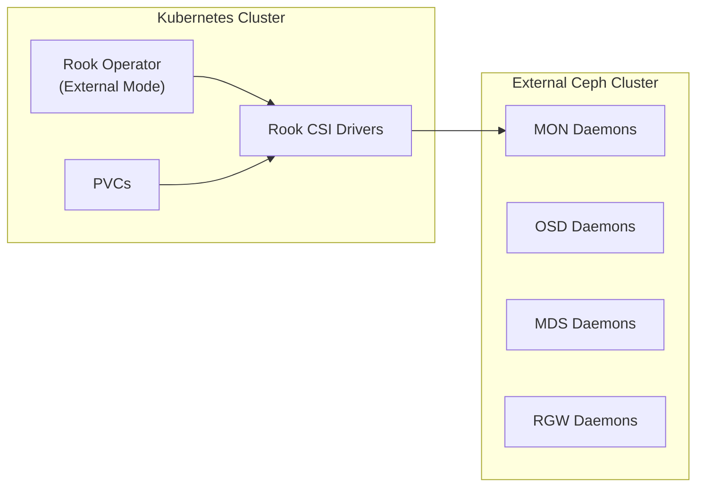

# How to Set Up Rook-Ceph with External Ceph Cluster

Author: [nawazdhandala](https://www.github.com/nawazdhandala)

Tags: Rook, Ceph, Kubernetes, External Cluster, Storage, Integration

Description: Configure Rook-Ceph to connect to an externally managed Ceph cluster, enabling Kubernetes workloads to use existing Ceph storage without Rook managing the cluster lifecycle.

---

## How External Cluster Mode Works

In external cluster mode, Rook does not manage the Ceph cluster lifecycle. Instead, it acts as a CSI driver bridge - creating StorageClasses, provisioning PVCs, and managing CSI secrets - while the actual Ceph daemons run outside Kubernetes (managed by cephadm, Ansible, or another tool). This is useful when an operations team already runs a centralized Ceph cluster that multiple Kubernetes clusters should share.



## Prerequisites

- An existing Ceph cluster (Quincy or newer recommended)
- The Ceph cluster admin keyring
- Network connectivity from Kubernetes nodes to Ceph MON IPs
- The `create-external-cluster-resources.py` script from the Rook repository

## Step 1 - Generate External Cluster Resources

On the existing Ceph cluster, run the Rook helper script to generate the required secrets and configuration. Download the script:

```bash
curl -o create-external-cluster-resources.py \
  https://raw.githubusercontent.com/rook/rook/release-1.16/deploy/examples/create-external-cluster-resources.py
```

Run it on the Ceph admin node:

```bash
python3 create-external-cluster-resources.py \
  --rbd-data-pool-name replicapool \
  --namespace rook-ceph \
  --format bash
```

For CephFS support, add:

```bash
python3 create-external-cluster-resources.py \
  --rbd-data-pool-name replicapool \
  --cephfs-filesystem-name myfs \
  --namespace rook-ceph \
  --format bash
```

For RGW (object store) support:

```bash
python3 create-external-cluster-resources.py \
  --rbd-data-pool-name replicapool \
  --rgw-endpoint <rgw-host>:80 \
  --namespace rook-ceph \
  --format bash
```

The script outputs a series of `export` statements. Save them to a file:

```bash
python3 create-external-cluster-resources.py \
  --rbd-data-pool-name replicapool \
  --namespace rook-ceph \
  --format bash > external-env.sh
```

## Step 2 - Apply the Generated Resources

Source the generated environment file and run the import script on the Kubernetes cluster:

```bash
source external-env.sh

curl -o import-external-cluster.sh \
  https://raw.githubusercontent.com/rook/rook/release-1.16/deploy/examples/import-external-cluster.sh

chmod +x import-external-cluster.sh
./import-external-cluster.sh
```

This creates the required Kubernetes Secrets containing Ceph keyrings and the ConfigMap with MON endpoints.

Verify the secrets were created:

```bash
kubectl -n rook-ceph get secrets | grep rook-ceph
```

## Step 3 - Deploy the CephCluster in External Mode

Create a `CephCluster` resource with `external.enable: true`:

```yaml
apiVersion: ceph.rook.io/v1
kind: CephCluster
metadata:
  name: rook-ceph-external
  namespace: rook-ceph
spec:
  external:
    enable: true
  dataDirHostPath: /var/lib/rook
  cephVersion:
    image: quay.io/ceph/ceph:v19.2.0
```

Apply it:

```bash
kubectl apply -f cephcluster-external.yaml
```

Check the cluster status:

```bash
kubectl -n rook-ceph get cephcluster rook-ceph-external
```

The `phase` should eventually show `Connected`.

## Step 4 - Create StorageClasses

Create a StorageClass for RBD block storage pointing to the external pool:

```yaml
apiVersion: storage.k8s.io/v1
kind: StorageClass
metadata:
  name: rook-ceph-block-external
provisioner: rook-ceph.rbd.csi.ceph.com
parameters:
  clusterID: rook-ceph
  pool: replicapool
  imageFormat: "2"
  imageFeatures: layering
  csi.storage.k8s.io/provisioner-secret-name: rook-csi-rbd-provisioner
  csi.storage.k8s.io/provisioner-secret-namespace: rook-ceph
  csi.storage.k8s.io/controller-expand-secret-name: rook-csi-rbd-provisioner
  csi.storage.k8s.io/controller-expand-secret-namespace: rook-ceph
  csi.storage.k8s.io/node-stage-secret-name: rook-csi-rbd-node
  csi.storage.k8s.io/node-stage-secret-namespace: rook-ceph
reclaimPolicy: Delete
allowVolumeExpansion: true
```

For CephFS:

```yaml
apiVersion: storage.k8s.io/v1
kind: StorageClass
metadata:
  name: rook-cephfs-external
provisioner: rook-ceph.cephfs.csi.ceph.com
parameters:
  clusterID: rook-ceph
  fsName: myfs
  pool: myfs-replicated
  csi.storage.k8s.io/provisioner-secret-name: rook-csi-cephfs-provisioner
  csi.storage.k8s.io/provisioner-secret-namespace: rook-ceph
  csi.storage.k8s.io/controller-expand-secret-name: rook-csi-cephfs-provisioner
  csi.storage.k8s.io/controller-expand-secret-namespace: rook-ceph
  csi.storage.k8s.io/node-stage-secret-name: rook-csi-cephfs-node
  csi.storage.k8s.io/node-stage-secret-namespace: rook-ceph
reclaimPolicy: Delete
allowVolumeExpansion: true
```

## Step 5 - Verify Connectivity

Check that the Rook CSI provisioner can reach the external Ceph cluster:

```bash
kubectl -n rook-ceph logs -l app=csi-rbdplugin-provisioner -c csi-provisioner --tail=30
```

Create a test PVC:

```yaml
apiVersion: v1
kind: PersistentVolumeClaim
metadata:
  name: test-external-pvc
spec:
  accessModes:
    - ReadWriteOnce
  storageClassName: rook-ceph-block-external
  resources:
    requests:
      storage: 1Gi
```

```bash
kubectl apply -f test-pvc.yaml
kubectl get pvc test-external-pvc
```

The PVC should reach `Bound` status within a few seconds.

## Summary

Rook-Ceph external cluster mode allows Kubernetes workloads to consume storage from a pre-existing Ceph cluster without Rook managing the Ceph lifecycle. The setup involves generating secrets and configuration with the `create-external-cluster-resources.py` script, importing them into Kubernetes, and deploying a `CephCluster` with `external.enable: true`. Rook then acts purely as a CSI driver coordinator, bridging Kubernetes PVCs to the external Ceph pools.
