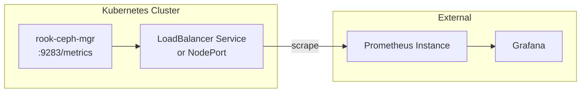

# How to Set Up External Manager Endpoints for Monitoring in Rook

Author: [nawazdhandala](https://www.github.com/nawazdhandala)

Tags: Rook, Ceph, Kubernetes, Monitoring, Prometheus, Storage

Description: Configure external Ceph MGR endpoints for Prometheus monitoring when the cluster exposes metrics outside Kubernetes, enabling scraping by an external Prometheus instance.

---

## External Manager Endpoints Use Case

When Rook-Ceph runs in a Kubernetes cluster but your Prometheus monitoring stack runs outside Kubernetes (or in a different namespace/cluster), you need to configure external MGR endpoints so Prometheus can scrape Ceph metrics without relying on Kubernetes service discovery.



## Step 1 - Expose MGR Metrics via LoadBalancer or NodePort

Create an external-facing service for the MGR metrics port:

```yaml
apiVersion: v1
kind: Service
metadata:
  name: rook-ceph-mgr-external-metrics
  namespace: rook-ceph
  labels:
    app: rook-ceph-mgr
    rook_cluster: rook-ceph
spec:
  type: NodePort
  selector:
    app: rook-ceph-mgr
    rook_cluster: rook-ceph
  ports:
    - name: metrics
      port: 9283
      targetPort: 9283
      nodePort: 30928
      protocol: TCP
```

Apply it:

```bash
kubectl apply -f mgr-external-metrics-svc.yaml
```

Get the Node IP and NodePort:

```bash
kubectl -n rook-ceph get svc rook-ceph-mgr-external-metrics
NODE_IP=$(kubectl get nodes -o jsonpath='{.items[0].status.addresses[?(@.type=="ExternalIP")].address}')
echo "Metrics endpoint: http://${NODE_IP}:30928/metrics"
```

## Step 2 - Configure External Prometheus Scrape

In your external Prometheus `prometheus.yml`:

```yaml
scrape_configs:
  - job_name: ceph-rook
    static_configs:
      - targets:
          - 192.168.1.100:30928
          - 192.168.1.101:30928
          - 192.168.1.102:30928
    metrics_path: /metrics
    scrape_interval: 30s
    scrape_timeout: 15s
    relabel_configs:
      - source_labels: [__address__]
        target_label: cluster
        replacement: rook-ceph
```

Apply the Prometheus config reload:

```bash
curl -X POST http://prometheus:9090/-/reload
```

## Step 3 - Using the externalMgrPrometheusPort Field

The CephCluster CRD supports configuring external MGR Prometheus endpoint settings:

```yaml
apiVersion: ceph.rook.io/v1
kind: CephCluster
metadata:
  name: rook-ceph
  namespace: rook-ceph
spec:
  cephVersion:
    image: quay.io/ceph/ceph:v19.2.0
  dataDirHostPath: /var/lib/rook
  monitoring:
    enabled: true
    externalMgrPrometheusPort: 9283
    externalMgrEndpoints:
      - ip: 10.0.0.100
```

The `externalMgrEndpoints` field is used when connecting to an external Ceph cluster from Rook, to tell Rook where the external Ceph MGR is running so it can configure the ServiceMonitor to point at that external IP.

## Step 4 - Verify External Scraping

Test the endpoint from outside the cluster:

```bash
curl -s http://192.168.1.100:30928/metrics | grep ceph_health_status
```

Check in Prometheus that targets are UP:

```text
Status -> Targets -> ceph-rook
```

All targets should show `UP` state.

## Step 5 - Authenticate Metrics Endpoint (Optional)

To secure the metrics endpoint with basic authentication, configure MGR via the toolbox:

```bash
kubectl -n rook-ceph exec -it deploy/rook-ceph-tools -- \
  ceph dashboard set-prometheus-credentials --username metrics --password securepass
```

Add authentication to the Prometheus scrape config:

```yaml
scrape_configs:
  - job_name: ceph-rook
    basic_auth:
      username: metrics
      password: securepass
    static_configs:
      - targets:
          - 192.168.1.100:30928
```

## Firewall Rules for External Access

Allow the NodePort on Kubernetes worker nodes:

```bash
# CentOS/RHEL
firewall-cmd --permanent --add-port=30928/tcp
firewall-cmd --reload

# Ubuntu UFW
ufw allow 30928/tcp comment "Ceph MGR Metrics"
ufw reload
```

## Summary

To expose Ceph MGR metrics to an external Prometheus instance, create a NodePort or LoadBalancer Service targeting the MGR pod on port 9283. Configure the external Prometheus scrape job with the node IPs and NodePort. For Rook deployments that connect to an external Ceph cluster, use `monitoring.externalMgrEndpoints` and `externalMgrPrometheusPort` in the CephCluster spec to direct ServiceMonitor resources at the correct external MGR endpoint.
