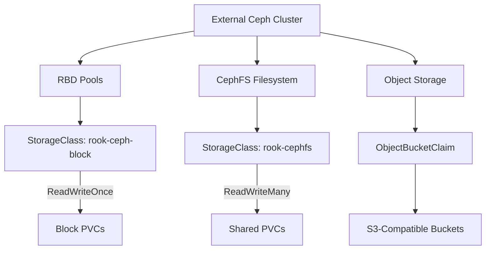

# How to Set Up Storage Classes for External Ceph Clusters in Rook

Author: [nawazdhandala](https://www.github.com/nawazdhandala)

Tags: Rook, Ceph, Kubernetes, Storage

Description: Create and configure Kubernetes StorageClasses for RBD and CephFS backed by an external Ceph cluster managed through Rook.

---

## Introduction

After connecting Rook to an external Ceph cluster, the next step is creating StorageClasses that Kubernetes workloads can use to dynamically provision persistent volumes. This guide covers creating StorageClasses for RBD block storage, CephFS shared filesystems, and object storage backed by your external Ceph cluster.

## Storage Class Types



## Prerequisites

- Rook connected to external Ceph cluster (see authentication guide)
- External Ceph cluster with RBD pools and/or CephFS filesystems configured
- CSI secrets created in the Rook namespace

## Step 1: Verify External Ceph Pools and Filesystems

On the external Ceph admin host, confirm the pools and filesystems exist:

```bash
# List all pools
ceph osd pool ls

# List RBD pools (application = rbd)
ceph osd pool application get <pool-name>

# List CephFS filesystems
ceph fs ls

# Get the cluster FSID needed for StorageClass clusterID
ceph fsid
```

## Step 2: Create StorageClass for RBD Block Storage

```yaml
# storageclass-rbd-external.yaml
apiVersion: storage.k8s.io/v1
kind: StorageClass
metadata:
  name: rook-ceph-block-external
  annotations:
    storageclass.kubernetes.io/is-default-class: "false"
provisioner: rook-ceph.rbd.csi.ceph.com
parameters:
  # FSID of the external Ceph cluster
  clusterID: "a945d810-3d4c-4a29-b71e-3dd7ffb6c8d2"
  # RBD pool on the external cluster
  pool: replicapool
  # RBD image format - always use 2
  imageFormat: "2"
  # RBD image features compatible with kernel RBD driver
  imageFeatures: layering,fast-diff,object-map,deep-flatten,exclusive-lock
  # CSI provisioner secret references
  csi.storage.k8s.io/provisioner-secret-name: rook-csi-rbd-provisioner
  csi.storage.k8s.io/provisioner-secret-namespace: rook-ceph-external
  csi.storage.k8s.io/controller-expand-secret-name: rook-csi-rbd-provisioner
  csi.storage.k8s.io/controller-expand-secret-namespace: rook-ceph-external
  csi.storage.k8s.io/node-stage-secret-name: rook-csi-rbd-node
  csi.storage.k8s.io/node-stage-secret-namespace: rook-ceph-external
reclaimPolicy: Delete
allowVolumeExpansion: true
volumeBindingMode: Immediate
```

```bash
kubectl apply -f storageclass-rbd-external.yaml
```

## Step 3: Create a Retain Policy StorageClass for Production

```yaml
# storageclass-rbd-external-retain.yaml
apiVersion: storage.k8s.io/v1
kind: StorageClass
metadata:
  name: rook-ceph-block-external-retain
provisioner: rook-ceph.rbd.csi.ceph.com
parameters:
  clusterID: "a945d810-3d4c-4a29-b71e-3dd7ffb6c8d2"
  pool: replicapool
  imageFormat: "2"
  imageFeatures: layering,fast-diff,object-map,deep-flatten,exclusive-lock
  csi.storage.k8s.io/provisioner-secret-name: rook-csi-rbd-provisioner
  csi.storage.k8s.io/provisioner-secret-namespace: rook-ceph-external
  csi.storage.k8s.io/controller-expand-secret-name: rook-csi-rbd-provisioner
  csi.storage.k8s.io/controller-expand-secret-namespace: rook-ceph-external
  csi.storage.k8s.io/node-stage-secret-name: rook-csi-rbd-node
  csi.storage.k8s.io/node-stage-secret-namespace: rook-ceph-external
# Retain keeps the PV and RBD image after PVC deletion
reclaimPolicy: Retain
allowVolumeExpansion: true
volumeBindingMode: Immediate
```

## Step 4: Create StorageClass for CephFS Shared Storage

```yaml
# storageclass-cephfs-external.yaml
apiVersion: storage.k8s.io/v1
kind: StorageClass
metadata:
  name: rook-cephfs-external
provisioner: rook-ceph.cephfs.csi.ceph.com
parameters:
  clusterID: "a945d810-3d4c-4a29-b71e-3dd7ffb6c8d2"
  # CephFS filesystem name on the external cluster
  fsName: myfs
  # CephFS pool where data will be stored
  pool: myfs-data0
  # Root path within the CephFS filesystem
  rootPath: /external-volumes
  csi.storage.k8s.io/provisioner-secret-name: rook-csi-cephfs-provisioner
  csi.storage.k8s.io/provisioner-secret-namespace: rook-ceph-external
  csi.storage.k8s.io/controller-expand-secret-name: rook-csi-cephfs-provisioner
  csi.storage.k8s.io/controller-expand-secret-namespace: rook-ceph-external
  csi.storage.k8s.io/node-stage-secret-name: rook-csi-cephfs-node
  csi.storage.k8s.io/node-stage-secret-namespace: rook-ceph-external
reclaimPolicy: Delete
allowVolumeExpansion: true
volumeBindingMode: Immediate
```

```bash
kubectl apply -f storageclass-cephfs-external.yaml
```

## Step 5: Create StorageClass for Erasure Coded Pool

```yaml
# storageclass-ec-external.yaml
apiVersion: storage.k8s.io/v1
kind: StorageClass
metadata:
  name: rook-ceph-block-ec-external
provisioner: rook-ceph.rbd.csi.ceph.com
parameters:
  clusterID: "a945d810-3d4c-4a29-b71e-3dd7ffb6c8d2"
  # Data pool uses erasure coding for space efficiency
  pool: ec-data-pool
  # Required: metadata pool must be replicated
  dataPool: ec-data-pool
  imageFormat: "2"
  # Erasure coded pools require only layering feature
  imageFeatures: layering
  csi.storage.k8s.io/provisioner-secret-name: rook-csi-rbd-provisioner
  csi.storage.k8s.io/provisioner-secret-namespace: rook-ceph-external
  csi.storage.k8s.io/controller-expand-secret-name: rook-csi-rbd-provisioner
  csi.storage.k8s.io/controller-expand-secret-namespace: rook-ceph-external
  csi.storage.k8s.io/node-stage-secret-name: rook-csi-rbd-node
  csi.storage.k8s.io/node-stage-secret-namespace: rook-ceph-external
reclaimPolicy: Delete
allowVolumeExpansion: true
```

## Step 6: Create VolumeSnapshotClass for External Cluster

```yaml
# volumesnapshotclass-external.yaml
apiVersion: snapshot.storage.k8s.io/v1
kind: VolumeSnapshotClass
metadata:
  name: csi-rbdplugin-snapclass-external
driver: rook-ceph.rbd.csi.ceph.com
parameters:
  clusterID: "a945d810-3d4c-4a29-b71e-3dd7ffb6c8d2"
  csi.storage.k8s.io/volumesnapshot/secret-name: rook-csi-rbd-provisioner
  csi.storage.k8s.io/volumesnapshot/secret-namespace: rook-ceph-external
deletionPolicy: Delete
```

```bash
kubectl apply -f volumesnapshotclass-external.yaml
```

## Step 7: Test the StorageClasses

```bash
# Test RBD block storage
kubectl apply -f - <<EOF
apiVersion: v1
kind: PersistentVolumeClaim
metadata:
  name: test-block-external
spec:
  accessModes:
    - ReadWriteOnce
  storageClassName: rook-ceph-block-external
  resources:
    requests:
      storage: 1Gi
EOF

# Test CephFS shared storage
kubectl apply -f - <<EOF
apiVersion: v1
kind: PersistentVolumeClaim
metadata:
  name: test-cephfs-external
spec:
  accessModes:
    - ReadWriteMany
  storageClassName: rook-cephfs-external
  resources:
    requests:
      storage: 1Gi
EOF

# Check PVC status
kubectl get pvc test-block-external test-cephfs-external
```

## Step 8: Set a Default StorageClass

```bash
# Make the RBD StorageClass the default
kubectl patch storageclass rook-ceph-block-external \
  -p '{"metadata": {"annotations":{"storageclass.kubernetes.io/is-default-class":"true"}}}'

# Verify
kubectl get storageclass
```

## Troubleshooting

```bash
# Check CSI provisioner logs for errors
kubectl logs -n rook-ceph deploy/csi-rbdplugin-provisioner -c csi-provisioner | tail -20

# Check if the clusterID matches the external cluster FSID
kubectl describe storageclass rook-ceph-block-external | grep clusterID
ceph fsid  # Run on external cluster - should match

# Verify CSI secrets exist in the correct namespace
kubectl get secrets -n rook-ceph-external | grep csi

# Check PVC events for provisioning failures
kubectl describe pvc test-block-external
```

## Summary

Setting up StorageClasses for an external Ceph cluster requires configuring the correct `clusterID` (external cluster FSID), referencing the appropriate CSI secrets created during authentication setup, and specifying the correct pool names from the external cluster. Create separate StorageClasses for RBD block storage, CephFS shared filesystems, and erasure coded pools to give workloads access to the full range of external Ceph storage capabilities.
