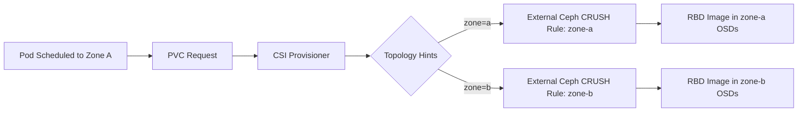

# How to Use Topology-Based Provisioning with External Clusters in Rook

Author: [OneUptime](https://www.github.com/oneuptime)

Tags: Rook, Ceph, Kubernetes, Storage

Description: Configure topology-aware volume provisioning with an external Ceph cluster in Rook to co-locate storage with compute for improved performance.

---

## Introduction

Topology-based provisioning allows Rook to provision volumes in the same zone or region as the pod that will consume them. When using an external Ceph cluster, topology awareness is especially important because Ceph CRUSH rules can target specific failure domains, and Kubernetes nodes may span multiple availability zones.

This guide explains how to enable topology hints, configure CRUSH rules on the external cluster, and set up StorageClasses to use topology-based provisioning.

## How Topology Provisioning Works



## Prerequisites

- External Ceph cluster with OSDs distributed across multiple failure domains (zones, racks, or hosts)
- Kubernetes nodes labeled with topology keys
- Rook operator v1.10 or newer
- CSI driver topology feature enabled

## Step 1: Label Kubernetes Nodes with Topology Keys

```bash
# Label nodes with zone topology
kubectl label node k8s-node-01 topology.kubernetes.io/zone=zone-a
kubectl label node k8s-node-02 topology.kubernetes.io/zone=zone-a
kubectl label node k8s-node-03 topology.kubernetes.io/zone=zone-b
kubectl label node k8s-node-04 topology.kubernetes.io/zone=zone-b

# Verify labels
kubectl get nodes --show-labels | grep topology
```

## Step 2: Configure CRUSH Rules on the External Ceph Cluster

On the external Ceph admin host, create CRUSH rules that align with your topology:

```bash
# View existing CRUSH hierarchy
ceph osd crush tree

# Create a CRUSH rule that distributes replicas across zones
ceph osd crush rule create-replicated zone-replicated default zone osd

# Alternatively, create via CRUSH map for fine-grained control
ceph osd getcrushmap -o /tmp/crushmap.bin
crushtool -d /tmp/crushmap.bin -o /tmp/crushmap.txt

# Edit the crushmap to add zone-aware rules, then:
crushtool -c /tmp/crushmap.txt -o /tmp/crushmap-new.bin
ceph osd setcrushmap -i /tmp/crushmap-new.bin

# List all rules
ceph osd crush rule ls
ceph osd crush rule dump zone-replicated
```

## Step 3: Create Topology-Enabled StorageClass

The `domainLabel` parameter maps Kubernetes topology labels to Ceph CRUSH bucket types:

```yaml
# storageclass-topology.yaml
apiVersion: storage.k8s.io/v1
kind: StorageClass
metadata:
  name: rook-ceph-block-topology
provisioner: rook-ceph.rbd.csi.ceph.com
parameters:
  clusterID: <external-ceph-cluster-fsid>
  pool: replicapool
  imageFormat: "2"
  imageFeatures: layering,fast-diff,object-map,deep-flatten,exclusive-lock
  csi.storage.k8s.io/provisioner-secret-name: rook-csi-rbd-provisioner
  csi.storage.k8s.io/provisioner-secret-namespace: rook-ceph-external
  csi.storage.k8s.io/controller-expand-secret-name: rook-csi-rbd-provisioner
  csi.storage.k8s.io/controller-expand-secret-namespace: rook-ceph-external
  csi.storage.k8s.io/node-stage-secret-name: rook-csi-rbd-node
  csi.storage.k8s.io/node-stage-secret-namespace: rook-ceph-external
  # Map Kubernetes topology zone label to Ceph CRUSH bucket type
  topologyConstrainedPools: |
    [{"poolName":"replicapool-zone-a","domainSegments":[{"domainLabel":"topology.kubernetes.io/zone","value":"zone-a"}]},
     {"poolName":"replicapool-zone-b","domainSegments":[{"domainLabel":"topology.kubernetes.io/zone","value":"zone-b"}]}]
reclaimPolicy: Delete
allowVolumeExpansion: true
volumeBindingMode: WaitForFirstConsumer
allowedTopologies:
  - matchLabelExpressions:
      - key: topology.kubernetes.io/zone
        values:
          - zone-a
          - zone-b
```

```bash
kubectl apply -f storageclass-topology.yaml
```

## Step 4: Create Topology-Specific Pools on External Ceph

Create separate pools for each topology zone on the external cluster:

```bash
# Create pools for each zone
ceph osd pool create replicapool-zone-a 32 32 replicated zone-replicated
ceph osd pool create replicapool-zone-b 32 32 replicated zone-replicated

# Enable RBD application on each pool
ceph osd pool application enable replicapool-zone-a rbd
ceph osd pool application enable replicapool-zone-b rbd

# Set replication size
ceph osd pool set replicapool-zone-a size 3
ceph osd pool set replicapool-zone-b size 3
```

## Step 5: Configure the CSI Driver for Topology

Update the Rook operator ConfigMap to enable topology:

```yaml
# rook-ceph-operator-config patch
apiVersion: v1
kind: ConfigMap
metadata:
  name: rook-ceph-operator-config
  namespace: rook-ceph
data:
  # Enable topology support in CSI
  CSI_ENABLE_TOPOLOGY: "true"
  # Domain label key used for topology
  CSI_TOPOLOGY_DOMAIN_LABELS: "topology.kubernetes.io/zone"
```

```bash
kubectl apply -f rook-ceph-operator-config.yaml
# Restart the operator to pick up changes
kubectl rollout restart deployment/rook-ceph-operator -n rook-ceph
```

## Step 6: Deploy a Pod with Topology-Aware PVC

Using `WaitForFirstConsumer` ensures the PVC is provisioned in the same zone as the pod:

```yaml
# topology-pvc-test.yaml
apiVersion: v1
kind: PersistentVolumeClaim
metadata:
  name: topology-pvc
spec:
  accessModes:
    - ReadWriteOnce
  storageClassName: rook-ceph-block-topology
  resources:
    requests:
      storage: 10Gi
---
apiVersion: v1
kind: Pod
metadata:
  name: topology-test-pod
spec:
  containers:
    - name: app
      image: busybox
      command: ["sleep", "infinity"]
      volumeMounts:
        - name: data
          mountPath: /data
  volumes:
    - name: data
      persistentVolumeClaim:
        claimName: topology-pvc
  # Optionally constrain the pod to a specific zone
  affinity:
    nodeAffinity:
      requiredDuringSchedulingIgnoredDuringExecution:
        nodeSelectorTerms:
          - matchExpressions:
              - key: topology.kubernetes.io/zone
                operator: In
                values:
                  - zone-a
```

```bash
kubectl apply -f topology-pvc-test.yaml

# Verify the PV has topology information
kubectl get pv $(kubectl get pvc topology-pvc -o jsonpath='{.spec.volumeName}') \
  -o jsonpath='{.spec.nodeAffinity}' | python3 -m json.tool
```

## Step 7: Verify Topology Constraints on the PV

```bash
# Check the PV's node affinity reflects the correct zone
kubectl describe pv <pv-name> | grep -A10 "Node Affinity"

# Check which Ceph pool the volume was created in
kubectl describe pv <pv-name> | grep "pool"
```

Expected output showing zone affinity:

```text
Node Affinity:
  Required Terms:
    Term 0:
      topology.kubernetes.io/zone in [zone-a]
```

## Troubleshooting

```bash
# Check if CSI provisioner has topology enabled
kubectl logs -n rook-ceph deploy/csi-rbdplugin-provisioner -c csi-provisioner | grep topology

# Verify StorageClass topology parameters
kubectl describe storageclass rook-ceph-block-topology

# Check pending PVC events for topology issues
kubectl describe pvc topology-pvc | grep -A10 Events
```

## Summary

Topology-based provisioning with external Ceph clusters aligns Kubernetes volume placement with Ceph CRUSH rules to reduce cross-zone data movement. The key configuration points are labeling nodes with topology keys, creating zone-specific Ceph pools with appropriate CRUSH rules, and configuring the `topologyConstrainedPools` parameter in the StorageClass along with `WaitForFirstConsumer` volume binding mode.
