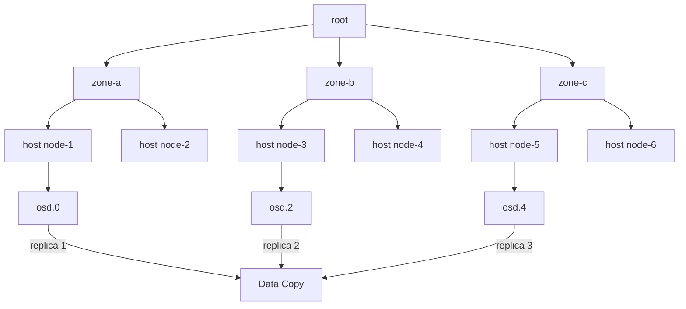

# How to Configure Failure Domains in Rook-Ceph Pools

Author: [nawazdhandala](https://www.github.com/nawazdhandala)

Tags: Rook, Ceph, Kubernetes, Pool, FailureDomain, CRUSH

Description: Configure failure domains in Rook-Ceph block and filesystem pools so replicas are spread across zones, racks, or hosts for true fault tolerance.

---

A failure domain defines the boundary within which Ceph will not place two copies of the same data. Setting the correct failure domain ensures your data survives the loss of an entire zone, rack, or host.

## Failure Domain Hierarchy



## Default Failure Domain

By default, Rook sets the failure domain to `host`. This means each replica goes to a different host. If you lose a host, no data is lost.

## Configure Host-Level Failure Domain

```yaml
apiVersion: ceph.rook.io/v1
kind: CephBlockPool
metadata:
  name: replicapool
  namespace: rook-ceph
spec:
  failureDomain: host    # default - one replica per host
  replicated:
    size: 3
    requireSafeReplicaSize: true
```

## Configure Zone-Level Failure Domain

For multi-zone clusters, set the failure domain to `zone`:

```yaml
apiVersion: ceph.rook.io/v1
kind: CephBlockPool
metadata:
  name: zonal-pool
  namespace: rook-ceph
spec:
  failureDomain: zone    # one replica per zone
  replicated:
    size: 3
    requireSafeReplicaSize: true
```

This requires your CRUSH map to have `zone` buckets:

```bash
kubectl exec -n rook-ceph deploy/rook-ceph-tools -- bash

# Add zone buckets
ceph osd crush add-bucket zone-a zone
ceph osd crush add-bucket zone-b zone
ceph osd crush add-bucket zone-c zone

# Move hosts under their zones
ceph osd crush move node-1 zone=zone-a
ceph osd crush move node-2 zone=zone-b
ceph osd crush move node-3 zone=zone-c

# Create zone-level CRUSH rule
ceph osd crush rule create-replicated zone-rule default zone
```

## Configure Rack-Level Failure Domain

For on-premises clusters with physical racks, use `rack`:

```yaml
apiVersion: ceph.rook.io/v1
kind: CephBlockPool
metadata:
  name: rack-pool
  namespace: rook-ceph
spec:
  failureDomain: rack
  replicated:
    size: 3
    requireSafeReplicaSize: true
```

Label nodes with rack topology and configure CRUSH:

```bash
# Label nodes
kubectl label node node-1 topology.rook.io/rack=rack-a
kubectl label node node-2 topology.rook.io/rack=rack-b
kubectl label node node-3 topology.rook.io/rack=rack-c

# In Ceph toolbox
ceph osd crush add-bucket rack-a rack
ceph osd crush add-bucket rack-b rack
ceph osd crush add-bucket rack-c rack
ceph osd crush move node-1 rack=rack-a
ceph osd crush move node-2 rack=rack-b
ceph osd crush move node-3 rack=rack-c
```

## Failure Domain for CephFilesystem

Apply failure domains to both metadata and data pools in a filesystem:

```yaml
apiVersion: ceph.rook.io/v1
kind: CephFilesystem
metadata:
  name: myfs
  namespace: rook-ceph
spec:
  metadataPool:
    failureDomain: host
    replicated:
      size: 3
  dataPools:
    - name: data0
      failureDomain: zone    # zone-level protection for data
      replicated:
        size: 3
  metadataServer:
    activeCount: 1
    activeStandby: true
```

## Failure Domain for Erasure-Coded Pools

```yaml
apiVersion: ceph.rook.io/v1
kind: CephBlockPool
metadata:
  name: ec-pool
  namespace: rook-ceph
spec:
  failureDomain: host
  erasureCoded:
    dataChunks: 4
    codingChunks: 2
    # Requires at least 6 hosts (4+2) for host failure domain
```

## Verify Failure Domain

```bash
# Check the CRUSH rule of a pool
kubectl exec -n rook-ceph deploy/rook-ceph-tools -- \
  ceph osd pool get replicapool crush_rule

# Decode and view the CRUSH rule
kubectl exec -n rook-ceph deploy/rook-ceph-tools -- \
  ceph osd crush rule dump zone-rule

# Simulate placement to verify failure domains
kubectl exec -n rook-ceph deploy/rook-ceph-tools -- \
  ceph osd crush rule dump replicapool-replicated-rule

# Check current PG distribution
kubectl exec -n rook-ceph deploy/rook-ceph-tools -- \
  ceph pg dump | awk 'NR>1 {print $1, $14}' | head -20
```

## Minimum Node Requirements per Failure Domain

| Failure Domain | Replication Size | Minimum Units |
|---|---|---|
| host | 2 | 2 hosts |
| host | 3 | 3 hosts |
| rack | 3 | 3 racks |
| zone | 3 | 3 zones |
| Erasure k+m | - | k+m units |

## Summary

Failure domains in Rook-Ceph pools determine where Ceph places replicas or erasure-coded chunks. Using `host` failure domains protects against single-node failures, while `zone` or `rack` failure domains protect against larger infrastructure failures. Always ensure you have enough CRUSH buckets at the chosen failure domain level to satisfy the replication or erasure-coding requirements.
