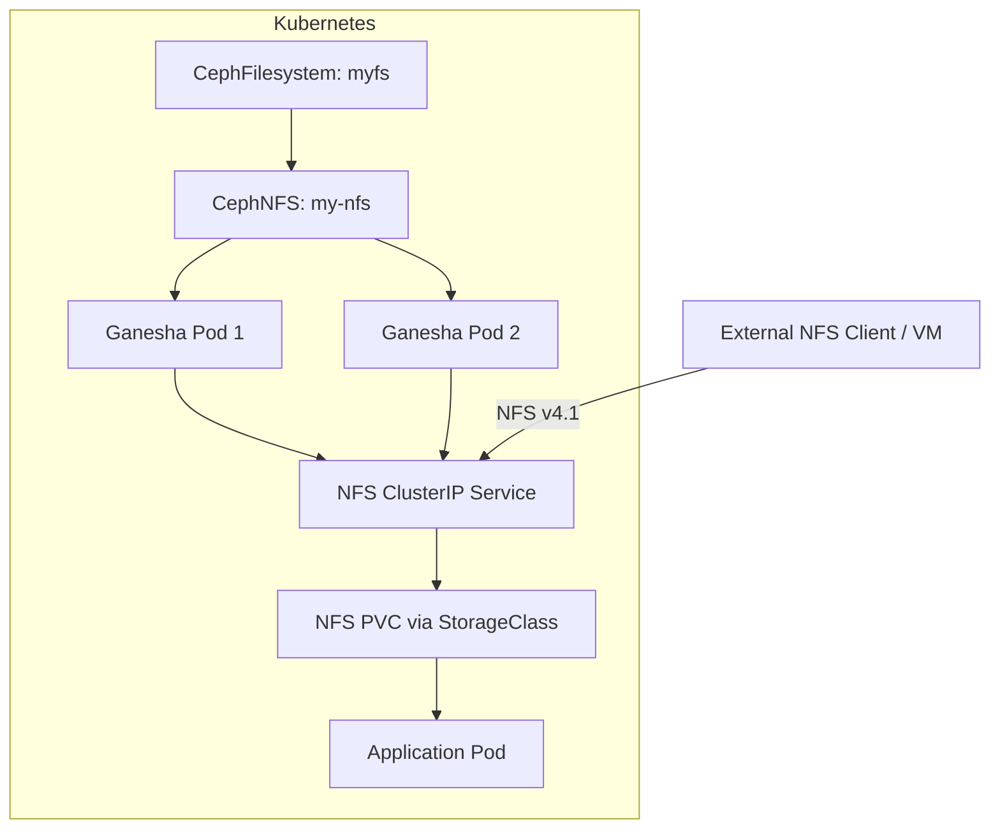

# How to Set Up Ganesha NFS with CephFS Backend in Rook

Author: [nawazdhandala](https://www.github.com/nawazdhandala)

Tags: Rook, Ceph, Kubernetes, NFS, Ganesha, CephFS, Storage, Shared

Description: End-to-end guide to deploying NFS Ganesha with a CephFS backend in Rook, including CephNFS setup, export creation, PVC provisioning, and pod mounting.

---

NFS Ganesha in Rook uses CephFS as its backend file store (FSAL). This provides a standard NFS v4.1 interface to any client -- inside or outside Kubernetes -- backed by the resilience and scalability of Ceph.

## Full Architecture



## Step 1: Ensure CephFilesystem Exists

```bash
kubectl get cephfilesystem -n rook-ceph
```

If not, create one:

```yaml
apiVersion: ceph.rook.io/v1
kind: CephFilesystem
metadata:
  name: myfs
  namespace: rook-ceph
spec:
  metadataPool:
    failureDomain: host
    replicated:
      size: 3
  dataPools:
    - name: data0
      failureDomain: host
      replicated:
        size: 3
  preserveFilesystemOnDelete: true
  metadataServer:
    activeCount: 1
    activeStandby: true
```

## Step 2: Deploy CephNFS

```yaml
apiVersion: ceph.rook.io/v1
kind: CephNFS
metadata:
  name: my-nfs
  namespace: rook-ceph
spec:
  rados:
    pool: myfs-metadata
    namespace: nfs-ns
  server:
    active: 2
    resources:
      requests:
        cpu: "500m"
        memory: "1Gi"
      limits:
        cpu: "2"
        memory: "4Gi"
```

```bash
kubectl apply -f cephnfs.yaml
kubectl get pods -n rook-ceph -l app=rook-ceph-nfs
```

## Step 3: Create a CephFS Export

```bash
kubectl exec -n rook-ceph deploy/rook-ceph-tools -- \
  ceph nfs export create cephfs my-nfs /nfs-share myfs \
    --path=/

# Verify the export
kubectl exec -n rook-ceph deploy/rook-ceph-tools -- \
  ceph nfs export ls my-nfs
```

## Step 4: Get the NFS Service ClusterIP

```bash
kubectl get svc -n rook-ceph | grep nfs
# rook-ceph-nfs-my-nfs-a  ClusterIP  10.96.5.200  2049/TCP
NFS_IP="10.96.5.200"
```

## Step 5: Mount NFS in a Pod (Direct)

```yaml
apiVersion: v1
kind: Pod
metadata:
  name: nfs-test
  namespace: default
spec:
  containers:
    - name: test
      image: busybox
      command: ["sh", "-c", "while true; do sleep 60; done"]
      volumeMounts:
        - name: nfs-vol
          mountPath: /mnt/nfs
  volumes:
    - name: nfs-vol
      nfs:
        server: rook-ceph-nfs-my-nfs-a.rook-ceph.svc.cluster.local
        path: /nfs-share
        readOnly: false
```

## Step 6: Use NFS via PersistentVolumeClaim

Create a StorageClass using the NFS CSI driver:

```yaml
apiVersion: storage.k8s.io/v1
kind: StorageClass
metadata:
  name: rook-ceph-nfs
provisioner: rook-ceph.nfs.csi.ceph.com
parameters:
  clusterID: rook-ceph
  nfsClusterID: my-nfs
  fsName: myfs
  pool: myfs-data0
  csi.storage.k8s.io/provisioner-secret-name: rook-csi-cephfs-provisioner
  csi.storage.k8s.io/provisioner-secret-namespace: rook-ceph
  csi.storage.k8s.io/node-stage-secret-name: rook-csi-cephfs-node
  csi.storage.k8s.io/node-stage-secret-namespace: rook-ceph
reclaimPolicy: Delete
allowVolumeExpansion: true
```

```yaml
apiVersion: v1
kind: PersistentVolumeClaim
metadata:
  name: nfs-pvc
  namespace: default
spec:
  accessModes:
    - ReadWriteMany
  resources:
    requests:
      storage: 10Gi
  storageClassName: rook-ceph-nfs
```

## Verify the Mount

```bash
kubectl exec -n default nfs-test -- df -h /mnt/nfs
kubectl exec -n default nfs-test -- touch /mnt/nfs/hello-from-k8s
kubectl exec -n default nfs-test -- ls /mnt/nfs
```

## External VM Mount (Outside Kubernetes)

```bash
# On an external Linux host in the same network
sudo apt-get install -y nfs-common
sudo mount -t nfs4 10.96.5.200:/nfs-share /mnt/ceph-nfs
df -h /mnt/ceph-nfs

# Make persistent (/etc/fstab)
echo "10.96.5.200:/nfs-share /mnt/ceph-nfs nfs4 defaults,_netdev 0 0" >> /etc/fstab
```

## Summary

Setting up Ganesha NFS with CephFS in Rook requires a `CephFilesystem`, a `CephNFS` CR, and at least one NFS export. The Ganesha daemon uses CephFS as its FSAL backend, providing NFS v4.1 access to the filesystem data. Pods can mount NFS volumes directly using the `nfs` volume type or through the NFS CSI StorageClass for dynamic provisioning with PVCs.
