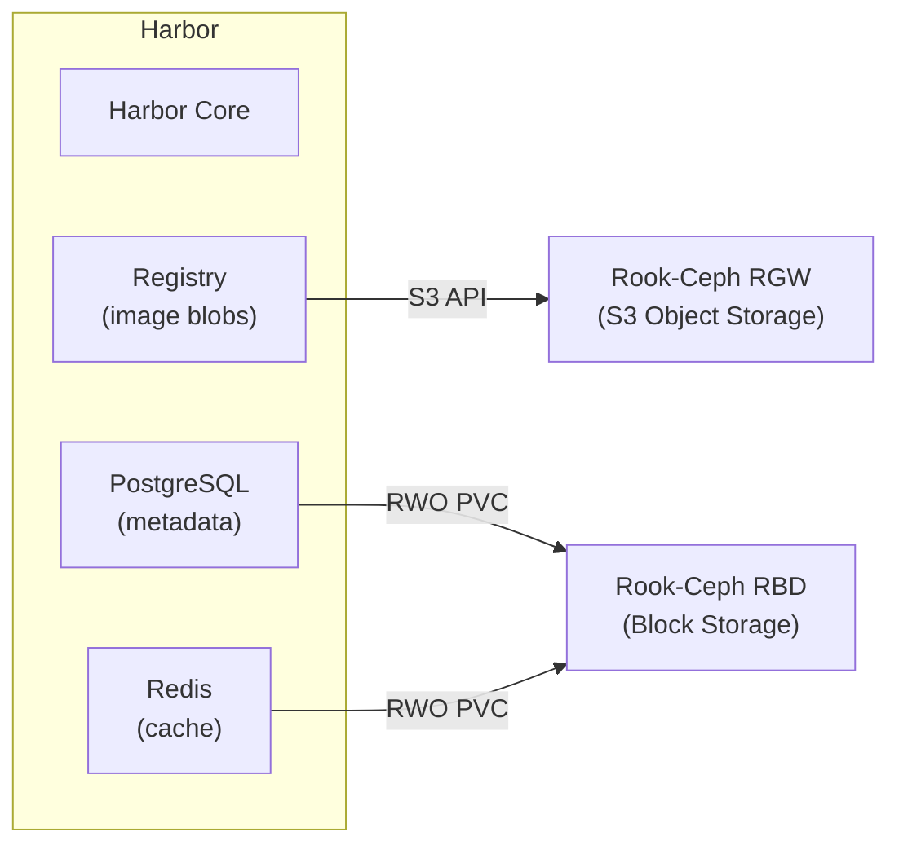

# How to Use Rook-Ceph with Harbor Container Registry

Author: [nawazdhandala](https://www.github.com/nawazdhandala)

Tags: Rook, Ceph, Kubernetes, Harbor, Container Registry, S3, Storage

Description: Configure Harbor container registry to use Rook-Ceph for persistent storage, including S3-compatible object storage for image layers and block storage for the registry database.

---

## How Harbor Uses Storage

Harbor is a CNCF container registry that stores container images, Helm charts, and vulnerability scan results. It uses multiple storage backends: an S3-compatible object store (or local filesystem) for image layer blobs, a PostgreSQL database for metadata, Redis for caching, and Trivy for vulnerability scanning. Rook-Ceph can provide all of these storage types.



## Prerequisites

- Rook-Ceph cluster with both RGW (object store) and RBD (block storage) operational
- Helm 3 installed
- Cert-manager or TLS certificates for Harbor HTTPS

## Step 1 - Set Up Rook-Ceph S3 for Harbor Image Storage

Create a dedicated bucket for Harbor image layers:

```bash
kubectl -n rook-ceph exec -it deploy/rook-ceph-tools -- \
  radosgw-admin user create \
  --uid=harbor \
  --display-name="Harbor Registry" \
  --access-key=harbor-access-key \
  --secret-key=harbor-secret-key

kubectl -n rook-ceph exec -it deploy/rook-ceph-tools -- \
  radosgw-admin bucket create \
  --bucket=harbor-registry \
  --uid=harbor
```

Get the RGW service endpoint:

```bash
RGW_SVC=$(kubectl -n rook-ceph get svc rook-ceph-rgw-my-store -o jsonpath='{.spec.clusterIP}')
echo "RGW endpoint: http://${RGW_SVC}:80"
```

## Step 2 - Create Harbor Namespace and Secrets

Create the Harbor namespace:

```bash
kubectl create namespace harbor
```

Create a secret for the Harbor S3 (RGW) credentials:

```bash
kubectl -n harbor create secret generic harbor-s3-credentials \
  --from-literal=accesskey=harbor-access-key \
  --from-literal=secretkey=harbor-secret-key
```

## Step 3 - Create PVCs for Harbor Components

Create PVCs for Harbor's database and Redis using Rook-Ceph block storage:

```yaml
apiVersion: v1
kind: PersistentVolumeClaim
metadata:
  name: harbor-database
  namespace: harbor
spec:
  accessModes:
    - ReadWriteOnce
  storageClassName: rook-ceph-block
  resources:
    requests:
      storage: 20Gi
---
apiVersion: v1
kind: PersistentVolumeClaim
metadata:
  name: harbor-redis
  namespace: harbor
spec:
  accessModes:
    - ReadWriteOnce
  storageClassName: rook-ceph-block
  resources:
    requests:
      storage: 5Gi
---
apiVersion: v1
kind: PersistentVolumeClaim
metadata:
  name: harbor-jobservice
  namespace: harbor
spec:
  accessModes:
    - ReadWriteOnce
  storageClassName: rook-ceph-block
  resources:
    requests:
      storage: 5Gi
```

Apply:

```bash
kubectl apply -f harbor-pvcs.yaml
```

## Step 4 - Install Harbor with Helm Using Rook-Ceph Storage

Add the Harbor Helm repository:

```bash
helm repo add harbor https://helm.goharbor.io
helm repo update
```

Create a values file for Harbor configured to use Rook-Ceph:

```yaml
expose:
  type: ingress
  ingress:
    hosts:
      core: registry.example.com
  tls:
    enabled: true
    certSource: secret
    secret:
      secretName: harbor-tls

externalURL: https://registry.example.com

persistence:
  enabled: true
  persistentVolumeClaim:
    registry:
      existingClaim: ""
      storageClass: rook-ceph-block
      accessMode: ReadWriteOnce
      size: 5Gi
    database:
      existingClaim: harbor-database
    redis:
      existingClaim: harbor-redis
    jobservice:
      jobLog:
        existingClaim: harbor-jobservice
  imageChartStorage:
    disableredirect: true
    type: s3
    s3:
      accesskey: harbor-access-key
      secretkey: harbor-secret-key
      bucket: harbor-registry
      regionendpoint: http://rook-ceph-rgw-my-store.rook-ceph.svc:80
      region: us-east-1
      encrypt: false
      secure: false
      v4auth: true
      chunksize: "5242880"
      storageclass: STANDARD

database:
  type: internal
  internal:
    password: "change-this-strong-password"

redis:
  type: internal

harborAdminPassword: "change-this-admin-password"
```

Install Harbor:

```bash
helm install harbor harbor/harbor \
  --namespace harbor \
  --values harbor-values.yaml \
  --version 1.15.0
```

## Step 5 - Verify Harbor Installation

Check all Harbor pods are running:

```bash
kubectl -n harbor get pods
```

Wait for all pods to reach `Running` state:

```bash
kubectl -n harbor rollout status deployment/harbor-core
```

Test the S3 connection by checking if Harbor can access the RGW bucket:

```bash
kubectl -n harbor logs deployment/harbor-registry | grep -i s3
```

## Step 6 - Test Image Push and Pull

Log in to Harbor:

```bash
docker login registry.example.com \
  -u admin \
  -p change-this-admin-password
```

Tag and push a test image:

```bash
docker pull alpine:latest
docker tag alpine:latest registry.example.com/library/alpine:test
docker push registry.example.com/library/alpine:test
```

Verify the image blob is stored in the RGW bucket:

```bash
AWS_ACCESS_KEY_ID=harbor-access-key \
AWS_SECRET_ACCESS_KEY=harbor-secret-key \
aws s3 ls --endpoint-url http://<rgw-ip>:80 s3://harbor-registry/ | head -20
```

## Step 7 - Configure Trivy Scanner Storage

Trivy's vulnerability database also needs persistent storage. It uses the existing PVCs when configured correctly in the Helm values:

```yaml
trivy:
  enabled: true
  storage:
    reports:
      storageClass: rook-ceph-block
      size: 5Gi
    cache:
      storageClass: rook-ceph-block
      size: 5Gi
```

## Monitoring Harbor Storage Usage

Check bucket usage for Harbor image storage:

```bash
kubectl -n rook-ceph exec -it deploy/rook-ceph-tools -- \
  radosgw-admin bucket stats --bucket=harbor-registry
```

Monitor PVC usage:

```bash
kubectl -n harbor get pvc
```

## Summary

Rook-Ceph provides all storage components for Harbor container registry: RGW S3-compatible storage for image layer blobs (configured via `imageChartStorage.type: s3`), and RBD block storage PVCs for PostgreSQL, Redis, and jobservice. The key configuration is pointing Harbor's S3 storage to the Rook-Ceph RGW service with `disableredirect: true` (required when not using a CDN or external load balancer). This setup gives Harbor scalable, durable storage entirely within the Kubernetes cluster.
