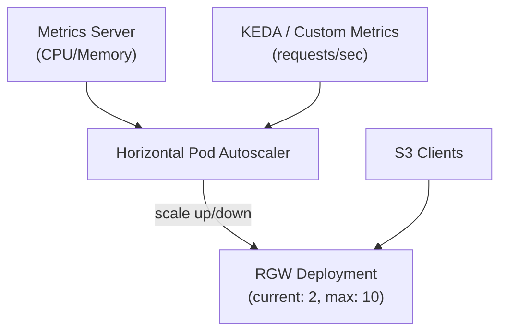

# How to Configure Rook-Ceph Horizontal Pod Autoscaling

Author: [nawazdhandala](https://www.github.com/nawazdhandala)

Tags: Rook, Ceph, Kubernetes, HPA, Autoscaling, RGW, MDS, Storage

Description: Configure Horizontal Pod Autoscaling for Rook-Ceph RGW gateways and MDS daemons to automatically scale based on CPU, memory, and custom storage metrics.

---

## How HPA Works with Rook-Ceph

Rook-Ceph supports Horizontal Pod Autoscaling for two key scalable components: RGW (RadosGW) object store gateways and MDS (Metadata Server) daemons for CephFS. When traffic increases, HPA adds more RGW instances to handle S3 API requests. Similarly, when CephFS metadata operations spike, HPA can scale the active MDS count.



## Prerequisites

- Rook-Ceph cluster with at least one CephObjectStore or CephFilesystem
- Kubernetes Metrics Server installed
- Prometheus and KEDA (optional, for custom metric scaling)

Install the Metrics Server:

```bash
kubectl apply -f https://github.com/kubernetes-sigs/metrics-server/releases/latest/download/components.yaml
```

## Step 1 - Configure RGW with Multiple Instances

First, configure the object store to support multiple gateway instances:

```yaml
apiVersion: ceph.rook.io/v1
kind: CephObjectStore
metadata:
  name: my-store
  namespace: rook-ceph
spec:
  metadataPool:
    replicated:
      size: 3
  dataPool:
    replicated:
      size: 3
  gateway:
    port: 80
    instances: 2
    resources:
      requests:
        cpu: "500m"
        memory: "1Gi"
      limits:
        cpu: "2"
        memory: "2Gi"
    priorityClassName: system-cluster-critical
```

The `instances` field sets the baseline number of RGW pods. HPA will scale above this based on load.

## Step 2 - Create HPA for RGW

After the RGW deployment is created by Rook, attach an HPA to it. The RGW deployment name follows the pattern `rook-ceph-rgw-<storename>-<zone>`:

```bash
kubectl -n rook-ceph get deployment | grep rgw
```

Create an HPA based on CPU utilization:

```yaml
apiVersion: autoscaling/v2
kind: HorizontalPodAutoscaler
metadata:
  name: rook-ceph-rgw-hpa
  namespace: rook-ceph
spec:
  scaleTargetRef:
    apiVersion: apps/v1
    kind: Deployment
    name: rook-ceph-rgw-my-store-a
  minReplicas: 2
  maxReplicas: 10
  metrics:
    - type: Resource
      resource:
        name: cpu
        target:
          type: Utilization
          averageUtilization: 70
    - type: Resource
      resource:
        name: memory
        target:
          type: Utilization
          averageUtilization: 80
  behavior:
    scaleUp:
      stabilizationWindowSeconds: 60
      policies:
        - type: Pods
          value: 2
          periodSeconds: 60
    scaleDown:
      stabilizationWindowSeconds: 300
      policies:
        - type: Pods
          value: 1
          periodSeconds: 120
```

Apply:

```bash
kubectl apply -f rgw-hpa.yaml
```

## Step 3 - Monitor HPA Status

Watch the HPA in action:

```bash
kubectl -n rook-ceph get hpa rook-ceph-rgw-hpa -w
```

Check current replica count and metric values:

```bash
kubectl -n rook-ceph describe hpa rook-ceph-rgw-hpa
```

## Step 4 - Create HPA for MDS (CephFS Metadata Server)

MDS daemons serve CephFS metadata requests. Scale the active MDS count based on load.

First, check the MDS deployment name:

```bash
kubectl -n rook-ceph get deployment | grep mds
```

Create an HPA for MDS:

```yaml
apiVersion: autoscaling/v2
kind: HorizontalPodAutoscaler
metadata:
  name: rook-ceph-mds-hpa
  namespace: rook-ceph
spec:
  scaleTargetRef:
    apiVersion: apps/v1
    kind: Deployment
    name: rook-ceph-mds-myfs-a
  minReplicas: 1
  maxReplicas: 4
  metrics:
    - type: Resource
      resource:
        name: cpu
        target:
          type: Utilization
          averageUtilization: 75
```

## Step 5 - Custom Metrics HPA with KEDA

For more precise scaling based on Ceph-specific metrics (like RGW requests per second), use KEDA with Prometheus.

Install KEDA:

```bash
helm install keda kedacore/keda --namespace keda --create-namespace
```

Create a ScaledObject for RGW based on requests per second from Prometheus:

```yaml
apiVersion: keda.sh/v1alpha1
kind: ScaledObject
metadata:
  name: rgw-scaled-object
  namespace: rook-ceph
spec:
  scaleTargetRef:
    name: rook-ceph-rgw-my-store-a
  minReplicaCount: 2
  maxReplicaCount: 10
  cooldownPeriod: 120
  triggers:
    - type: prometheus
      metadata:
        serverAddress: http://prometheus-operated.monitoring.svc:9090
        metricName: rgw_requests_total
        query: |
          sum(rate(ceph_rgw_req[5m]))
        threshold: "500"
```

This scales RGW up when the total request rate exceeds 500 requests/second (adjustable per your traffic patterns).

## Step 6 - Prevent Rook from Overriding HPA

By default, Rook reconciles the `instances` count in the CephObjectStore spec. To prevent Rook from overriding the HPA-managed replica count, set the `instances` in the CephObjectStore to the minimum value (HPA minimum) and let HPA manage scaling above that:

```yaml
spec:
  gateway:
    instances: 2
```

Rook sets the desired replica count based on `instances`, but HPA modifies it. The next reconciliation by Rook resets replicas to `instances`. To avoid this conflict, set `instances` in the CephObjectStore to match HPA's `minReplicas`.

## Testing HPA Scaling

Generate load on the RGW to trigger autoscaling:

```bash
kubectl run load-gen --rm -it --image=alpine -- \
  sh -c "apk add curl && while true; do curl -s http://rook-ceph-rgw-my-store.rook-ceph.svc/; done"
```

Watch pods scale up:

```bash
kubectl -n rook-ceph get pods -l app=rook-ceph-rgw -w
```

## Summary

Rook-Ceph RGW and MDS support Horizontal Pod Autoscaling by attaching an HPA to the Rook-managed Deployments. For CPU/memory-based scaling, use standard Kubernetes HPA with the Metrics Server. For custom metric scaling (RGW requests/sec, IOPS, etc.), use KEDA with Prometheus as the metrics source. Set the CephObjectStore `instances` to match HPA's minimum replica count to prevent Rook reconciliation from overriding the HPA-adjusted replica count.
