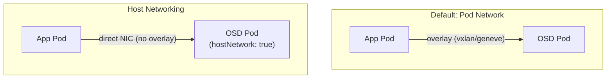

# How to Set Up Host Networking for Rook-Ceph

Author: [nawazdhandala](https://www.github.com/nawazdhandala)

Tags: Rook, Ceph, Kubernetes, Network, Storage, Performance

Description: Configure Rook-Ceph to use host networking, bypassing the Kubernetes pod network for direct NIC access, improving storage throughput and reducing latency on bare-metal clusters.

---

## Why Use Host Networking for Ceph

By default, Rook-Ceph pods use the Kubernetes pod network (CNI overlay). Host networking bypasses the overlay and directly uses the node's network interfaces. This provides:

- Lower latency (no overlay encapsulation)
- Higher throughput (no iptables/overlay overhead)
- Stable IP addresses (Ceph Mon IPs match the node IPs)
- Simplified network debugging

Host networking is strongly recommended for bare-metal clusters with dedicated storage NICs.



## Enabling Host Networking

Configure `network.provider: host` in the CephCluster spec:

```yaml
apiVersion: ceph.rook.io/v1
kind: CephCluster
metadata:
  name: rook-ceph
  namespace: rook-ceph
spec:
  cephVersion:
    image: quay.io/ceph/ceph:v19.2.0
  dataDirHostPath: /var/lib/rook
  network:
    provider: host
  mon:
    count: 3
    allowMultiplePerNode: false
  storage:
    useAllNodes: false
    useAllDevices: false
    nodes:
      - name: storage-node-1
        devices:
          - name: sdb
      - name: storage-node-2
        devices:
          - name: sdb
      - name: storage-node-3
        devices:
          - name: sdb
```

## Combining Host Networking with CIDR Ranges

When using host networking, all node IPs are reachable. Specify which network interfaces Ceph should use for public (client-facing) and cluster (replication) traffic:

```yaml
spec:
  network:
    provider: host
    addressRanges:
      public:
        - 10.10.1.0/24
      cluster:
        - 10.10.2.0/24
```

Ceph will bind Mon and OSD public addresses to NICs with IPs in `10.10.1.0/24` and OSD cluster addresses to NICs in `10.10.2.0/24`.

## Port Considerations with Host Networking

With `hostNetwork: true`, Ceph daemons bind to node ports directly. Ensure these ports are not used by other services on the node:

| Daemon | Default Ports |
|---|---|
| Mon | 6789 (v1), 3300 (v2/msgr2) |
| OSD | 6800-7300 (range) |
| MGR Dashboard | 8443 |
| MGR Metrics | 9283 |
| RGW | 80 or 8080 |

Check for port conflicts:

```bash
ss -tlnp | grep -E "6789|3300|6800|8443|9283"
```

## DNS Considerations

With host networking, Mon DNS names resolve to node IPs rather than pod IPs. If your cluster uses internal DNS that maps to pod IPs, Mon connectivity may break when Mons move between nodes.

To avoid DNS issues, use IP-based Mon addressing by not relying on pod DNS for Ceph client configuration. The `rook-ceph-mon-endpoints` ConfigMap is updated by Rook automatically with current Mon IPs:

```bash
kubectl -n rook-ceph get configmap rook-ceph-mon-endpoints -o yaml
```

## Verifying Host Networking

After applying the configuration, check that OSD pods use host networking:

```bash
kubectl -n rook-ceph get pod rook-ceph-osd-0-<hash> \
  -o jsonpath='{.spec.hostNetwork}'
# Expected: true
```

Verify Ceph Mon addresses are node IPs (not overlay IPs):

```bash
kubectl -n rook-ceph exec -it deploy/rook-ceph-tools -- ceph mon dump | grep addr
```

The addresses should be in your node IP range, not the pod CIDR.

## Network Policy Restrictions

Network policies applied to the `rook-ceph` namespace do not affect host-networked pods in the same way as overlay-networked pods. Host-networked traffic bypasses Kubernetes network policy enforcement by most CNI implementations.

For security on host-networked clusters, use node-level firewall rules:

```bash
# Allow Ceph traffic only from storage network
iptables -A INPUT -s 10.10.1.0/24 -p tcp --dport 6789 -j ACCEPT
iptables -A INPUT -s 10.10.2.0/24 -p tcp --dport 6800:7300 -j ACCEPT
```

## Summary

Host networking for Rook-Ceph is enabled with `network.provider: host` in the CephCluster spec. It routes Ceph traffic directly over the node's NICs, bypassing the overlay network for lower latency and higher throughput. Use `network.addressRanges` to bind Ceph public and cluster traffic to specific NICs. Ensure Ceph ports (6789, 3300, 6800-7300) are not conflicting with other services on the nodes, and use firewall rules for network security since Kubernetes NetworkPolicies do not apply to host-networked pods.
