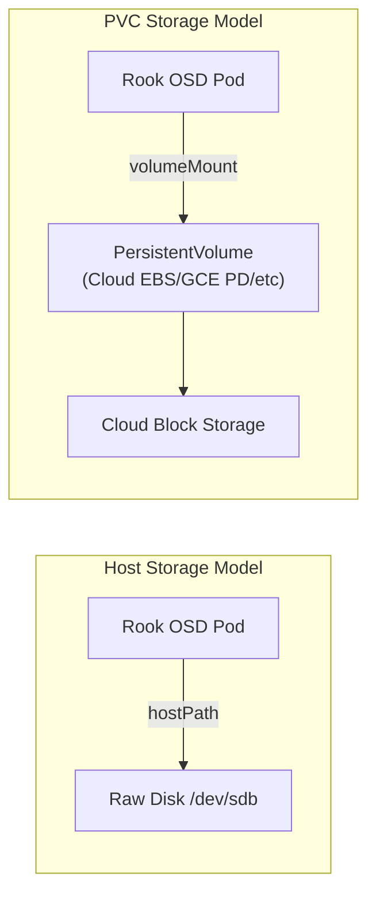

# How to Choose Between Host Storage and PVC Storage in Rook

Author: [nawazdhandala](https://www.github.com/nawazdhandala)

Tags: Rook, Ceph, Kubernetes, Storage, Architecture, PVC

Description: Compare Rook-Ceph host storage clusters using raw block devices against PVC storage clusters using cloud provisioners to choose the right model for your environment.

---

## Two Storage Models in Rook-Ceph

Rook supports two fundamentally different ways to provide OSD and Mon backing storage:

1. **Host storage** - Rook accesses raw block devices directly on the host node using hostPath volumes
2. **PVC storage** - Rook provisions PVCs through a Kubernetes StorageClass and mounts them into OSD pods

Both models produce the same Ceph cluster functionality; the difference is how Rook acquires the physical disk space.



## Host Storage Model

### Configuration

```yaml
spec:
  storage:
    useAllNodes: false
    useAllDevices: false
    nodes:
      - name: node-1
        devices:
          - name: sdb
          - name: sdc
      - name: node-2
        devices:
          - name: sdb
          - name: sdc
```

### When to Use Host Storage

- Bare-metal Kubernetes clusters with dedicated storage hardware
- High-performance workloads where kernel-level disk access matters
- Environments where you control node hardware and disk assignment
- Lowest latency requirements (no abstraction layers between Ceph and disk)

### Advantages

- Maximum performance - direct device access
- No dependency on a pre-existing StorageClass
- Works with any Linux block device (NVMe, SAS, SATA, LVM, loop)
- OSDs pinned to specific nodes and disks - predictable placement

### Disadvantages

- Manual disk preparation required on each node
- Disks cannot be moved between nodes without manual intervention
- Cloud VMs rarely have spare raw block devices
- Scaling requires physically attaching new disks to nodes

## PVC Storage Model

### Configuration

```yaml
spec:
  mon:
    volumeClaimTemplate:
      spec:
        storageClassName: gp3
        resources:
          requests:
            storage: 10Gi
  storage:
    storageClassDeviceSets:
      - name: set1
        count: 3
        portable: true
        volumeClaimTemplates:
          - metadata:
              name: data
            spec:
              resources:
                requests:
                  storage: 100Gi
              storageClassName: gp3
              volumeMode: Block
              accessModes:
                - ReadWriteOnce
```

### When to Use PVC Storage

- Managed cloud clusters (EKS, GKE, AKS, DigitalOcean)
- Environments where worker nodes have no spare raw disks
- When you want Kubernetes to manage disk lifecycle (automatic deletion with PVC)
- Multi-zone deployments where `portable: true` allows scheduler flexibility

### Advantages

- Works on any Kubernetes cluster with a block-capable StorageClass
- Disks are portable across nodes (when `portable: true`)
- Scaling is as simple as incrementing `count`
- Cloud provider handles disk lifecycle (snapshots, expansion, deletion)

### Disadvantages

- Additional cost from cloud block storage provisioning
- Performance depends on the cloud StorageClass (gp2 vs. gp3 vs. io2)
- Requires a working block-mode StorageClass

## Comparison Table

| Criteria | Host Storage | PVC Storage |
|---|---|---|
| Environment | Bare metal | Cloud / managed K8s |
| Disk access | Raw device | Cloud block volume |
| Performance | Highest | Cloud StorageClass-dependent |
| Scaling | Manual disk attachment | Increment `count` |
| Node portability | Pinned to node | Portable (if `portable: true`) |
| Setup complexity | Disk wipe required | StorageClass setup required |
| OSD node binding | Fixed | Flexible |

## Hybrid: Host Nodes with PVC Monitors

You can mix models by using raw host devices for OSD data while using PVC-backed volumes for Mon state:

```yaml
spec:
  mon:
    count: 3
    volumeClaimTemplate:
      spec:
        storageClassName: gp3
        resources:
          requests:
            storage: 10Gi
  storage:
    useAllNodes: false
    useAllDevices: false
    nodes:
      - name: baremetal-1
        devices:
          - name: nvme0n1
```

This is useful on hybrid clusters where Mon state benefits from cloud disk durability but OSDs run on local NVMe for IOPS.

## Summary

Choose host storage when running on bare metal with dedicated OSD disks and when maximum performance is required. Choose PVC storage when running on cloud-managed Kubernetes clusters where nodes have no raw block devices, or when you want Kubernetes to manage the disk lifecycle. The PVC model is more portable and simpler to scale but adds a cloud storage cost and relies on the StorageClass for performance. Both models support the full Ceph feature set, including block, filesystem, and object storage.
