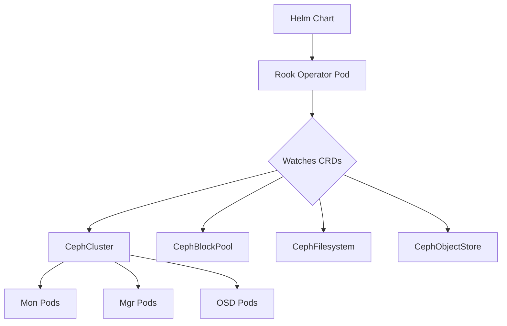

# How to Install the Rook Operator on Kubernetes Using Helm

Author: [nawazdhandala](https://www.github.com/nawazdhandala)

Tags: Rook, Ceph, Kubernetes, Helm, Operator, Storage

Description: Step-by-step guide to installing the Rook operator on a Kubernetes cluster using Helm charts, covering chart configuration and operator verification.

---

## How the Rook Operator Works

Rook is a cloud-native storage orchestrator for Kubernetes. The Rook operator is a controller that watches for Rook custom resources and translates them into running Ceph components. When you install the Rook operator via Helm, it deploys a pod that continuously reconciles CephCluster, CephBlockPool, CephFilesystem, and other custom resources.

The operator itself does not run Ceph - it manages Ceph daemons as Kubernetes workloads. This means all Ceph monitors, managers, OSDs, and gateways run as pods inside your cluster.



## Prerequisites

Before installing the Rook operator, ensure the following conditions are met:

- Kubernetes 1.22 or later
- Helm 3.x installed on your local machine
- `kubectl` configured and pointing at your target cluster
- Cluster admin permissions (the operator needs cluster-wide RBAC)
- At least three nodes recommended for production (one is sufficient for testing)

Verify your Kubernetes version and Helm installation:

```bash
kubectl version --short
helm version --short
```

## Adding the Rook Helm Repository

Add the official Rook Helm repository and update your local chart cache:

```bash
helm repo add rook-release https://charts.rook.io/release
helm repo update
```

Confirm the repository was added and check available chart versions:

```bash
helm search repo rook-release --versions | head -10
```

## Installing the Rook-Ceph Operator Chart

The Rook operator is distributed as the `rook-ceph` Helm chart. Install it into its own namespace:

```bash
helm install --create-namespace \
  --namespace rook-ceph \
  rook-ceph rook-release/rook-ceph \
  --version v1.14.0
```

This creates the `rook-ceph` namespace, installs all CRDs, creates the necessary RBAC resources, and starts the operator pod.

## Customizing Operator Values

You can override default values by creating a custom values file. The most common customizations include enabling monitoring and setting resource limits.

Create a `values-operator.yaml` file:

```yaml
# values-operator.yaml
image:
  tag: v1.14.0

monitoring:
  # Enable Prometheus ServiceMonitor for the operator
  enabled: true

logLevel: INFO

resources:
  requests:
    cpu: 100m
    memory: 128Mi
  limits:
    cpu: 500m
    memory: 512Mi

# Allow the operator to run on control-plane nodes if needed
tolerations:
  - key: node-role.kubernetes.io/control-plane
    operator: Exists
    effect: NoSchedule
```

Apply the custom values during installation:

```bash
helm install --create-namespace \
  --namespace rook-ceph \
  rook-ceph rook-release/rook-ceph \
  --version v1.14.0 \
  -f values-operator.yaml
```

## Verifying the Operator Installation

After installation, verify that the operator pod is running:

```bash
kubectl -n rook-ceph get pods
```

Expected output showing the operator in a Running state:

```text
NAME                                  READY   STATUS    RESTARTS   AGE
rook-ceph-operator-7d6f8b9c4d-xk2pq   1/1     Running   0          2m
```

Check that all Rook CRDs were installed:

```bash
kubectl get crds | grep ceph.rook.io
```

You should see CRDs for all Ceph resource types:

```text
cephblockpoolradosnamespaces.ceph.rook.io
cephblockpools.ceph.rook.io
cephbucketnotifications.ceph.rook.io
cephbuckettopics.ceph.rook.io
cephclients.ceph.rook.io
cephclusters.ceph.rook.io
cephfilesystemmirrors.ceph.rook.io
cephfilesystems.ceph.rook.io
cephfilesystemsubvolumegroups.ceph.rook.io
cephobjectrealms.ceph.rook.io
cephobjectstores.ceph.rook.io
cephobjectstoreusers.ceph.rook.io
cephobjectzonegroups.ceph.rook.io
cephobjectzones.ceph.rook.io
cephrbdmirrors.ceph.rook.io
```

Inspect the operator logs to confirm it started cleanly:

```bash
kubectl -n rook-ceph logs deployment/rook-ceph-operator --tail=50
```

## Upgrading the Operator

To upgrade the operator to a new version, update the Helm release:

```bash
helm repo update
helm upgrade --namespace rook-ceph rook-ceph rook-release/rook-ceph --version v1.15.0
```

Always check the Rook upgrade documentation before upgrading, as some versions require specific migration steps.

## Uninstalling the Operator

To remove the operator without deleting cluster data, first delete any CephCluster resources, then uninstall the Helm release:

```bash
# Remove the cluster first (this triggers OSD and mon cleanup)
kubectl -n rook-ceph delete cephcluster rook-ceph

# Wait for the cluster to be fully deleted
kubectl -n rook-ceph get pods

# Then uninstall the operator
helm uninstall --namespace rook-ceph rook-ceph
```

## Summary

Installing the Rook operator via Helm is straightforward: add the Rook Helm repository, install the `rook-ceph` chart into a dedicated namespace, and verify the operator pod is running along with all required CRDs. The operator itself is lightweight - it only begins creating Ceph workloads after you define a CephCluster custom resource. Using a custom values file lets you control resource limits, enable Prometheus monitoring, and configure tolerations so the operator can be scheduled on any node in your cluster.
