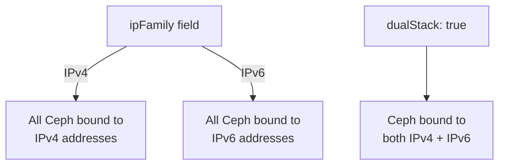

# How to Enable IPv4, IPv6, or Dual-Stack Networking in Rook-Ceph

Author: [nawazdhandala](https://www.github.com/nawazdhandala)

Tags: Rook, Ceph, Kubernetes, Network, IPv6, Storage

Description: Configure Rook-Ceph to use IPv4-only, IPv6-only, or dual-stack networking using the ipFamily and dualStack fields in the CephCluster network spec.

---

## IP Family Options in Rook-Ceph

Rook supports three IP family configurations for the Ceph network:

1. **IPv4** (default) - All Ceph addresses use IPv4
2. **IPv6** - All Ceph addresses use IPv6
3. **Dual-Stack** - Ceph binds to both IPv4 and IPv6 addresses

The `network.ipFamily` and `network.dualStack` fields in the CephCluster spec control this behavior.



## IPv4 (Default)

No special configuration is needed for IPv4. This is the implicit default:

```yaml
apiVersion: ceph.rook.io/v1
kind: CephCluster
metadata:
  name: rook-ceph
  namespace: rook-ceph
spec:
  cephVersion:
    image: quay.io/ceph/ceph:v19.2.0
  dataDirHostPath: /var/lib/rook
  network:
    provider: host
    ipFamily: IPv4
    addressRanges:
      public:
        - 10.10.1.0/24
      cluster:
        - 10.10.2.0/24
```

## IPv6 Configuration

For a pure IPv6 deployment, set `ipFamily: IPv6`:

```yaml
spec:
  network:
    provider: host
    ipFamily: IPv6
    addressRanges:
      public:
        - fd00:10::/64
      cluster:
        - fd00:20::/64
```

Prerequisites for IPv6:
- All Kubernetes nodes must have IPv6 addresses assigned
- Your CNI plugin must support IPv6
- The Kubernetes API server must be reachable over IPv6

Verify node IPv6 addresses:

```bash
kubectl get nodes -o jsonpath='{range .items[*]}{.metadata.name} {.status.addresses[*].address}{"\n"}{end}'
```

## Dual-Stack Configuration

For dual-stack, set `dualStack: true`. The `ipFamily` field should still be set to indicate the primary family:

```yaml
spec:
  network:
    provider: host
    ipFamily: IPv4
    dualStack: true
    addressRanges:
      public:
        - 10.10.1.0/24
        - fd00:10::/64
      cluster:
        - 10.10.2.0/24
        - fd00:20::/64
```

Ceph will bind Mon and OSD sockets to both IPv4 and IPv6 addresses, allowing clients using either protocol to connect.

## Kernel Requirements for IPv6

IPv6 CephFS kernel client requires kernel 5.11+ for Msgr2 with IPv6 support. For older kernels, use the FUSE-based CephFS client instead.

Check IPv6 connectivity on nodes:

```bash
ping6 -c 3 fd00:10::1
# Or with ip tool:
ip -6 addr show
```

## Verifying IP Family Configuration

After deploying, check Mon addresses:

```bash
kubectl -n rook-ceph exec -it deploy/rook-ceph-tools -- ceph mon dump
```

For IPv6, Mon addresses appear as:
```yaml
v2:[fd00:10::11]:3300/0
v1:[fd00:10::11]:6789/0
```

For dual-stack, you see both:
```yaml
v2:10.10.1.11:3300/0
v2:[fd00:10::11]:3300/0
```

## Client Configuration for IPv6

If clients connect over IPv6, ensure the Ceph CSI driver is also configured with IPv6. Check the Rook operator ConfigMap:

```bash
kubectl -n rook-ceph get configmap rook-ceph-operator-config -o yaml | grep -i ipv6
```

Update if needed:

```bash
kubectl -n rook-ceph patch configmap rook-ceph-operator-config \
  --type merge \
  -p '{"data":{"CSI_FORCE_CEPHFS_KERNEL_CLIENT":"false"}}'
```

For IPv6 CSI mounts, the FUSE client may be more reliable than the kernel client on older kernels.

## Summary

Configure Rook-Ceph IP family via `network.ipFamily` (IPv4 or IPv6) and `network.dualStack: true` for dual-stack deployments. Pair with `network.addressRanges` to specify the IPv6 or dual-stack CIDRs for public and cluster networks. Pure IPv6 requires all nodes to have IPv6 addresses and a compatible CNI. Dual-stack allows clients using either protocol to connect. Verify the configuration by checking Mon dump addresses for the expected protocol format.
