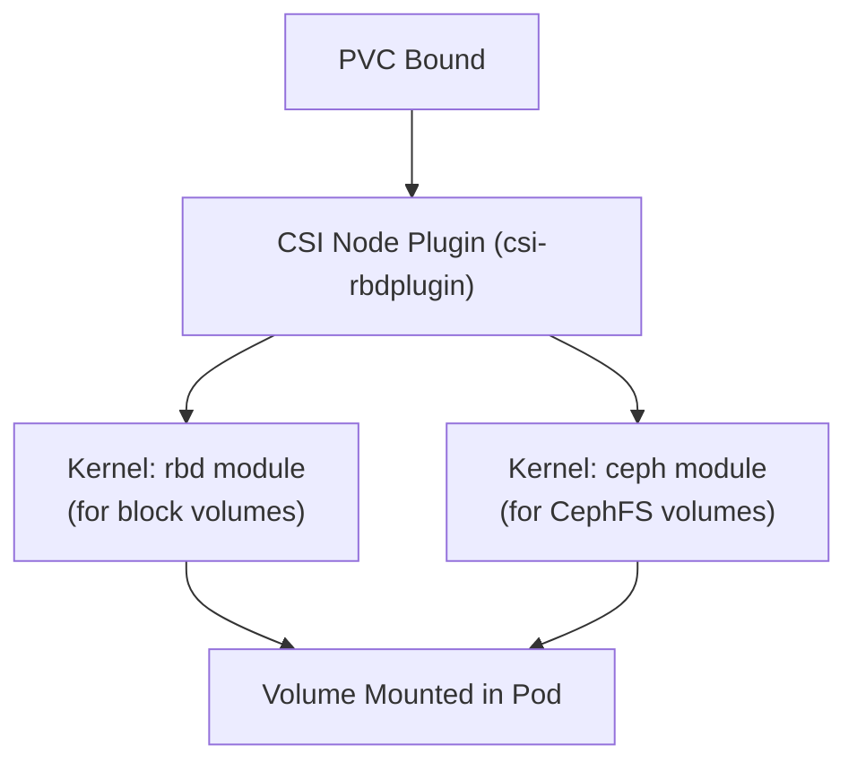

# How to Check Kernel Requirements for Rook-Ceph (RBD and CephFS)

Author: [nawazdhandala](https://www.github.com/nawazdhandala)

Tags: Rook, Ceph, Kubernetes, Storage, Kernel, RBD, CephFS

Description: Verify Linux kernel module requirements for Rook-Ceph, including RBD and CephFS kernel modules, minimum kernel versions, and how to load missing modules on worker nodes.

---

## Why Kernel Modules Matter for Rook-Ceph

Rook-Ceph's CSI drivers use kernel modules to map and mount storage volumes on Kubernetes worker nodes. Without these modules, PVC provisioning will succeed but pods will fail to start because the node cannot mount the volume.



## Minimum Kernel Versions

| Feature | Minimum Kernel Version |
|---|---|
| RBD (block) | 3.10+ (older Ceph features), 4.17+ (full feature set) |
| CephFS kernel client | 4.1+ |
| CephFS encryption | 5.4+ |
| RBD encryption | 5.4+ |
| Msgr2 protocol | 5.11+ (for kernel CephFS) |
| CephFS snapshot | 5.2+ |

For production use, kernel 5.4 LTS or newer is strongly recommended.

## Step 1 - Check the Running Kernel Version

On each Kubernetes worker node:

```bash
uname -r
```

Or check from inside a pod:

```bash
kubectl run kernel-check --rm -it --image=busybox --restart=Never -- \
  uname -r
```

Verify against the minimum version table above.

## Step 2 - Check RBD Module

The `rbd` module enables Rook CSI to map Ceph block images as device files on the node.

Check if the module is loaded:

```bash
lsmod | grep rbd
```

If not loaded, load it:

```bash
modprobe rbd
```

Verify it loaded:

```bash
lsmod | grep rbd
# Expected output: rbd    <size>    0
```

To make the module persist across reboots:

```bash
echo "rbd" > /etc/modules-load.d/rook-ceph.conf
```

## Step 3 - Check CephFS Module

The `ceph` kernel module is required for CephFS volume mounts using the kernel client.

```bash
lsmod | grep ceph
```

Load if absent:

```bash
modprobe ceph
```

Persist across reboots:

```bash
echo "ceph" >> /etc/modules-load.d/rook-ceph.conf
```

## Step 4 - Check NBD Module (Optional)

The `nbd` (Network Block Device) module is required when using Ceph mirroring with NBD-based RBD mirrors or when `cephObjectStore` uses NBD. It is not required for standard PVC workloads.

```bash
lsmod | grep nbd
modprobe nbd
```

## Step 5 - Verify from a Running Cluster

Use the Rook toolbox to verify the modules are visible from within the cluster:

```bash
kubectl -n rook-ceph exec -it deploy/rook-ceph-tools -- bash
```

Inside the toolbox:

```bash
# Check RBD kernel features
rbd feature disable replicapool/test-image deep-flatten
# If this fails with "feature not supported", the kernel lacks RBD feature support
```

Check supported RBD features:

```bash
rbd info replicapool/<your-image-name> | grep features
```

## Step 6 - Disable Unsupported RBD Features

If your kernel is older (pre-4.17), some RBD image features are not supported. Disable them in the StorageClass:

```yaml
apiVersion: storage.k8s.io/v1
kind: StorageClass
metadata:
  name: rook-ceph-block
provisioner: rook-ceph.rbd.csi.ceph.com
parameters:
  clusterID: rook-ceph
  pool: replicapool
  imageFormat: "2"
  imageFeatures: layering
```

The `imageFeatures: layering` value uses only the `layering` feature, which is supported on all kernels from 3.10+. Avoid `exclusive-lock`, `object-map`, and `fast-diff` on older kernels.

## Common Kernel Module Errors

If a pod fails to mount a PVC with:

```text
MountVolume.MountDevice failed for volume ... rbd: map failed
```

Check dmesg on the affected node:

```bash
dmesg | grep -i rbd | tail -20
```

If you see:

```yaml
rbd: module not found
```

The `rbd` kernel module is not installed. On Ubuntu:

```bash
apt-get install -y linux-modules-extra-$(uname -r)
```

On RHEL/CentOS:

```bash
dnf install -y kernel-modules-extra
```

## Summary

Rook-Ceph requires the `rbd` kernel module for block (RBD) PVC mounts and the `ceph` kernel module for CephFS PVC mounts on every Kubernetes worker node. Kernel 5.4 LTS or newer is recommended for full feature support including encryption and snapshots. Load missing modules with `modprobe` and persist them via `/etc/modules-load.d/rook-ceph.conf`. For older kernels, restrict RBD image features to `layering` only in the StorageClass to avoid mount failures.
