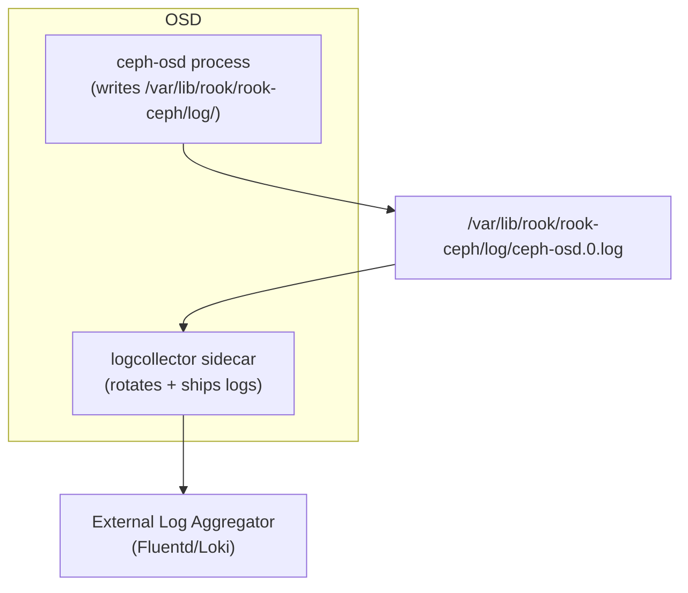

# How to Configure Log Collection Settings in Rook-Ceph

Author: [nawazdhandala](https://www.github.com/nawazdhandala)

Tags: Rook, Ceph, Kubernetes, Storage, Logging, Diagnostics

Description: Configure log collection in Rook-Ceph using the logCollector spec, set log rotation periodicity and size limits, and integrate with external log aggregation systems.

---

## Rook-Ceph Log Collection Overview

Rook-Ceph provides a `logCollector` feature that runs a sidecar container alongside each Ceph daemon pod. The sidecar captures Ceph daemon log files from the `dataDirHostPath` and manages rotation based on size and time period. This is distinct from container stdout logs captured by kubelet.



## Configuring the Log Collector

Enable log collection in the CephCluster spec:

```yaml
apiVersion: ceph.rook.io/v1
kind: CephCluster
metadata:
  name: rook-ceph
  namespace: rook-ceph
spec:
  cephVersion:
    image: quay.io/ceph/ceph:v19.2.0
  dataDirHostPath: /var/lib/rook
  logCollector:
    enabled: true
    periodicity: daily
    maxLogSize: 500M
```

## periodicity Options

The `periodicity` field controls how often log rotation occurs:

| Value | Rotation Interval |
|---|---|
| `hourly` | Every hour |
| `daily` | Once per day (recommended) |
| `weekly` | Once per week |
| `monthly` | Once per month |

For high-volume clusters with verbose logging, use `hourly` or set a `maxLogSize` limit.

## maxLogSize Field

`maxLogSize` sets the maximum size of a log file before rotation is triggered regardless of the periodicity schedule. Accepts standard size suffixes:

```yaml
logCollector:
  enabled: true
  periodicity: daily
  maxLogSize: 1G
```

Valid values: `500M`, `1G`, `2G`, etc.

## Disabling Log Collection

If you use a node-level log agent (Fluent Bit DaemonSet, filebeat) that reads directly from `dataDirHostPath`, you may prefer to disable the built-in log collector:

```yaml
spec:
  logCollector:
    enabled: false
```

## Viewing Ceph Daemon Logs

Access daemon logs via the Ceph pods directly:

```bash
# OSD logs
OSD_POD=$(kubectl -n rook-ceph get pods -l app=rook-ceph-osd -o name | head -1)
kubectl -n rook-ceph logs $OSD_POD -c osd --tail=100

# Mon logs
MON_POD=$(kubectl -n rook-ceph get pods -l app=rook-ceph-mon -o name | head -1)
kubectl -n rook-ceph logs $MON_POD -c mon --tail=100
```

Or from the hostPath directly on the node:

```bash
ls /var/lib/rook/rook-ceph/log/
tail -f /var/lib/rook/rook-ceph/log/ceph-osd.0.log
```

## Increasing Ceph Log Verbosity

For debugging, increase log levels via the toolbox:

```bash
kubectl -n rook-ceph exec -it deploy/rook-ceph-tools -- \
  ceph config set osd debug_osd 10

# Reset to default after debugging
kubectl -n rook-ceph exec -it deploy/rook-ceph-tools -- \
  ceph config set osd debug_osd 0/5
```

## Shipping Logs to an External Aggregator

Deploy a Fluent Bit DaemonSet to forward logs from `/var/lib/rook/rook-ceph/log/` to your log aggregation system:

```yaml
apiVersion: v1
kind: ConfigMap
metadata:
  name: fluent-bit-ceph-config
  namespace: logging
data:
  fluent-bit.conf: |
    [INPUT]
        Name        tail
        Path        /var/lib/rook/rook-ceph/log/*.log
        Tag         ceph.*
        DB          /tmp/flb_ceph.db
        Mem_Buf_Limit 5MB

    [OUTPUT]
        Name        loki
        Match       ceph.*
        Host        loki.monitoring.svc.cluster.local
        Port        3100
        Labels      job=ceph,cluster=rook-ceph
```

Mount the log directory into the Fluent Bit DaemonSet:

```yaml
volumes:
  - name: ceph-logs
    hostPath:
      path: /var/lib/rook/rook-ceph/log
volumeMounts:
  - name: ceph-logs
    mountPath: /var/lib/rook/rook-ceph/log
    readOnly: true
```

## Summary

Enable log collection in the CephCluster spec with `logCollector.enabled: true`, set a `periodicity` (hourly, daily, weekly) for log rotation, and configure `maxLogSize` to bound log file growth. The log collector runs as a sidecar in each Ceph daemon pod and manages files in the `dataDirHostPath/log` directory. For centralized log management, use a Fluent Bit DaemonSet to tail the Ceph log directory and forward logs to Loki or Elasticsearch.
