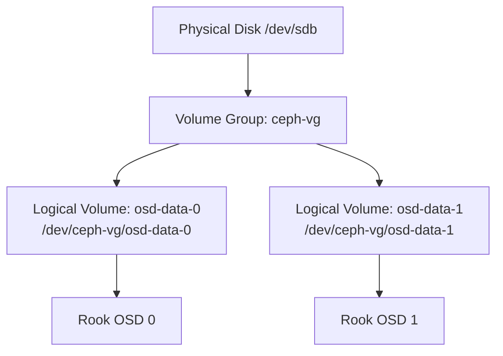

# How to Use LVM Logical Volumes with Rook-Ceph

Author: [nawazdhandala](https://www.github.com/nawazdhandala)

Tags: Rook, Ceph, Kubernetes, Storage, LVM, OSD

Description: Configure Rook-Ceph to provision OSDs on LVM logical volumes, covering LVM preparation, device path configuration, and metadata volume separation.

---

## Why Use LVM with Rook-Ceph

LVM (Logical Volume Manager) lets you carve physical disks into logical volumes before handing them to Rook-Ceph as OSD backing devices. This is useful when raw disks are shared across workloads, when you want to pre-allocate a fixed size for Ceph from a larger disk, or when your nodes already use LVM for the OS and you want to add extra logical volumes for storage.



## Step 1 - Prepare the Physical Volume and Volume Group

On each storage node, initialize the disk as an LVM physical volume and create a volume group:

```bash
# Wipe existing data
wipefs -a /dev/sdb

# Create physical volume
pvcreate /dev/sdb

# Create volume group
vgcreate ceph-vg /dev/sdb

# Verify
pvs
vgs
```

## Step 2 - Create Logical Volumes for OSDs

Create one logical volume per OSD you want Rook to manage. Leave free space in the VG if you want room to grow:

```bash
# Create an 80 GB logical volume for OSD data
lvcreate -n osd-data-0 -L 80G ceph-vg

# Create a second OSD LV if multiple OSDs per node
lvcreate -n osd-data-1 -L 80G ceph-vg

# List the LVs
lvs -o lv_name,lv_path,lv_size ceph-vg
```

The resulting devices will be at paths like `/dev/ceph-vg/osd-data-0`.

## Step 3 - Wipe the Logical Volumes

Rook requires devices to have no existing filesystem or partition table:

```bash
wipefs -a /dev/ceph-vg/osd-data-0
wipefs -a /dev/ceph-vg/osd-data-1

# Confirm clean
blkid /dev/ceph-vg/osd-data-0
```

A clean device returns no output from `blkid`.

## Step 4 - Configure CephCluster to Use the LVM Devices

Reference the logical volume device paths explicitly in the CephCluster spec. Use `useAllDevices: false` and list nodes and devices individually:

```yaml
apiVersion: ceph.rook.io/v1
kind: CephCluster
metadata:
  name: rook-ceph
  namespace: rook-ceph
spec:
  cephVersion:
    image: quay.io/ceph/ceph:v19.2.0
  dataDirHostPath: /var/lib/rook
  storage:
    useAllNodes: false
    useAllDevices: false
    nodes:
      - name: storage-node-1
        devices:
          - name: dm-0        # symlink to /dev/ceph-vg/osd-data-0
          - name: dm-1        # symlink to /dev/ceph-vg/osd-data-1
      - name: storage-node-2
        devices:
          - name: dm-0
          - name: dm-1
```

LVM device mapper devices appear as `/dev/dm-N`. To reliably map them, use the full path via the `config` field:

```yaml
    nodes:
      - name: storage-node-1
        devices:
          - name: /dev/ceph-vg/osd-data-0
          - name: /dev/ceph-vg/osd-data-1
```

## Step 5 - Verify OSD Creation

After applying the CephCluster, watch the OSD pods come up:

```bash
kubectl -n rook-ceph get pods -l app=rook-ceph-osd -w
```

Inspect the Rook toolbox to confirm OSDs are in the cluster:

```bash
kubectl -n rook-ceph exec -it deploy/rook-ceph-tools -- ceph osd tree
```

Expected output shows `osd.0`, `osd.1`, etc. with `up in` status.

## Step 6 - Optional - Separate Metadata onto a Fast Device

If you have an SSD and want to place OSD metadata (WAL/DB) on it while data lives on the LV:

```bash
# Create a metadata LV on SSD volume group
vgcreate ssd-vg /dev/nvme0n1
lvcreate -n osd-meta-0 -L 10G ssd-vg
```

Reference both in the CephCluster:

```yaml
    nodes:
      - name: storage-node-1
        devices:
          - name: /dev/ceph-vg/osd-data-0
            config:
              metadataDevice: /dev/ssd-vg/osd-meta-0
```

## Troubleshooting LVM OSD Failures

If OSD pods crash-loop, check the prepare job logs:

```bash
kubectl -n rook-ceph logs -l app=rook-ceph-osd-prepare --tail=50
```

Common issues:

- `LVM2 tools not installed` - Ensure `lvm2` is installed on the host node
- `device or resource busy` - Another process holds the LV open; check with `lsof /dev/ceph-vg/osd-data-0`
- `blkid: device not found` - The device path changed; verify with `lvs`

Ensure the `lvm2` package is installed on the node:

```bash
# Debian/Ubuntu
apt-get install -y lvm2

# RHEL/CentOS
dnf install -y lvm2
```

## Summary

Rook-Ceph can use LVM logical volumes as OSD backing devices by creating a volume group from physical disks, carving out logical volumes sized for each OSD, wiping them clean, and specifying their device paths in the CephCluster `storage.nodes[].devices` list. Use `useAllDevices: false` to prevent Rook from claiming unintended devices. For performance-sensitive workloads, place OSD metadata on a separate SSD-backed logical volume using the `metadataDevice` config option.
