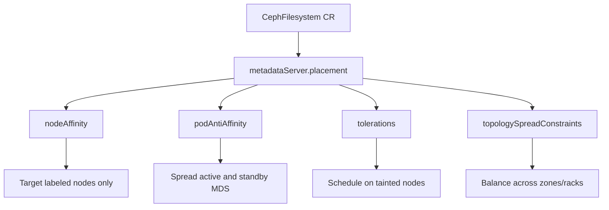

# How to Configure MDS Placement and Affinity in Rook

Author: [nawazdhandala](https://www.github.com/nawazdhandala)

Tags: Rook, Ceph, Kubernetes, MDS, Placement, Affinity, CephFilesystem

Description: Learn how to control MDS daemon scheduling in Rook using node affinity, pod anti-affinity, tolerations, and topology spread constraints.

---

MDS (Metadata Server) daemons handle CephFS metadata operations. Controlling their placement is essential for performance isolation, high availability, and ensuring they land on nodes with sufficient memory.

## Placement Architecture



## Basic Node Affinity

Use node affinity to restrict MDS to nodes labeled for storage workloads:

```yaml
apiVersion: ceph.rook.io/v1
kind: CephFilesystem
metadata:
  name: myfs
  namespace: rook-ceph
spec:
  metadataPool:
    failureDomain: host
    replicated:
      size: 3
  dataPools:
    - name: data0
      failureDomain: host
      replicated:
        size: 3
  preserveFilesystemOnDelete: true
  metadataServer:
    activeCount: 1
    activeStandby: true
    placement:
      nodeAffinity:
        requiredDuringSchedulingIgnoredDuringExecution:
          nodeSelectorTerms:
            - matchExpressions:
                - key: role
                  operator: In
                  values:
                    - storage-node
```

## Pod Anti-Affinity for HA

Prevent active and standby MDS from landing on the same node:

```yaml
apiVersion: ceph.rook.io/v1
kind: CephFilesystem
metadata:
  name: myfs
  namespace: rook-ceph
spec:
  metadataPool:
    failureDomain: host
    replicated:
      size: 3
  dataPools:
    - name: data0
      failureDomain: host
      replicated:
        size: 3
  preserveFilesystemOnDelete: true
  metadataServer:
    activeCount: 1
    activeStandby: true
    placement:
      podAntiAffinity:
        requiredDuringSchedulingIgnoredDuringExecution:
          - labelSelector:
              matchExpressions:
                - key: app
                  operator: In
                  values:
                    - rook-ceph-mds
            topologyKey: kubernetes.io/hostname
```

## Tolerations for Dedicated Nodes

If MDS nodes are tainted, add tolerations:

```yaml
metadataServer:
  activeCount: 1
  activeStandby: true
  placement:
    tolerations:
      - key: storage-only
        operator: Equal
        value: "true"
        effect: NoSchedule
    nodeAffinity:
      requiredDuringSchedulingIgnoredDuringExecution:
        nodeSelectorTerms:
          - matchExpressions:
              - key: storage-only
                operator: In
                values:
                  - "true"
```

## Topology Spread Constraints

Distribute MDS pods across availability zones:

```yaml
metadataServer:
  activeCount: 2
  activeStandby: true
  placement:
    topologySpreadConstraints:
      - maxSkew: 1
        topologyKey: topology.kubernetes.io/zone
        whenUnsatisfiable: DoNotSchedule
        labelSelector:
          matchLabels:
            app: rook-ceph-mds
```

## Combined Full Placement Example

```yaml
apiVersion: ceph.rook.io/v1
kind: CephFilesystem
metadata:
  name: myfs
  namespace: rook-ceph
spec:
  metadataPool:
    failureDomain: host
    replicated:
      size: 3
  dataPools:
    - name: data0
      failureDomain: host
      replicated:
        size: 3
  preserveFilesystemOnDelete: true
  metadataServer:
    activeCount: 2
    activeStandby: true
    resources:
      requests:
        cpu: "1"
        memory: "2Gi"
      limits:
        cpu: "4"
        memory: "8Gi"
    priorityClassName: system-cluster-critical
    placement:
      nodeAffinity:
        preferredDuringSchedulingIgnoredDuringExecution:
          - weight: 100
            preference:
              matchExpressions:
                - key: role
                  operator: In
                  values:
                    - storage-node
      podAntiAffinity:
        preferredDuringSchedulingIgnoredDuringExecution:
          - weight: 100
            podAffinityTerm:
              labelSelector:
                matchExpressions:
                  - key: app
                    operator: In
                    values:
                      - rook-ceph-mds
              topologyKey: kubernetes.io/hostname
      tolerations:
        - key: node-role.kubernetes.io/storage
          operator: Exists
          effect: NoSchedule
```

## Verifying Placement

```bash
# Check which nodes MDS pods are running on
kubectl get pods -n rook-ceph -l app=rook-ceph-mds -o wide

# Verify MDS state (active vs standby)
kubectl exec -n rook-ceph deploy/rook-ceph-tools -- ceph mds stat

# Check filesystem status
kubectl exec -n rook-ceph deploy/rook-ceph-tools -- ceph fs status myfs
```

## Summary

MDS placement in Rook is controlled through the `metadataServer.placement` block in the `CephFilesystem` CR. Use node affinity to target dedicated storage nodes, pod anti-affinity to spread active and standby MDS for high availability, tolerations for tainted nodes, and topology spread constraints to distribute across failure domains.
