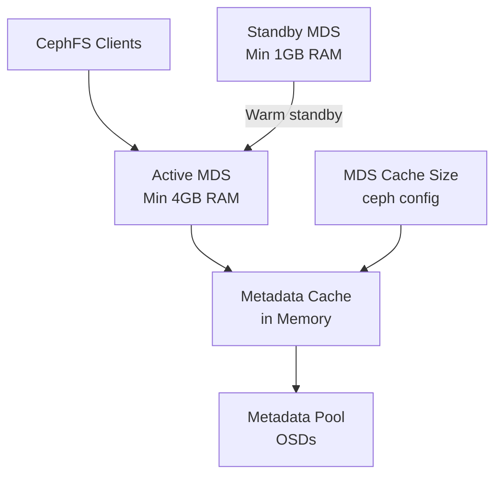

# How to Configure MDS Resource Requirements in Rook (Minimum 4GB Memory)

Author: [nawazdhandala](https://www.github.com/nawazdhandala)

Tags: Rook, Ceph, Kubernetes, Storage

Description: Set CPU and memory resource requests and limits for Ceph MDS daemons in Rook, ensuring the minimum 4GB memory requirement is met for CephFS.

---

## Introduction

Ceph MDS (Metadata Server) daemons are responsible for managing CephFS metadata operations. They have significant memory requirements: Ceph recommends at least 4GB of RAM per active MDS daemon in production environments. Without adequate memory, MDS daemons will thrash the metadata cache, causing severe latency increases for CephFS workloads.

This guide covers configuring resource requests and limits for MDS in Rook, including setting up separate configurations for active and standby daemons.

## MDS Memory Architecture



## Prerequisites

- Rook-Ceph cluster deployed
- Kubernetes nodes with sufficient memory (at least 8GB per node hosting MDS)
- CephFilesystem CRD to be created or updated

## Step 1: Understand MDS Memory Requirements

MDS memory usage is primarily driven by the metadata cache size. Key guidelines:

- Active MDS: minimum 4GB, recommended 8-16GB for production
- Standby MDS: minimum 1GB (no cache needed)
- Cache size should be set to 85% of the MDS memory limit

## Step 2: Configure MDS Resources in the CephFilesystem CRD

```yaml
# cephfilesystem-with-resources.yaml
apiVersion: ceph.rook.io/v1
kind: CephFilesystem
metadata:
  name: myfs
  namespace: rook-ceph
spec:
  metadataPool:
    replicated:
      size: 3
  dataPools:
    - name: replicated
      replicated:
        size: 3
  preserveFilesystemOnDelete: false
  metadataServer:
    # Number of active MDS daemons
    activeCount: 1
    # Keep 1 standby MDS for fast failover
    activeStandby: true
    # Resource configuration for MDS pods
    resources:
      requests:
        # MDS needs at least 4GB of memory
        memory: "4Gi"
        cpu: "500m"
      limits:
        # Set limit above request to allow burst, cap at 8GB
        memory: "8Gi"
        cpu: "2000m"
    # MDS priority class for guaranteed scheduling
    priorityClassName: "rook-ceph-default-priority-class"
```

```bash
kubectl apply -f cephfilesystem-with-resources.yaml

# Verify the MDS pods have the correct resource settings
kubectl get pods -n rook-ceph -l app=rook-ceph-mds
kubectl describe pod -n rook-ceph <mds-pod-name> | grep -A10 "Limits:"
```

## Step 3: Configure the MDS Cache Size to Match Memory

After setting the memory limit, configure the MDS cache size accordingly:

```bash
# Access the Rook toolbox
kubectl -n rook-ceph exec -it deploy/rook-ceph-tools -- bash

# Set MDS cache memory limit (85% of the memory limit = 6.8GB for 8GB limit)
# Value is in bytes
ceph config set mds mds_cache_memory_limit 6442450944

# Verify the setting
ceph config get mds mds_cache_memory_limit

# Check current MDS memory usage
ceph mds stat
ceph fs status myfs
```

## Step 4: Use a ConfigMap to Set MDS Config Options

```yaml
# mds-config.yaml
apiVersion: v1
kind: ConfigMap
metadata:
  name: rook-config-override
  namespace: rook-ceph
data:
  config: |
    [mds]
    # Cache size: 85% of 8GB limit = ~6.8GB in bytes
    mds_cache_memory_limit = 6442450944
    # Reduce log verbosity in production
    debug_mds = 1/5
    # MDS tick interval
    mds_tick_interval = 5
```

```bash
kubectl apply -f mds-config.yaml
# Rook will pick up this config and apply it to MDS daemons
```

## Step 5: Configure Resources for High-Availability Active-Active MDS

For CephFS with multiple active MDS daemons, scale resources proportionally:

```yaml
# cephfilesystem-active-active.yaml
apiVersion: ceph.rook.io/v1
kind: CephFilesystem
metadata:
  name: myfs-ha
  namespace: rook-ceph
spec:
  metadataPool:
    replicated:
      size: 3
  dataPools:
    - name: replicated
      replicated:
        size: 3
  metadataServer:
    # Two active MDS for higher throughput
    activeCount: 2
    activeStandby: true
    resources:
      requests:
        # Each active MDS needs at least 4GB
        memory: "4Gi"
        cpu: "1000m"
      limits:
        memory: "8Gi"
        cpu: "4000m"
    # Place MDS on nodes with high-memory label
    placement:
      nodeAffinity:
        requiredDuringSchedulingIgnoredDuringExecution:
          nodeSelectorTerms:
            - matchExpressions:
                - key: high-memory
                  operator: In
                  values:
                    - "true"
      # Spread MDS pods across different nodes
      podAntiAffinity:
        requiredDuringSchedulingIgnoredDuringExecution:
          - labelSelector:
              matchLabels:
                app: rook-ceph-mds
            topologyKey: kubernetes.io/hostname
```

## Step 6: Configure Annotations for Memory Management

Add annotations to control how the Kubernetes OOM killer handles MDS pods:

```yaml
# Annotation to use in the metadataServer spec
metadataServer:
  resources:
    requests:
      memory: "4Gi"
      cpu: "500m"
    limits:
      memory: "8Gi"
      cpu: "2000m"
  annotations:
    # Ensure MDS is treated as Guaranteed QoS by setting requests = limits
    # Or use BestEffort/Burstable depending on your SLA requirements
```

For Guaranteed QoS (highest protection from OOM):

```yaml
metadataServer:
  resources:
    requests:
      memory: "8Gi"
      cpu: "2000m"
    limits:
      memory: "8Gi"
      cpu: "2000m"
```

## Step 7: Monitor MDS Memory Usage

```bash
# Check current MDS memory usage via the toolbox
kubectl -n rook-ceph exec -it deploy/rook-ceph-tools -- \
  ceph tell mds.myfs-a heap stats

# Check MDS cache fullness
kubectl -n rook-ceph exec -it deploy/rook-ceph-tools -- \
  ceph mds metadata <mds-id> | grep -i memory

# Query Prometheus for MDS memory metrics
# ceph_mds_mem_rss - RSS memory of MDS process
# ceph_mds_cache_size_bytes - size of the metadata cache
```

Set up a Prometheus alert for MDS memory pressure:

```yaml
# mds-memory-alert.yaml
apiVersion: monitoring.coreos.com/v1
kind: PrometheusRule
metadata:
  name: rook-mds-memory-alerts
  namespace: rook-ceph
  labels:
    release: kube-prometheus-stack
spec:
  groups:
    - name: mds-memory.rules
      rules:
        - alert: MDSLowMemory
          expr: |
            (ceph_mds_mem_rss / (kube_pod_container_resource_limits{container="mds",resource="memory"})) > 0.85
          for: 5m
          labels:
            severity: warning
          annotations:
            summary: "MDS daemon {{ $labels.ceph_daemon }} is using >85% of memory limit"
            description: "Consider increasing the MDS memory limit to avoid cache eviction."
```

## Step 8: Verify MDS Pod Resource Allocation

```bash
# Check actual resource usage
kubectl top pod -n rook-ceph -l app=rook-ceph-mds

# Check pod QoS class
kubectl get pod -n rook-ceph -l app=rook-ceph-mds \
  -o jsonpath='{range .items[*]}{.metadata.name}{"\t"}{.status.qosClass}{"\n"}{end}'

# Verify resources on the pod
kubectl get pod -n rook-ceph <mds-pod-name> \
  -o jsonpath='{.spec.containers[0].resources}' | python3 -m json.tool
```

## Troubleshooting

```bash
# MDS pod OOMKilled - increase memory limit
kubectl describe pod -n rook-ceph <mds-pod-name> | grep -E "OOMKilled|Reason"

# If requests cannot be satisfied (Pending pods)
kubectl describe pod -n rook-ceph <mds-pod-name> | grep -A10 Events

# Check node has enough memory
kubectl describe node <node-name> | grep -A10 "Allocated resources:"

# Reduce cache size to fit within available memory
kubectl -n rook-ceph exec -it deploy/rook-ceph-tools -- \
  ceph config set mds mds_cache_memory_limit 3221225472  # 3GB
```

## Summary

Configuring MDS resource requirements in Rook requires setting at least `4Gi` memory requests for active MDS daemons in the CephFilesystem `metadataServer.resources` section. Limits should be set to `8Gi` or higher for production CephFS deployments. The Ceph MDS cache size (`mds_cache_memory_limit`) should be configured to approximately 85% of the memory limit via the `rook-config-override` ConfigMap. Use pod anti-affinity rules to spread MDS pods across nodes and Guaranteed QoS by setting requests equal to limits for critical workloads.
