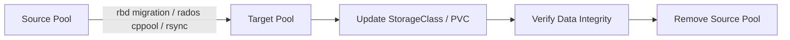

# How to Migrate Data Between Ceph Pools in Rook

Author: [nawazdhandala](https://www.github.com/nawazdhandala)

Tags: Rook, Ceph, Kubernetes, Storage, Migration, Pool

Description: Learn how to migrate data between Ceph pools in Rook-Ceph using rbd migration, rados cppool, and Kubernetes volume cloning techniques.

---

## How Pool Migration Works in Rook-Ceph

Moving data between Ceph pools is necessary when changing replication factors, switching from replicated to erasure-coded pools, or reorganizing storage tiers. Rook-Ceph exposes several methods depending on the data type: RBD images, CephFS files, or object store buckets.



## Prerequisites

- `rook-ceph-tools` pod running for CLI access
- Source and target pools created and healthy
- Sufficient free space in the target pool for the data being migrated
- Applications using the source pool should be quiesced or put in read-only mode during migration

Check available pools:

```bash
kubectl -n rook-ceph exec -it deploy/rook-ceph-tools -- ceph osd lspools
```

## Creating the Target Pool

Before migrating, create the destination pool via a CephBlockPool resource:

```yaml
apiVersion: ceph.rook.io/v1
kind: CephBlockPool
metadata:
  name: replicapool-new
  namespace: rook-ceph
spec:
  failureDomain: host
  replicated:
    size: 3
    requireSafeReplicaSize: true
```

Apply it:

```bash
kubectl apply -f cephblockpool-new.yaml
```

Verify the pool is ready:

```bash
kubectl -n rook-ceph exec -it deploy/rook-ceph-tools -- ceph osd pool ls
```

## Migrating RBD Images Between Pools

For block storage (RBD), use the `rbd migration` command, which performs a live migration with minimal downtime.

First, list images in the source pool:

```bash
kubectl -n rook-ceph exec -it deploy/rook-ceph-tools -- rbd ls replicapool
```

Prepare the migration for a specific image:

```bash
kubectl -n rook-ceph exec -it deploy/rook-ceph-tools -- \
  rbd migration prepare replicapool/csi-vol-abc123 replicapool-new/csi-vol-abc123
```

Execute the migration (copies all data):

```bash
kubectl -n rook-ceph exec -it deploy/rook-ceph-tools -- \
  rbd migration execute replicapool/csi-vol-abc123
```

Monitor progress:

```bash
kubectl -n rook-ceph exec -it deploy/rook-ceph-tools -- \
  rbd status replicapool/csi-vol-abc123
```

Commit the migration to finalize:

```bash
kubectl -n rook-ceph exec -it deploy/rook-ceph-tools -- \
  rbd migration commit replicapool/csi-vol-abc123
```

## Migrating CephFS Data

For CephFS, the most reliable method is to rsync data at the filesystem level after mounting both pools as data pools.

Add a new data pool to an existing CephFS:

```yaml
apiVersion: ceph.rook.io/v1
kind: CephFilesystem
metadata:
  name: myfs
  namespace: rook-ceph
spec:
  metadataPool:
    replicated:
      size: 3
  dataPools:
    - name: replicated
      replicated:
        size: 3
    - name: ec-pool
      erasureCoded:
        dataChunks: 4
        codingChunks: 2
```

Set the new pool as the default for new files:

```bash
kubectl -n rook-ceph exec -it deploy/rook-ceph-tools -- \
  ceph fs set myfs default_data_pool myfs-ec-pool
```

Move existing data by relocating directory layouts. First, set the layout on the target directory:

```bash
setfattr -n ceph.dir.layout.pool -v myfs-ec-pool /mnt/cephfs/target-dir
```

Then rsync data into the new directory so it lands in the new pool.

## Migrating RADOS Object Data Between Pools

For RADOS objects, use `rados cppool`:

```bash
kubectl -n rook-ceph exec -it deploy/rook-ceph-tools -- \
  rados cppool source-pool destination-pool
```

This copies all RADOS objects from the source pool to the destination pool. For large pools this can take a significant amount of time.

## Updating Kubernetes StorageClass After Migration

After migrating data, update applications to use the new pool by creating a new StorageClass pointing to the new pool:

```yaml
apiVersion: storage.k8s.io/v1
kind: StorageClass
metadata:
  name: rook-ceph-block-new
provisioner: rook-ceph.rbd.csi.ceph.com
parameters:
  clusterID: rook-ceph
  pool: replicapool-new
  imageFormat: "2"
  imageFeatures: layering
  csi.storage.k8s.io/provisioner-secret-name: rook-csi-rbd-provisioner
  csi.storage.k8s.io/provisioner-secret-namespace: rook-ceph
  csi.storage.k8s.io/controller-expand-secret-name: rook-csi-rbd-provisioner
  csi.storage.k8s.io/controller-expand-secret-namespace: rook-ceph
  csi.storage.k8s.io/node-stage-secret-name: rook-csi-rbd-node
  csi.storage.k8s.io/node-stage-secret-namespace: rook-ceph
reclaimPolicy: Delete
allowVolumeExpansion: true
```

New PVCs will provision into the new pool automatically.

## Verifying Data Integrity

After migration, verify the data in the new pool:

```bash
kubectl -n rook-ceph exec -it deploy/rook-ceph-tools -- \
  rbd ls replicapool-new
```

Check pool statistics:

```bash
kubectl -n rook-ceph exec -it deploy/rook-ceph-tools -- \
  ceph df detail
```

Confirm cluster health is still good:

```bash
kubectl -n rook-ceph exec -it deploy/rook-ceph-tools -- ceph status
```

## Summary

Migrating data between Ceph pools in Rook depends on the storage type. RBD images support live migration with `rbd migration prepare/execute/commit`. CephFS data can be migrated by adding a new data pool and moving directory layouts. RADOS objects can be bulk-copied with `rados cppool`. After migration, update your StorageClass to point to the new pool for new provisioning, and verify data integrity before decommissioning the source pool.
