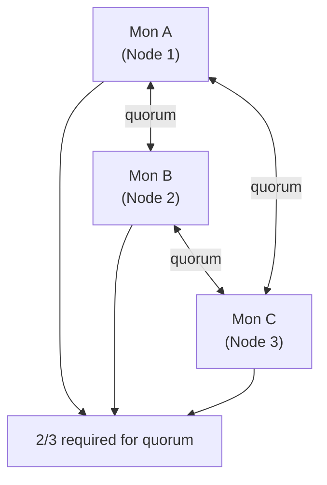

# How to Configure Monitor Count and Placement in Rook-Ceph

Author: [nawazdhandala](https://www.github.com/nawazdhandala)

Tags: Rook, Ceph, Kubernetes, Storage, Monitor, High Availability

Description: Configure the number of Ceph monitors and their placement in Rook-Ceph, including node affinity rules, tolerations, and spread constraints for fault tolerance.

---

## Ceph Monitor Quorum Requirements

Ceph Monitors maintain the cluster map and require quorum for cluster operations. The number of Mons must be odd to enable majority voting:

| Mon Count | Tolerated Failures | Recommendation |
|---|---|---|
| 1 | 0 | Development/testing only |
| 3 | 1 | Standard production |
| 5 | 2 | High-availability production |

Three Mons is the recommended minimum for production. With 3 Mons, one Mon can fail without losing quorum.



## Basic Monitor Count Configuration

```yaml
apiVersion: ceph.rook.io/v1
kind: CephCluster
metadata:
  name: rook-ceph
  namespace: rook-ceph
spec:
  cephVersion:
    image: quay.io/ceph/ceph:v19.2.0
  dataDirHostPath: /var/lib/rook
  mon:
    count: 3
    allowMultiplePerNode: false
```

`allowMultiplePerNode: false` ensures Rook spreads Mons across different physical nodes, preventing a single node failure from taking down multiple Mons.

## Five-Monitor Configuration for High Availability

```yaml
spec:
  mon:
    count: 5
    allowMultiplePerNode: false
```

With 5 Mons, two simultaneous Mon failures (on different nodes) do not break quorum.

## Controlling Mon Placement with Node Affinity

Restrict Mon pods to specific nodes using placement rules. First, label your Mon nodes:

```bash
kubectl label node mon-node-1 role=mon
kubectl label node mon-node-2 role=mon
kubectl label node mon-node-3 role=mon
```

Then configure placement in the CephCluster:

```yaml
spec:
  mon:
    count: 3
    allowMultiplePerNode: false
  placement:
    mon:
      nodeAffinity:
        requiredDuringSchedulingIgnoredDuringExecution:
          nodeSelectorTerms:
            - matchExpressions:
                - key: role
                  operator: In
                  values:
                    - mon
      podAntiAffinity:
        requiredDuringSchedulingIgnoredDuringExecution:
          - labelSelector:
              matchExpressions:
                - key: app
                  operator: In
                  values:
                    - rook-ceph-mon
            topologyKey: kubernetes.io/hostname
```

The `podAntiAffinity` rule forces Mon pods onto different nodes.

## Scheduling Mons on Control Plane Nodes

To schedule Mons on control plane nodes (useful in small clusters where control and storage share nodes), add tolerations:

```yaml
spec:
  placement:
    mon:
      tolerations:
        - key: node-role.kubernetes.io/control-plane
          operator: Exists
          effect: NoSchedule
        - key: node-role.kubernetes.io/master
          operator: Exists
          effect: NoSchedule
```

## Pod Topology Spread Constraints

For cloud environments with availability zones, use topology spread constraints to distribute Mons across zones:

```yaml
spec:
  placement:
    mon:
      topologySpreadConstraints:
        - maxSkew: 1
          topologyKey: topology.kubernetes.io/zone
          whenUnsatisfiable: DoNotSchedule
          labelSelector:
            matchLabels:
              app: rook-ceph-mon
```

This ensures Mons are spread across availability zones, surviving zone-level failures.

## Checking Mon Status

```bash
# List Mon pods and their nodes
kubectl -n rook-ceph get pods -l app=rook-ceph-mon -o wide

# Check Mon quorum status
kubectl -n rook-ceph exec -it deploy/rook-ceph-tools -- ceph mon stat

# Detailed Mon health
kubectl -n rook-ceph exec -it deploy/rook-ceph-tools -- ceph mon dump
```

## Scaling Mon Count

To increase from 3 to 5 Mons:

```bash
kubectl -n rook-ceph patch cephcluster rook-ceph \
  --type merge \
  -p '{"spec":{"mon":{"count":5}}}'
```

Rook adds the new Mons automatically. Confirm they join quorum:

```bash
kubectl -n rook-ceph exec -it deploy/rook-ceph-tools -- ceph mon stat
# Expected: quorum a,b,c,d,e
```

## Summary

Configure Mon count with `spec.mon.count` (must be odd, minimum 3 for production) and set `allowMultiplePerNode: false` to ensure Mon fault isolation. Use `placement.mon.nodeAffinity` to restrict Mons to dedicated nodes and `placement.mon.podAntiAffinity` to enforce spreading across hosts. For cloud deployments, use `topologySpreadConstraints` with `topology.kubernetes.io/zone` to distribute Mons across availability zones. Scale Mon count by patching the CephCluster and monitoring quorum formation.
