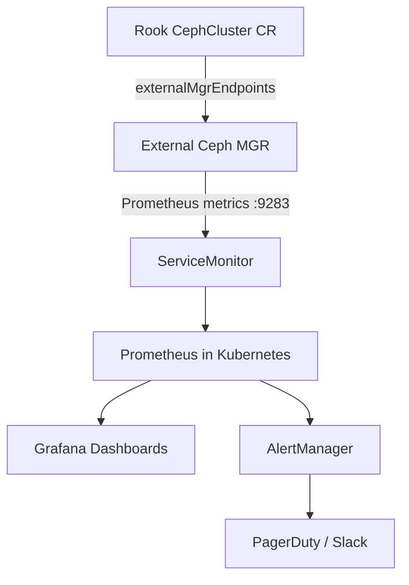

# How to Monitor an External Ceph Cluster Through Rook

Author: [nawazdhandala](https://www.github.com/nawazdhandala)

Tags: Rook, Ceph, Kubernetes, Storage

Description: Set up monitoring for an external Ceph cluster using Rook's CephCluster CR, Prometheus, and Grafana dashboards inside Kubernetes.

---

## Introduction

When using Rook with an external Ceph cluster, you still want full observability into the cluster's health, performance, and capacity. Rook can expose external Ceph metrics into your Kubernetes-based monitoring stack by configuring the CephCluster CR to enable monitoring and connecting to the external Ceph MGR's Prometheus endpoint.

This guide covers enabling the Ceph MGR Prometheus module, creating the necessary Kubernetes resources, and viewing dashboards in Grafana.

## Monitoring Architecture



## Prerequisites

- External Ceph cluster with MGR running
- Rook operator with monitoring enabled
- Prometheus Operator installed in Kubernetes (kube-prometheus-stack recommended)
- External Ceph MGR reachable from Kubernetes nodes

## Step 1: Enable the Prometheus Module on External Ceph

```bash
# Enable the Prometheus MGR module
ceph mgr module enable prometheus

# Verify the module is active
ceph mgr module ls | grep prometheus

# Check the MGR is exposing metrics on port 9283
curl http://<mgr-host>:9283/metrics | head -20

# Get the MGR host address for later use
ceph mgr dump | grep '"addr"'
```

## Step 2: Configure CephCluster CR with External MGR Endpoints

```yaml
# external-cluster-monitoring.yaml
apiVersion: ceph.rook.io/v1
kind: CephCluster
metadata:
  name: rook-ceph-external
  namespace: rook-ceph-external
spec:
  external:
    enable: true
  dataDirHostPath: /var/lib/rook
  # Point Rook to the external MGR Prometheus endpoint
  monitoring:
    enabled: true
    # External MGR endpoint(s) - port 9283 is default
    externalMgrEndpoints:
      - ip: "192.168.1.20"
    externalMgrPrometheusPort: 9283
    # Create Prometheus rules for alerting
    createPrometheusRules: true
  crashCollector:
    disable: true
```

```bash
kubectl apply -f external-cluster-monitoring.yaml
```

## Step 3: Create a Kubernetes Service for the External MGR

Rook needs a Kubernetes Service to expose the external MGR metrics endpoint within the cluster:

```yaml
# external-mgr-service.yaml
apiVersion: v1
kind: Service
metadata:
  name: rook-ceph-mgr-external
  namespace: rook-ceph-external
  labels:
    app: rook-ceph-mgr
    rook_cluster: rook-ceph-external
spec:
  ports:
    - name: http-metrics
      port: 9283
      protocol: TCP
      targetPort: 9283
  type: ClusterIP
---
apiVersion: v1
kind: Endpoints
metadata:
  name: rook-ceph-mgr-external
  namespace: rook-ceph-external
subsets:
  - addresses:
      - ip: "192.168.1.20"
    ports:
      - name: http-metrics
        port: 9283
        protocol: TCP
```

```bash
kubectl apply -f external-mgr-service.yaml

# Verify the endpoint is reachable
kubectl run -n rook-ceph-external curl-test --image=curlimages/curl --rm -it --restart=Never \
  -- curl http://rook-ceph-mgr-external:9283/metrics | head -10
```

## Step 4: Create a ServiceMonitor for Prometheus

```yaml
# servicemonitor-external-ceph.yaml
apiVersion: monitoring.coreos.com/v1
kind: ServiceMonitor
metadata:
  name: rook-ceph-mgr-external
  namespace: rook-ceph-external
  labels:
    # Match the Prometheus Operator's serviceMonitorSelector label
    release: kube-prometheus-stack
spec:
  endpoints:
    - port: http-metrics
      path: /metrics
      interval: 30s
      scrapeTimeout: 10s
  namespaceSelector:
    matchNames:
      - rook-ceph-external
  selector:
    matchLabels:
      app: rook-ceph-mgr
      rook_cluster: rook-ceph-external
```

```bash
kubectl apply -f servicemonitor-external-ceph.yaml

# Verify Prometheus picked up the target
kubectl port-forward -n monitoring svc/prometheus-operated 9090:9090 &
# Open http://localhost:9090/targets and look for rook-ceph-mgr-external
```

## Step 5: Import Grafana Dashboards

Rook provides pre-built Grafana dashboards compatible with external clusters:

```bash
# Download the Rook dashboards
curl -sL https://raw.githubusercontent.com/rook/rook/v1.14.0/deploy/examples/monitoring/grafana/ceph-cluster.json \
  -o ceph-cluster-dashboard.json
curl -sL https://raw.githubusercontent.com/rook/rook/v1.14.0/deploy/examples/monitoring/grafana/ceph-pools.json \
  -o ceph-pools-dashboard.json

# Create a ConfigMap for each dashboard
kubectl create configmap grafana-dashboard-ceph-cluster \
  --from-file=ceph-cluster.json=ceph-cluster-dashboard.json \
  -n monitoring

kubectl label configmap grafana-dashboard-ceph-cluster \
  grafana_dashboard=1 -n monitoring
```

Or use Grafana's built-in dashboard import with IDs from grafana.com:

```yaml
# grafana-dashboard-configmap.yaml
apiVersion: v1
kind: ConfigMap
metadata:
  name: grafana-ceph-dashboards
  namespace: monitoring
  labels:
    grafana_dashboard: "1"
data:
  ceph-cluster.json: |
    { "id": null, "gnetId": 2842, "title": "Ceph - Cluster" }
  ceph-osd.json: |
    { "id": null, "gnetId": 5336, "title": "Ceph - OSD" }
  ceph-pools.json: |
    { "id": null, "gnetId": 5342, "title": "Ceph - Pools" }
```

## Step 6: Set Up PrometheusRules for Alerting

```yaml
# ceph-external-alerts.yaml
apiVersion: monitoring.coreos.com/v1
kind: PrometheusRule
metadata:
  name: rook-ceph-external-alerts
  namespace: rook-ceph-external
  labels:
    release: kube-prometheus-stack
spec:
  groups:
    - name: ceph-external.rules
      rules:
        - alert: CephClusterHealthWarning
          expr: ceph_health_status == 1
          for: 5m
          labels:
            severity: warning
          annotations:
            summary: "External Ceph cluster health is WARN"
            description: "The external Ceph cluster has been in HEALTH_WARN state for more than 5 minutes."
        - alert: CephClusterHealthError
          expr: ceph_health_status == 2
          for: 1m
          labels:
            severity: critical
          annotations:
            summary: "External Ceph cluster health is ERROR"
            description: "The external Ceph cluster is in HEALTH_ERR state."
        - alert: CephOSDDown
          expr: ceph_osd_up == 0
          for: 2m
          labels:
            severity: warning
          annotations:
            summary: "Ceph OSD {{ $labels.ceph_daemon }} is down"
        - alert: CephCapacityWarning
          expr: (ceph_cluster_total_used_bytes / ceph_cluster_total_bytes) > 0.80
          for: 5m
          labels:
            severity: warning
          annotations:
            summary: "External Ceph cluster capacity above 80%"
```

```bash
kubectl apply -f ceph-external-alerts.yaml
```

## Step 7: Verify Metrics Are Flowing

```bash
# Port-forward to Prometheus and query Ceph metrics
kubectl port-forward -n monitoring svc/prometheus-operated 9090:9090 &

# Query Ceph health status
curl -s 'http://localhost:9090/api/v1/query?query=ceph_health_status' | python3 -m json.tool

# Query OSD status
curl -s 'http://localhost:9090/api/v1/query?query=ceph_osd_up' | python3 -m json.tool

# Check Rook operator logs for monitoring setup
kubectl logs -n rook-ceph deploy/rook-ceph-operator | grep -i "monitoring\|prometheus\|mgr" | tail -20
```

## Troubleshooting

```bash
# Check if Rook created the monitoring resources
kubectl get servicemonitor,prometheusrule -n rook-ceph-external

# Verify the external MGR port is reachable from within the cluster
kubectl run -it --rm debug --image=busybox --restart=Never -- \
  wget -qO- http://192.168.1.20:9283/metrics | head -5

# Check Prometheus scrape errors
kubectl port-forward -n monitoring svc/prometheus-operated 9090:9090 &
# Navigate to http://localhost:9090/targets for scrape status
```

## Summary

Monitoring an external Ceph cluster through Rook requires enabling the Ceph MGR Prometheus module, configuring the `externalMgrEndpoints` in the CephCluster CR, creating a Kubernetes Service and Endpoints pointing at the external MGR, and setting up a ServiceMonitor so Prometheus can scrape the metrics. With Grafana dashboards and PrometheusRules, you gain full observability into your external Ceph cluster from within Kubernetes.
