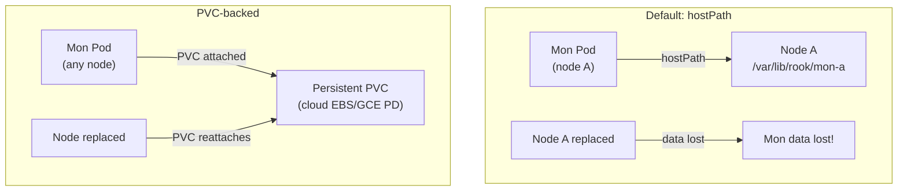

# How to Use VolumeClaimTemplates for Monitor Storage in Rook

Author: [nawazdhandala](https://www.github.com/nawazdhandala)

Tags: Rook, Ceph, Kubernetes, Storage, Monitor, PVC

Description: Configure VolumeClaimTemplates for Ceph Monitor storage in Rook-Ceph to persist Mon data on cloud block volumes instead of the node host filesystem.

---

## Why Use PVC-Backed Monitor Storage

By default, Rook stores Mon keyring files and configuration on the host filesystem at `dataDirHostPath`. This works well for bare-metal clusters with persistent node storage, but on cloud clusters where nodes can be replaced or terminated, the Mon data on the host filesystem is lost.

Using `volumeClaimTemplate` for Mon storage provisions a dedicated PVC per Mon. The cloud provider's CSI driver attaches this PVC to whichever node the Mon pod is scheduled on, persisting Mon data independently of the node lifecycle.



## Configuration

Add `volumeClaimTemplate` to `spec.mon`:

```yaml
apiVersion: ceph.rook.io/v1
kind: CephCluster
metadata:
  name: rook-ceph
  namespace: rook-ceph
spec:
  cephVersion:
    image: quay.io/ceph/ceph:v19.2.0
  dataDirHostPath: /var/lib/rook
  mon:
    count: 3
    allowMultiplePerNode: false
    volumeClaimTemplate:
      metadata:
        labels:
          source: rook
      spec:
        storageClassName: gp3
        accessModes:
          - ReadWriteOnce
        resources:
          requests:
            storage: 10Gi
```

When `volumeClaimTemplate` is set, Rook creates one PVC per Mon named `rook-ceph-mon-<id>` and mounts it at the Mon's data directory inside the pod.

## PVC Sizing

Mon storage requirements:

| Cluster Size | Recommended Mon PVC Size |
|---|---|
| Small (< 50 OSD) | 5-10 Gi |
| Medium (50-200 OSD) | 10-20 Gi |
| Large (200+ OSD) | 20-50 Gi |

Mon data includes keyring files, cluster maps, and Mon DB. The Mon DB grows with cluster size and map history.

## Viewing Mon PVCs

```bash
kubectl -n rook-ceph get pvc | grep mon
```

Expected output:

```text
rook-ceph-mon-a   Bound   pvc-xxx   10Gi   RWO   gp3   2m
rook-ceph-mon-b   Bound   pvc-yyy   10Gi   RWO   gp3   2m
rook-ceph-mon-c   Bound   pvc-zzz   10Gi   RWO   gp3   2m
```

## Mon PVC Portability

Since Mon PVCs use `accessModes: ReadWriteOnce` (single node at a time), Mon pods can be rescheduled to any node in the same availability zone as the PVC. For multi-zone clusters, Mons should be spread across zones and the PVCs should exist in the same zones as the Mons.

Use topology spread constraints to align Mons and their PVCs:

```yaml
spec:
  placement:
    mon:
      topologySpreadConstraints:
        - maxSkew: 1
          topologyKey: topology.kubernetes.io/zone
          whenUnsatisfiable: DoNotSchedule
          labelSelector:
            matchLabels:
              app: rook-ceph-mon
```

Cloud StorageClasses often support zone-aware PVC provisioning via `volumeBindingMode: WaitForFirstConsumer`.

## StorageClass Requirements

The StorageClass used for Mon PVCs must:

- Support `ReadWriteOnce` access mode
- Provide block-level storage (not NFS)
- Have reasonable IOPS (Mon DB is write-intensive during cluster events)

Example StorageClass for AWS gp3:

```yaml
apiVersion: storage.k8s.io/v1
kind: StorageClass
metadata:
  name: gp3
provisioner: ebs.csi.aws.com
parameters:
  type: gp3
  iops: "3000"
  throughput: "125"
volumeBindingMode: WaitForFirstConsumer
reclaimPolicy: Delete
allowVolumeExpansion: true
```

## Expanding Mon PVC Size

If Mon PVCs run out of space, expand them:

```bash
kubectl -n rook-ceph patch pvc rook-ceph-mon-a \
  --type merge \
  -p '{"spec":{"resources":{"requests":{"storage":"20Gi"}}}}'
```

The StorageClass must have `allowVolumeExpansion: true`.

## Summary

Use `spec.mon.volumeClaimTemplate` in the CephCluster to provision dedicated PVCs for each Mon, persisting Mon data on cloud block volumes rather than the host filesystem. This is essential for cloud-managed Kubernetes clusters where node replacement would otherwise destroy Mon keyring data. Size Mon PVCs based on cluster scale (10-20 Gi is typical) and use a StorageClass with `WaitForFirstConsumer` binding mode and zone-aware provisioning for multi-zone deployments.
