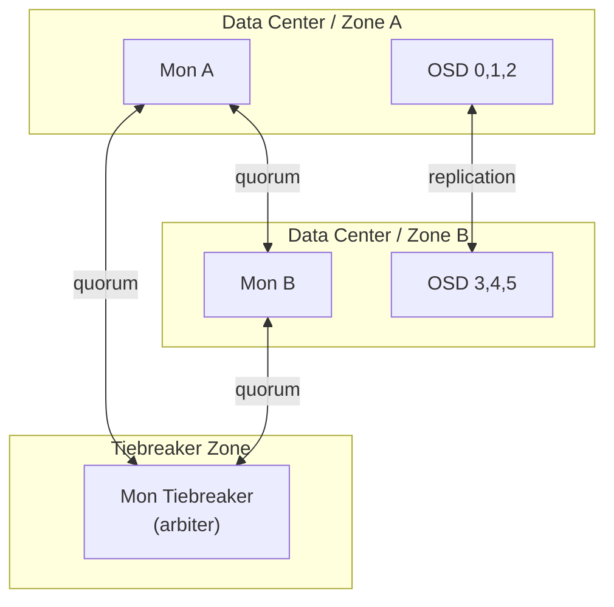

# How to Configure Monitor Zones for Stretch Clusters in Rook

Author: [nawazdhandala](https://www.github.com/nawazdhandala)

Tags: Rook, Ceph, Kubernetes, Storage, Monitor, Stretch Cluster

Description: Configure Ceph stretch clusters in Rook using monitor zones to deploy across two data centers or availability zones with a tiebreaker monitor for split-brain prevention.

---

## What is a Stretch Cluster

A Ceph stretch cluster spans two data centers or availability zones with data replicated synchronously between them, plus a lightweight tiebreaker monitor in a third location (or zone) to prevent split-brain scenarios. This provides site-level fault tolerance while maintaining a single Ceph cluster.



## Prerequisites

- Three Kubernetes zones or regions (two data zones + one tiebreaker)
- Node labels for zone identification
- 5 Mons minimum (2 per data zone + 1 tiebreaker)

Label nodes:

```bash
# Zone A nodes
kubectl label node node-a1 topology.kubernetes.io/zone=a
kubectl label node node-a2 topology.kubernetes.io/zone=a

# Zone B nodes
kubectl label node node-b1 topology.kubernetes.io/zone=b
kubectl label node node-b2 topology.kubernetes.io/zone=b

# Tiebreaker node
kubectl label node node-tb topology.kubernetes.io/zone=arbiter
```

## CephCluster Stretch Configuration

```yaml
apiVersion: ceph.rook.io/v1
kind: CephCluster
metadata:
  name: rook-ceph
  namespace: rook-ceph
spec:
  cephVersion:
    image: quay.io/ceph/ceph:v19.2.0
  dataDirHostPath: /var/lib/rook
  mon:
    count: 5
    allowMultiplePerNode: false
    stretchCluster:
      failureDomainLabel: topology.kubernetes.io/zone
      subFailureDomain: host
      zones:
        - name: a
          arbiter: false
        - name: b
          arbiter: false
        - name: arbiter
          arbiter: true
  storage:
    useAllNodes: false
    useAllDevices: false
    nodes:
      - name: node-a1
        devices:
          - name: sdb
      - name: node-a2
        devices:
          - name: sdb
      - name: node-b1
        devices:
          - name: sdb
      - name: node-b2
        devices:
          - name: sdb
```

## Configuring Stretch Pools

Stretch clusters require special pool configuration that replicates data to both zones. Create a stretch-replicated pool:

```yaml
apiVersion: ceph.rook.io/v1
kind: CephBlockPool
metadata:
  name: stretch-pool
  namespace: rook-ceph
spec:
  failureDomain: host
  replicated:
    size: 4
    requireSafeReplicaSize: true
    replicasPerFailureDomain: 2
    subFailureDomain: host
```

`replicasPerFailureDomain: 2` places 2 OSD copies in each zone (total: 4 copies across 2 zones).

## Placement for Tiebreaker Monitor

Configure the tiebreaker (arbiter) Mon to run on the arbiter zone node:

```yaml
spec:
  placement:
    mon:
      tolerations:
        - key: role
          value: arbiter
          effect: NoSchedule
          operator: Equal
```

Taint the tiebreaker node to reserve it for the arbiter Mon:

```bash
kubectl taint node node-tb role=arbiter:NoSchedule
```

## Verifying Stretch Cluster Configuration

```bash
kubectl -n rook-ceph exec -it deploy/rook-ceph-tools -- \
  ceph mon dump | grep -E "zone|arbiter"

kubectl -n rook-ceph exec -it deploy/rook-ceph-tools -- \
  ceph osd crush dump | grep zone
```

Check CRUSH map for stretch topology:

```bash
kubectl -n rook-ceph exec -it deploy/rook-ceph-tools -- \
  ceph osd tree
```

Expected: OSDs grouped under zones a and b, with balanced placement.

## Failure Scenarios

**Zone A fails:**
- Mons in Zone A go down
- Arbiter Mon + Zone B Mon maintain quorum (2 of 5 total, but 2 of 3 "vote groups")
- OSD copies in Zone A go down, Zone B copies remain
- Cluster enters HEALTH_WARN, continues serving I/O from Zone B replicas

**Zone B fails:**
- Same as above but mirrored

**Arbiter fails:**
- 4 Mons in Zone A and B still have quorum (4 of 5)
- Full read/write access maintained
- Replace the arbiter Mon as soon as possible

## Summary

Ceph stretch clusters in Rook use `spec.mon.stretchCluster` with `zones` defining two data zones and one arbiter (tiebreaker) zone. Configure 5 Mons: 2 per data zone and 1 arbiter. Create stretch-replicated block pools with `replicasPerFailureDomain: 2` to place data copies in both zones. The arbiter Mon requires minimal resources and can run on a small VM in a third location. Node labels with `topology.kubernetes.io/zone` drive the CRUSH map configuration for zone-aware data placement.
