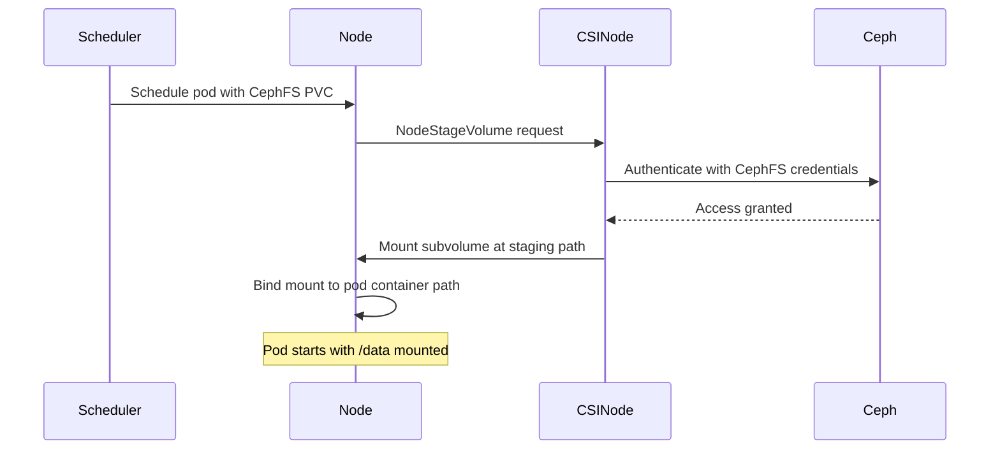

# How to Mount CephFS as a Persistent Volume in Kubernetes

Author: [nawazdhandala](https://www.github.com/nawazdhandala)

Tags: Rook, Ceph, Kubernetes, CephFS, PVC, Mount, SharedStorage

Description: Learn how to mount a Rook-Ceph CephFS volume as a Kubernetes PersistentVolume and use it across multiple pods with ReadWriteMany access.

---

## How CephFS Mounting Works in Kubernetes

When a pod mounts a CephFS PVC, the Rook CSI node plugin runs on the node and either uses the kernel CephFS driver or the FUSE daemon to mount the subvolume. The mount persists for the lifetime of the pod and is unmounted when the pod terminates. Multiple pods on different nodes can mount the same PVC simultaneously.



## Step 1 - Verify CephFS Prerequisites

Before mounting, confirm the CephFilesystem and StorageClass are ready:

```bash
# Filesystem should be in Ready phase
kubectl -n rook-ceph get cephfilesystem myfs

# StorageClass should exist
kubectl get storageclass rook-cephfs

# MDS pods should be running
kubectl -n rook-ceph get pods -l app=rook-ceph-mds
```

## Step 2 - Create a CephFS PVC

Create a ReadWriteMany PVC using the CephFS StorageClass:

```yaml
apiVersion: v1
kind: PersistentVolumeClaim
metadata:
  name: cephfs-shared-pvc
  namespace: default
spec:
  accessModes:
    - ReadWriteMany
  resources:
    requests:
      storage: 20Gi
  storageClassName: rook-cephfs
```

```bash
kubectl apply -f cephfs-pvc.yaml
kubectl get pvc cephfs-shared-pvc -w
```

The PVC should bind quickly as the provisioner creates the subvolume:

```text
NAME               STATUS   VOLUME       CAPACITY   ACCESS MODES   STORAGECLASS   AGE
cephfs-shared-pvc  Bound    pvc-xxx...   20Gi       RWX            rook-cephfs    5s
```

## Step 3 - Mount in a Single Pod

Use the PVC in a basic pod:

```yaml
apiVersion: v1
kind: Pod
metadata:
  name: cephfs-demo-pod
  namespace: default
spec:
  containers:
    - name: app
      image: busybox
      command: ["/bin/sh", "-c", "ls -la /mnt/data && sleep 3600"]
      volumeMounts:
        - name: cephfs-volume
          mountPath: /mnt/data
  volumes:
    - name: cephfs-volume
      persistentVolumeClaim:
        claimName: cephfs-shared-pvc
```

```bash
kubectl apply -f pod.yaml
kubectl exec cephfs-demo-pod -- df -h /mnt/data
```

## Step 4 - Mount Across Multiple Pods

The primary benefit of CephFS is simultaneous write access from multiple pods. Deploy a web content scenario where multiple writer pods share the same storage:

```yaml
apiVersion: apps/v1
kind: Deployment
metadata:
  name: content-writers
  namespace: default
spec:
  replicas: 3
  selector:
    matchLabels:
      app: content-writers
  template:
    metadata:
      labels:
        app: content-writers
    spec:
      containers:
        - name: writer
          image: busybox
          command:
            - /bin/sh
            - -c
            - |
              mkdir -p /content/$(hostname)
              while true; do
                echo "$(date): Written by $(hostname)" >> /content/$(hostname)/output.log
                sleep 10
              done
          volumeMounts:
            - name: shared-content
              mountPath: /content
      volumes:
        - name: shared-content
          persistentVolumeClaim:
            claimName: cephfs-shared-pvc
---
apiVersion: apps/v1
kind: Deployment
metadata:
  name: content-readers
  namespace: default
spec:
  replicas: 2
  selector:
    matchLabels:
      app: content-readers
  template:
    metadata:
      labels:
        app: content-readers
    spec:
      containers:
        - name: reader
          image: busybox
          command:
            - /bin/sh
            - -c
            - |
              while true; do
                echo "=== Reading shared content ==="
                ls /content/
                sleep 15
              done
          volumeMounts:
            - name: shared-content
              mountPath: /content
      volumes:
        - name: shared-content
          persistentVolumeClaim:
            claimName: cephfs-shared-pvc
```

```bash
kubectl apply -f multiwriter.yaml
kubectl logs -l app=content-readers --tail=20
```

## Step 5 - Mount in a StatefulSet for Per-Pod Subdirectories

For StatefulSets that need shared access but want per-pod directories, mount the same PVC in each pod:

```yaml
apiVersion: apps/v1
kind: StatefulSet
metadata:
  name: data-processors
spec:
  serviceName: data-processors
  replicas: 3
  selector:
    matchLabels:
      app: data-processor
  template:
    metadata:
      labels:
        app: data-processor
    spec:
      initContainers:
        - name: create-workdir
          image: busybox
          command: ["/bin/sh", "-c", "mkdir -p /shared/$(hostname)"]
          volumeMounts:
            - name: shared-storage
              mountPath: /shared
      containers:
        - name: processor
          image: busybox
          command: ["/bin/sh", "-c", "sleep 3600"]
          volumeMounts:
            - name: shared-storage
              mountPath: /shared
      volumes:
        - name: shared-storage
          persistentVolumeClaim:
            claimName: cephfs-shared-pvc
```

## Verifying the Mount

Check that the filesystem is mounted correctly inside a pod:

```bash
kubectl exec cephfs-demo-pod -- df -h /mnt/data
kubectl exec cephfs-demo-pod -- mount | grep ceph
```

From the toolbox, check active CephFS clients:

```bash
kubectl -n rook-ceph exec deploy/rook-ceph-tools -- ceph fs status myfs
```

The client count should match the number of pods currently mounting the volume.

## Summary

Mounting CephFS in Kubernetes requires creating a PVC with `accessModes: ReadWriteMany` using a CephFS StorageClass, then referencing that PVC in pod specs. The CSI driver handles all authentication and mounting automatically. Multiple pods across different nodes can mount the same PVC simultaneously, making CephFS ideal for content sharing, ML dataset access, and any workload where multiple writers or readers need concurrent POSIX filesystem access. Use `ceph fs status` from the toolbox to monitor active client connections.
