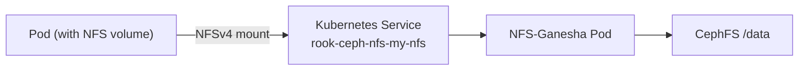

# How to Mount a Rook-Ceph NFS Share in Kubernetes

Author: [nawazdhandala](https://www.github.com/nawazdhandala)

Tags: Rook, Ceph, Kubernetes, NFS, Storage, Mount, PersistentVolume

Description: Mount a Rook-Ceph NFS share in Kubernetes using PersistentVolumes, PersistentVolumeClaims, and direct volume mounts with NFSv4.

---

## How NFS Mounts Work in Kubernetes with Rook-Ceph

Kubernetes can mount NFS shares using either static PersistentVolume definitions or the NFS CSI driver. Rook-Ceph's NFS-Ganesha server exposes CephFS paths over NFSv4, and pods can mount these paths as regular NFS volumes. This is useful for workloads that need ReadWriteMany (RWX) access across multiple pods or nodes.



## Prerequisites

- A `CephNFS` cluster deployed with an active export (see the NFS Gateway and NFS Export guides)
- The NFS-Ganesha service accessible from the namespace where pods will run
- Nodes must have `nfs-utils` installed (for kernel NFS client support)

Check that the NFS service is available:

```bash
kubectl -n rook-ceph get svc | grep nfs
```

Note the ClusterIP of the NFS service.

## Mounting NFS via Static PersistentVolume

Define a PersistentVolume that points to the NFS export. Replace `<nfs-service-ip>` with the ClusterIP of the NFS service:

```yaml
apiVersion: v1
kind: PersistentVolume
metadata:
  name: nfs-cephfs-pv
spec:
  capacity:
    storage: 10Gi
  accessModes:
    - ReadWriteMany
  persistentVolumeReclaimPolicy: Retain
  nfs:
    server: <nfs-service-ip>
    path: /cephfs-data
  mountOptions:
    - nfsvers=4.1
    - proto=tcp
```

Apply it:

```bash
kubectl apply -f nfs-pv.yaml
```

Create a PersistentVolumeClaim bound to this PV:

```yaml
apiVersion: v1
kind: PersistentVolumeClaim
metadata:
  name: nfs-cephfs-pvc
  namespace: default
spec:
  accessModes:
    - ReadWriteMany
  storageClassName: ""
  resources:
    requests:
      storage: 10Gi
  volumeName: nfs-cephfs-pv
```

Apply the PVC:

```bash
kubectl apply -f nfs-pvc.yaml
```

## Using the PVC in a Pod

Mount the NFS PVC in a pod:

```yaml
apiVersion: v1
kind: Pod
metadata:
  name: nfs-app
  namespace: default
spec:
  containers:
    - name: app
      image: nginx:alpine
      volumeMounts:
        - name: nfs-storage
          mountPath: /usr/share/nginx/html
  volumes:
    - name: nfs-storage
      persistentVolumeClaim:
        claimName: nfs-cephfs-pvc
```

```bash
kubectl apply -f nfs-pod.yaml
```

Verify the pod is running and the volume is mounted:

```bash
kubectl get pod nfs-app
kubectl exec nfs-app -- df -h /usr/share/nginx/html
```

## Mounting NFS Directly in a Pod (Without PV/PVC)

For quick testing, you can mount an NFS share directly as a volume in a pod spec:

```yaml
apiVersion: v1
kind: Pod
metadata:
  name: nfs-direct-mount
spec:
  containers:
    - name: app
      image: alpine
      command: ["sleep", "infinity"]
      volumeMounts:
        - name: nfs-vol
          mountPath: /mnt/nfs
  volumes:
    - name: nfs-vol
      nfs:
        server: <nfs-service-ip>
        path: /cephfs-data
        readOnly: false
```

## Using NFS CSI Driver for Dynamic Provisioning

If you have the [NFS CSI driver](https://github.com/kubernetes-csi/csi-driver-nfs) installed, you can use dynamic provisioning with a StorageClass:

```yaml
apiVersion: storage.k8s.io/v1
kind: StorageClass
metadata:
  name: nfs-cephfs
provisioner: nfs.csi.k8s.io
parameters:
  server: <nfs-service-ip>
  share: /cephfs-data
  subDir: ${pvc.metadata.namespace}/${pvc.metadata.name}
  onDeletePolicy: delete
reclaimPolicy: Delete
volumeBindingMode: Immediate
mountOptions:
  - nfsvers=4.1
  - proto=tcp
```

Then create a PVC using this StorageClass:

```yaml
apiVersion: v1
kind: PersistentVolumeClaim
metadata:
  name: nfs-dynamic-pvc
spec:
  accessModes:
    - ReadWriteMany
  storageClassName: nfs-cephfs
  resources:
    requests:
      storage: 5Gi
```

## Using NFS in a Deployment with ReadWriteMany

A major advantage of NFS is that multiple pods can read and write simultaneously. Deploy multiple replicas that all share the same storage:

```yaml
apiVersion: apps/v1
kind: Deployment
metadata:
  name: shared-app
spec:
  replicas: 3
  selector:
    matchLabels:
      app: shared-app
  template:
    metadata:
      labels:
        app: shared-app
    spec:
      containers:
        - name: app
          image: nginx:alpine
          volumeMounts:
            - name: shared-data
              mountPath: /data
      volumes:
        - name: shared-data
          persistentVolumeClaim:
            claimName: nfs-cephfs-pvc
```

## Troubleshooting NFS Mount Issues

If the pod is stuck in `ContainerCreating`, check the events:

```bash
kubectl describe pod nfs-app
```

Common issues:

- `nfs-utils` not installed on the node - install with the node's package manager
- NFS port blocked by network policy - ensure port 2049 is allowed
- Wrong NFS server IP - verify with `kubectl -n rook-ceph get svc`

Check if the NFS server is reachable from the node:

```bash
# Run on the node directly
showmount -e <nfs-service-ip>
```

## Summary

Mounting a Rook-Ceph NFS share in Kubernetes requires a running CephNFS server with an active export. Use a static PersistentVolume pointing to the NFS ClusterIP and export path, bind it with a PVC, and reference the PVC in your pod. For multi-pod workloads, NFS provides ReadWriteMany access that RBD block storage does not support, making it suitable for shared configuration, content, and log directories.
