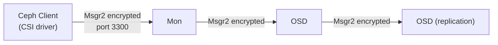

# How to Enable Msgr2 Protocol Encryption in Rook-Ceph

Author: [nawazdhandala](https://www.github.com/nawazdhandala)

Tags: Rook, Ceph, Kubernetes, Security, Encryption, Network

Description: Enable Msgr2 encryption in Rook-Ceph to encrypt all Ceph daemon-to-daemon and client-to-daemon network traffic using the v2 Ceph messenger protocol.

---

## What is Msgr2

Msgr2 is the second version of the Ceph messenger protocol (also called "v2"). It replaces the older msgr1 (v1) protocol and supports:

- **Encryption** - AES-GCM encryption of all wire traffic
- **Compression** - Optional compression of messages
- **Authentication** - Improved authentication with session keys

When Msgr2 encryption is enabled, all traffic between Ceph daemons (Mon-OSD, OSD-OSD) and between clients and daemons is encrypted in transit without requiring TLS certificates or external PKI.



## Enabling Msgr2 Encryption

Configure the encryption mode in `network.connections`:

```yaml
apiVersion: ceph.rook.io/v1
kind: CephCluster
metadata:
  name: rook-ceph
  namespace: rook-ceph
spec:
  cephVersion:
    image: quay.io/ceph/ceph:v19.2.0
  dataDirHostPath: /var/lib/rook
  network:
    provider: host
    connections:
      encryption:
        enabled: true
      compression:
        enabled: false
      requireMsgr2: true
```

## Encryption Modes

| Setting | Behavior |
|---|---|
| `encryption.enabled: false, requireMsgr2: false` | Msgr1 and Msgr2 both allowed, no encryption |
| `encryption.enabled: true, requireMsgr2: false` | Encrypt Msgr2 connections; Msgr1 fallback allowed |
| `encryption.enabled: true, requireMsgr2: true` | Require Msgr2 encrypted; reject all Msgr1 connections |

Setting `requireMsgr2: true` provides the strongest security by blocking old unencrypted connections.

## Kernel Requirements

The kernel CephFS client requires kernel 5.11+ for Msgr2 support. Check your kernel:

```bash
uname -r
```

If kernel < 5.11, the CephFS kernel client will fall back to Msgr1. Either upgrade the kernel or use the FUSE CephFS client:

```bash
kubectl -n rook-ceph patch configmap rook-ceph-operator-config \
  --type merge \
  -p '{"data":{"CSI_FORCE_CEPHFS_KERNEL_CLIENT":"false"}}'
```

## Verifying Encryption is Active

From the toolbox, check that Msgr2 is being used:

```bash
kubectl -n rook-ceph exec -it deploy/rook-ceph-tools -- \
  ceph config get mon.a ms_cluster_mode
# Expected: secure

kubectl -n rook-ceph exec -it deploy/rook-ceph-tools -- \
  ceph config get osd.0 ms_cluster_mode
# Expected: secure
```

Also check the connection count in Mon status:

```bash
kubectl -n rook-ceph exec -it deploy/rook-ceph-tools -- \
  ceph tell mon.* connection dump | grep -E "v2|secure"
```

## Checking Active Configuration via Ceph Config

Confirm the encryption settings are applied at the global level:

```bash
kubectl -n rook-ceph exec -it deploy/rook-ceph-tools -- \
  ceph config dump | grep -E "ms_cluster_mode|ms_service_mode|ms_client_mode"
```

Expected output when encryption is fully enabled:

```
ms_cluster_mode    secure
ms_service_mode    secure
ms_client_mode     secure
```

## Performance Impact

Msgr2 encryption uses AES-128-GCM, which has hardware acceleration support (AES-NI) on modern CPUs. The performance overhead is typically less than 5% on AES-NI capable hardware.

Check if AES-NI is available on a node:

```bash
grep -m1 aes /proc/cpuinfo
# Expected: flags: ... aes ...
```

On hardware without AES-NI (some ARM64, older x86), the overhead may be 10-20% depending on throughput.

## Disabling Encryption (Reverting)

To disable encryption, update the CephCluster and apply:

```yaml
spec:
  network:
    connections:
      encryption:
        enabled: false
      requireMsgr2: false
```

Ceph performs a rolling config update without requiring daemon restarts.

## Summary

Enable Msgr2 protocol encryption in Rook-Ceph via `network.connections.encryption.enabled: true` in the CephCluster spec. Set `requireMsgr2: true` to enforce encrypted-only connections and block legacy Msgr1 traffic. Msgr2 encrypts all Ceph wire traffic using AES-128-GCM with minimal overhead on AES-NI capable CPUs. Kernel 5.11+ is required for the CephFS kernel client to use Msgr2; on older kernels, switch to the FUSE client. Verify encryption is active with `ceph config dump | grep ms_cluster_mode`.
