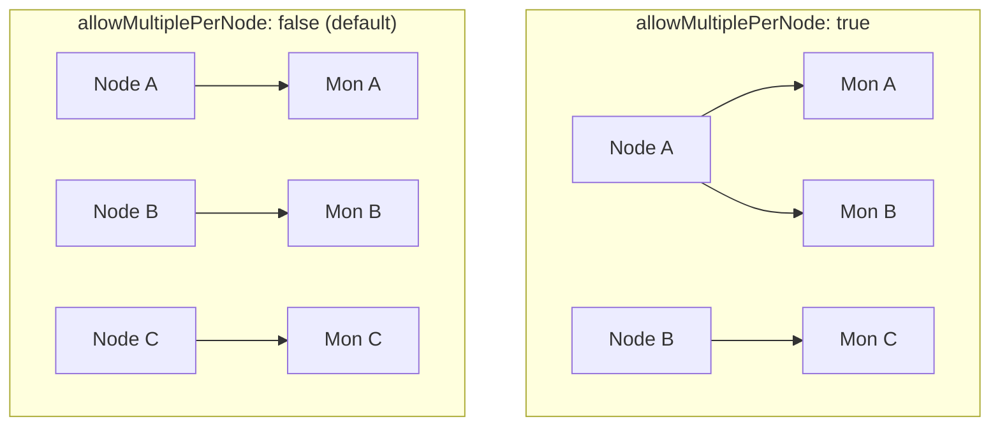

# How to Allow Multiple Monitors Per Node in Rook-Ceph

Author: [nawazdhandala](https://www.github.com/nawazdhandala)

Tags: Rook, Ceph, Kubernetes, Storage, Monitor, Configuration

Description: Configure Rook-Ceph to allow multiple Ceph monitors on a single node using allowMultiplePerNode, when it is appropriate, and the risks of collocating monitors.

---

## What allowMultiplePerNode Controls

The `spec.mon.allowMultiplePerNode` field controls whether Rook is permitted to schedule more than one Mon pod on the same Kubernetes node. When set to `false` (the default), Rook enforces that each Mon lands on a different node.



## When to Use allowMultiplePerNode: true

**Single-node testing clusters:**

```yaml
spec:
  mon:
    count: 3
    allowMultiplePerNode: true
```

On a Minikube or single-node development cluster, there is only one node available. Without `allowMultiplePerNode: true`, Rook cannot schedule all 3 Mons and the cluster will be stuck in a pending state.

**Small clusters (fewer nodes than Mons):**

If you have a 2-node cluster and want 3 Mons (for fault tolerance), one node must host 2 Mons:

```yaml
spec:
  mon:
    count: 3
    allowMultiplePerNode: true
```

Note: In a 2-node cluster with 2 Mons on one node, if that node fails, you lose quorum regardless of `allowMultiplePerNode`. The value of multiple Mons is only realized when they are on separate nodes.

## Production Setting (Recommended)

For production with 3 or more dedicated storage nodes:

```yaml
spec:
  mon:
    count: 3
    allowMultiplePerNode: false
```

This ensures each Mon failure corresponds to an independent node failure.

## Risk of Collocating Monitors

When multiple Mons share a node, a single node failure removes multiple Mons from quorum simultaneously. With 3 Mons all on one node, that node failing breaks quorum entirely.

Example: 3 Mons, 2 on Node A, 1 on Node B:
- Node A fails: Mons A and B go down, only Mon C survives - **quorum lost (1/3)**
- Node B fails: Mon C goes down, Mons A and B survive - **quorum maintained (2/3)**

## Checking Current Mon Distribution

```bash
kubectl -n rook-ceph get pods -l app=rook-ceph-mon -o wide
```

Check the `NODE` column to see which node each Mon is on.

## Combining with Pod Anti-Affinity

Even with `allowMultiplePerNode: true`, you can use pod anti-affinity as a preference (not a requirement) to encourage spreading:

```yaml
spec:
  mon:
    count: 3
    allowMultiplePerNode: true
  placement:
    mon:
      podAntiAffinity:
        preferredDuringSchedulingIgnoredDuringExecution:
          - weight: 100
            podAffinityTerm:
              labelSelector:
                matchExpressions:
                  - key: app
                    operator: In
                    values:
                      - rook-ceph-mon
              topologyKey: kubernetes.io/hostname
```

This tells the scheduler to prefer different nodes but allows collocation when no other option exists.

## Changing the Setting on a Running Cluster

You can change `allowMultiplePerNode` on a running cluster:

```bash
kubectl -n rook-ceph patch cephcluster rook-ceph \
  --type merge \
  -p '{"spec":{"mon":{"allowMultiplePerNode":false}}}'
```

Rook will attempt to reschedule any collocated Mons to different nodes if capacity allows. Monitor the process:

```bash
kubectl -n rook-ceph get events -w | grep mon
```

## Testing and Development Recommendation

For testing with Minikube or kind:

```yaml
spec:
  mon:
    count: 1
    allowMultiplePerNode: true
```

Using a single Mon for testing is simpler and avoids the overhead of quorum management on a development machine.

## Summary

`allowMultiplePerNode: true` is required for single-node or small clusters where there are fewer nodes than configured Mon count. For production, always use `allowMultiplePerNode: false` to ensure each Mon corresponds to an independent failure domain. When Mons share a node, a single node failure can remove multiple Mons and break quorum. Use preferred pod anti-affinity alongside `allowMultiplePerNode: true` to encourage distribution while still allowing collocation when needed.
