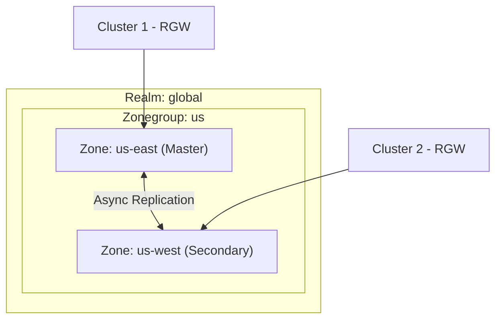

# How to Configure Rook-Ceph for Multi-Site Object Replication

Author: [nawazdhandala](https://www.github.com/nawazdhandala)

Tags: Rook, Ceph, Kubernetes, Object Storage, Multi-Site, Replication, RGW

Description: Configure Rook-Ceph multi-site object replication to synchronize S3-compatible object stores across multiple Kubernetes clusters for geo-redundancy.

---

## How Ceph Multi-Site Object Replication Works

Ceph RadosGW (RGW) supports multi-site replication through a hierarchy of realms, zonegroups, and zones. Each zone holds an independent object store, and Ceph synchronizes objects between zones within a zonegroup automatically. This enables active-active or active-passive geo-replication.



## Prerequisites

- Two Rook-Ceph clusters, each with an object store deployed
- Network connectivity between the two clusters (RGW endpoints reachable)
- `rook-ceph-tools` available on both clusters
- The Rook operator version 1.9 or later (CRD-based multi-site support)

## Step 1 - Create the Realm on the Master Cluster

On the master cluster, create a CephObjectRealm:

```yaml
apiVersion: ceph.rook.io/v1
kind: CephObjectRealm
metadata:
  name: us-realm
  namespace: rook-ceph
```

Apply it:

```bash
kubectl apply -f realm.yaml
```

## Step 2 - Create the Master Zonegroup

```yaml
apiVersion: ceph.rook.io/v1
kind: CephObjectZoneGroup
metadata:
  name: us
  namespace: rook-ceph
spec:
  realm: us-realm
```

```bash
kubectl apply -f zonegroup.yaml
```

## Step 3 - Create the Master Zone

```yaml
apiVersion: ceph.rook.io/v1
kind: CephObjectZone
metadata:
  name: us-east
  namespace: rook-ceph
spec:
  zoneGroup: us
  metadataPool:
    replicated:
      size: 3
  dataPool:
    replicated:
      size: 3
```

```bash
kubectl apply -f zone-master.yaml
```

## Step 4 - Deploy the Object Store on the Master Zone

```yaml
apiVersion: ceph.rook.io/v1
kind: CephObjectStore
metadata:
  name: us-east-store
  namespace: rook-ceph
spec:
  gateway:
    port: 80
    instances: 2
  zone:
    name: us-east
```

```bash
kubectl apply -f objectstore-master.yaml
```

## Step 5 - Export the Realm Token

Pull the realm token so the secondary cluster can join:

```bash
kubectl -n rook-ceph exec -it deploy/rook-ceph-tools -- \
  radosgw-admin realm pull --url=http://us-east-store-rgw.rook-ceph.svc:80 \
  --access-key=<master-access-key> \
  --secret=<master-secret-key>
```

Alternatively, retrieve the realm token via the Rook CRD status:

```bash
kubectl -n rook-ceph get cephobjectrealm us-realm -o jsonpath='{.status.info.token}'
```

Store this token as a Secret on the secondary cluster:

```yaml
apiVersion: v1
kind: Secret
metadata:
  name: us-realm-token
  namespace: rook-ceph
data:
  token: <base64-encoded-token>
  endpoint: aHR0cDovL3VzLWVhc3Qtc3RvcmUtcmd3LnJvb2stY2VwaC5zdmM6ODA=
```

## Step 6 - Join the Secondary Cluster to the Realm

On the secondary cluster, create the CephObjectRealm referencing the master:

```yaml
apiVersion: ceph.rook.io/v1
kind: CephObjectRealm
metadata:
  name: us-realm
  namespace: rook-ceph
spec:
  pull:
    endpoint: http://<master-rgw-endpoint>:80
    secret:
      name: us-realm-token
```

Create the secondary zone:

```yaml
apiVersion: ceph.rook.io/v1
kind: CephObjectZone
metadata:
  name: us-west
  namespace: rook-ceph
spec:
  zoneGroup: us
  metadataPool:
    replicated:
      size: 3
  dataPool:
    replicated:
      size: 3
```

Deploy the object store on the secondary zone:

```yaml
apiVersion: ceph.rook.io/v1
kind: CephObjectStore
metadata:
  name: us-west-store
  namespace: rook-ceph
spec:
  gateway:
    port: 80
    instances: 2
  zone:
    name: us-west
```

## Step 7 - Verify Replication is Active

On the master cluster, check zone sync status:

```bash
kubectl -n rook-ceph exec -it deploy/rook-ceph-tools -- \
  radosgw-admin sync status
```

Expect to see `sync is in progress` and replication lag information.

Check the realm configuration:

```bash
kubectl -n rook-ceph exec -it deploy/rook-ceph-tools -- \
  radosgw-admin realm list
```

Check zone info on both clusters:

```bash
kubectl -n rook-ceph exec -it deploy/rook-ceph-tools -- \
  radosgw-admin zone get --rgw-zone=us-east
```

## Configuring Sync Policy (Optional)

Rook supports fine-grained sync policies to control which buckets or prefixes are replicated. Define a sync policy to replicate only specific buckets:

```yaml
apiVersion: ceph.rook.io/v1
kind: CephObjectZone
metadata:
  name: us-east
  namespace: rook-ceph
spec:
  zoneGroup: us
  metadataPool:
    replicated:
      size: 3
  dataPool:
    replicated:
      size: 3
  syncPolicy:
    bucketPolicyScope: user
```

## Summary

Rook-Ceph multi-site object replication requires creating a realm, zonegroup, and zones using Rook CRDs. The master zone exports a realm token, which the secondary cluster uses to join the same realm. Once zones are linked, Ceph's RGW sync mechanism replicates objects between zones asynchronously. This configuration provides geo-redundant S3-compatible storage with automatic failover capability.
