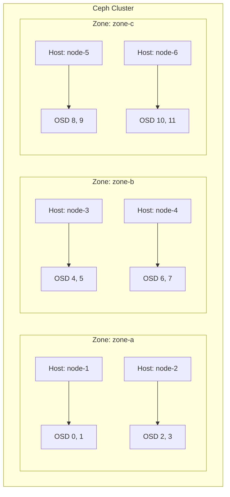

# How to Set Up Rook-Ceph in a Multi-Zone Configuration

Author: [nawazdhandala](https://www.github.com/nawazdhandala)

Tags: Rook, Ceph, Kubernetes, Multi-Zone, Storage, High Availability

Description: Configure Rook-Ceph in a multi-zone setup to distribute storage across failure domains for improved availability and fault tolerance.

---

## How Multi-Zone Works in Rook-Ceph

Multi-zone in Rook-Ceph can refer to two distinct concepts: Ceph CRUSH topology zones for data locality within a single cluster, and RGW multi-zone replication for object storage across clusters. This guide covers CRUSH-based multi-zone topology, which distributes OSDs across physical failure domains (zones, racks, DCs) to ensure data survives zone failures.



## Prerequisites

- Kubernetes nodes labeled with topology zone information
- Minimum of 3 zones with at least one node per zone for fault tolerance
- Rook-Ceph operator deployed
- Nodes in each zone accessible by the Rook operator

## Labeling Kubernetes Nodes with Zone Topology

Label each node with its failure domain zone. Kubernetes uses the standard `topology.kubernetes.io/zone` label:

```bash
kubectl label node node-1 topology.kubernetes.io/zone=zone-a
kubectl label node node-2 topology.kubernetes.io/zone=zone-a
kubectl label node node-3 topology.kubernetes.io/zone=zone-b
kubectl label node node-4 topology.kubernetes.io/zone=zone-b
kubectl label node node-5 topology.kubernetes.io/zone=zone-c
kubectl label node node-6 topology.kubernetes.io/zone=zone-c
```

Verify the labels:

```bash
kubectl get nodes -L topology.kubernetes.io/zone
```

## Configuring the CephCluster with Zone Topology

Set `topology` in the CephCluster spec to enable CRUSH map awareness of zones:

```yaml
apiVersion: ceph.rook.io/v1
kind: CephCluster
metadata:
  name: rook-ceph
  namespace: rook-ceph
spec:
  cephVersion:
    image: quay.io/ceph/ceph:v19.2.0
  dataDirHostPath: /var/lib/rook
  mon:
    count: 3
    allowMultiplePerNode: false
    volumeClaimTemplate:
      spec:
        storageClassName: local-storage
        resources:
          requests:
            storage: 10Gi
  storage:
    useAllNodes: true
    useAllDevices: true
  placement:
    all:
      topologySpreadConstraints:
        - maxSkew: 1
          topologyKey: topology.kubernetes.io/zone
          whenUnsatisfiable: DoNotSchedule
          labelSelector:
            matchLabels:
              app: rook-ceph-osd
```

## Configuring CRUSH Failure Domain to Zone

Create a CephBlockPool with `failureDomain: zone` to ensure each replica is placed in a different zone:

```yaml
apiVersion: ceph.rook.io/v1
kind: CephBlockPool
metadata:
  name: zone-replicated-pool
  namespace: rook-ceph
spec:
  failureDomain: zone
  replicated:
    size: 3
    requireSafeReplicaSize: true
```

Apply it:

```bash
kubectl apply -f cephblockpool-zone.yaml
```

Verify the pool was created with the zone failure domain:

```bash
kubectl -n rook-ceph exec -it deploy/rook-ceph-tools -- \
  ceph osd pool get zone-replicated-pool crush_rule
```

## Verifying the CRUSH Map

Check that the CRUSH map reflects the zone topology:

```bash
kubectl -n rook-ceph exec -it deploy/rook-ceph-tools -- \
  ceph osd tree
```

The output should show a hierarchy like:

```text
ID  CLASS  WEIGHT   TYPE NAME
-1         0.58789  root default
-4         0.19596      zone zone-a
-3         0.09798          host node-1
 0    hdd  0.04899              osd.0
 1    hdd  0.04899              osd.1
...
```

Check the CRUSH rule for your pool:

```bash
kubectl -n rook-ceph exec -it deploy/rook-ceph-tools -- \
  ceph osd crush rule dump zone-replicated-pool
```

## Configuring MONs Across Zones

To ensure MON quorum survives a zone failure, spread MONs across zones. Use `stretchCluster` for a stretch cluster configuration:

```yaml
apiVersion: ceph.rook.io/v1
kind: CephCluster
metadata:
  name: rook-ceph
  namespace: rook-ceph
spec:
  mon:
    count: 5
    allowMultiplePerNode: false
    stretchCluster:
      failureDomainLabel: topology.kubernetes.io/zone
      subFailureDomain: host
      zones:
        - name: zone-a
          arbiter: false
        - name: zone-b
          arbiter: false
        - name: zone-c
          arbiter: true
```

The arbiter zone hosts a single MON that serves as a tiebreaker but does not store data.

## Testing Zone Failure Tolerance

Simulate a zone failure by draining all nodes in one zone:

```bash
kubectl drain node-1 --ignore-daemonsets --delete-emptydir-data
kubectl drain node-2 --ignore-daemonsets --delete-emptydir-data
```

Check cluster health - it should remain `HEALTH_WARN` (zone down) but still serve I/O:

```bash
kubectl -n rook-ceph exec -it deploy/rook-ceph-tools -- ceph status
```

Restore the zone:

```bash
kubectl uncordon node-1
kubectl uncordon node-2
```

## Summary

Rook-Ceph multi-zone configuration uses Kubernetes node topology labels and Ceph CRUSH failure domains to distribute OSDs and replicas across physical zones. Setting `failureDomain: zone` on a CephBlockPool ensures each replica is written to a different zone, protecting data from zone-level failures. For MON high availability across zones, use the stretch cluster configuration with an arbiter zone as a tiebreaker.
