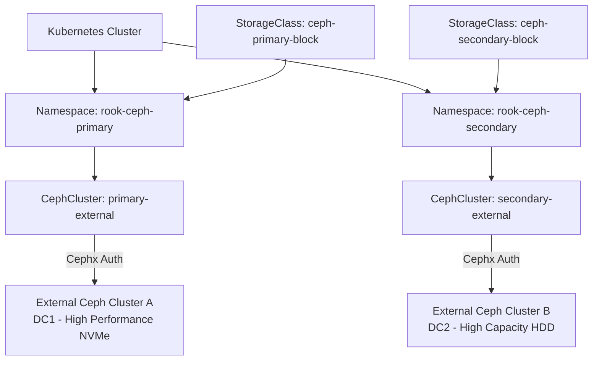

# How to Manage Multiple External Ceph Clusters with Rook

Author: [nawazdhandala](https://www.github.com/nawazdhandala)

Tags: Rook, Ceph, Kubernetes, Storage

Description: Configure Rook to connect to and manage multiple independent external Ceph clusters simultaneously from a single Kubernetes cluster.

---

## Introduction

There are many scenarios where a single Kubernetes cluster needs to consume storage from multiple external Ceph clusters: geographic distribution, separate clusters for different performance tiers, or multi-tenant isolation. Rook supports this by deploying multiple CephCluster CRs in separate namespaces, each with its own CSI driver instance and set of secrets.

This guide walks through deploying two external Ceph clusters in separate namespaces with their own StorageClasses.

## Multi-Cluster Architecture



## Prerequisites

- Rook operator installed (manages all namespaces by default)
- Two independent external Ceph clusters with admin access
- Network connectivity from Kubernetes nodes to both Ceph monitor endpoints

## Step 1: Configure the Rook Operator for Multiple Namespaces

By default, the Rook operator watches a single namespace. Update it to watch all namespaces:

```yaml
# rook-operator-config.yaml
apiVersion: v1
kind: ConfigMap
metadata:
  name: rook-ceph-operator-config
  namespace: rook-ceph
data:
  # Watch all namespaces (empty string = all)
  ROOK_CURRENT_NAMESPACE_ONLY: "false"
```

```bash
kubectl apply -f rook-operator-config.yaml
kubectl rollout restart deployment/rook-ceph-operator -n rook-ceph
```

## Step 2: Set Up the Primary External Cluster Namespace

```bash
kubectl create namespace rook-ceph-primary
```

Create secrets for the primary external cluster:

```yaml
# primary-secrets.yaml
apiVersion: v1
kind: Secret
metadata:
  name: rook-ceph-mon
  namespace: rook-ceph-primary
stringData:
  mon_host: "10.0.1.10:6789,10.0.1.11:6789,10.0.1.12:6789"
  fsid: "aaa11111-aaaa-aaaa-aaaa-aaaaaaaaaaaa"
---
apiVersion: v1
kind: Secret
metadata:
  name: rook-csi-rbd-provisioner
  namespace: rook-ceph-primary
stringData:
  userID: rook-csi-rbd-provisioner
  userKey: AQCprimary_provisioner_key==
---
apiVersion: v1
kind: Secret
metadata:
  name: rook-csi-rbd-node
  namespace: rook-ceph-primary
stringData:
  userID: rook-csi-rbd-node
  userKey: AQCprimary_node_key==
```

```bash
kubectl apply -f primary-secrets.yaml
```

Deploy the primary CephCluster CR:

```yaml
# primary-cephcluster.yaml
apiVersion: ceph.rook.io/v1
kind: CephCluster
metadata:
  name: rook-ceph-primary
  namespace: rook-ceph-primary
spec:
  external:
    enable: true
  dataDirHostPath: /var/lib/rook/primary
  monitoring:
    enabled: true
    externalMgrEndpoints:
      - ip: "10.0.1.20"
    externalMgrPrometheusPort: 9283
  crashCollector:
    disable: true
```

```bash
kubectl apply -f primary-cephcluster.yaml
```

## Step 3: Set Up the Secondary External Cluster Namespace

```bash
kubectl create namespace rook-ceph-secondary
```

```yaml
# secondary-secrets.yaml
apiVersion: v1
kind: Secret
metadata:
  name: rook-ceph-mon
  namespace: rook-ceph-secondary
stringData:
  mon_host: "10.0.2.10:6789,10.0.2.11:6789,10.0.2.12:6789"
  fsid: "bbb22222-bbbb-bbbb-bbbb-bbbbbbbbbbbb"
---
apiVersion: v1
kind: Secret
metadata:
  name: rook-csi-rbd-provisioner
  namespace: rook-ceph-secondary
stringData:
  userID: rook-csi-rbd-provisioner
  userKey: AQCsecondary_provisioner_key==
---
apiVersion: v1
kind: Secret
metadata:
  name: rook-csi-rbd-node
  namespace: rook-ceph-secondary
stringData:
  userID: rook-csi-rbd-node
  userKey: AQCsecondary_node_key==
```

```bash
kubectl apply -f secondary-secrets.yaml
```

Deploy the secondary CephCluster CR:

```yaml
# secondary-cephcluster.yaml
apiVersion: ceph.rook.io/v1
kind: CephCluster
metadata:
  name: rook-ceph-secondary
  namespace: rook-ceph-secondary
spec:
  external:
    enable: true
  dataDirHostPath: /var/lib/rook/secondary
  monitoring:
    enabled: true
    externalMgrEndpoints:
      - ip: "10.0.2.20"
    externalMgrPrometheusPort: 9283
  crashCollector:
    disable: true
```

```bash
kubectl apply -f secondary-cephcluster.yaml
```

## Step 4: Create Separate CSI Driver Instances

Each external cluster namespace needs its own CSI driver configuration. Set up the CSI configmap for both:

```yaml
# csi-config-multicluster.yaml
apiVersion: v1
kind: ConfigMap
metadata:
  name: rook-ceph-csi-config
  namespace: rook-ceph
data:
  config.json: |
    [
      {
        "clusterID": "aaa11111-aaaa-aaaa-aaaa-aaaaaaaaaaaa",
        "monitors": [
          "10.0.1.10:6789",
          "10.0.1.11:6789",
          "10.0.1.12:6789"
        ],
        "cephFS": {
          "subvolumeGroup": "csi"
        }
      },
      {
        "clusterID": "bbb22222-bbbb-bbbb-bbbb-bbbbbbbbbbbb",
        "monitors": [
          "10.0.2.10:6789",
          "10.0.2.11:6789",
          "10.0.2.12:6789"
        ],
        "cephFS": {
          "subvolumeGroup": "csi"
        }
      }
    ]
```

```bash
kubectl apply -f csi-config-multicluster.yaml
```

## Step 5: Create StorageClasses for Each Cluster

```yaml
# storageclass-primary.yaml
apiVersion: storage.k8s.io/v1
kind: StorageClass
metadata:
  name: ceph-primary-block
  annotations:
    description: "High-performance NVMe storage from primary Ceph cluster DC1"
provisioner: rook-ceph.rbd.csi.ceph.com
parameters:
  clusterID: "aaa11111-aaaa-aaaa-aaaa-aaaaaaaaaaaa"
  pool: nvme-pool
  imageFormat: "2"
  imageFeatures: layering,fast-diff,object-map,deep-flatten,exclusive-lock
  csi.storage.k8s.io/provisioner-secret-name: rook-csi-rbd-provisioner
  csi.storage.k8s.io/provisioner-secret-namespace: rook-ceph-primary
  csi.storage.k8s.io/controller-expand-secret-name: rook-csi-rbd-provisioner
  csi.storage.k8s.io/controller-expand-secret-namespace: rook-ceph-primary
  csi.storage.k8s.io/node-stage-secret-name: rook-csi-rbd-node
  csi.storage.k8s.io/node-stage-secret-namespace: rook-ceph-primary
reclaimPolicy: Delete
allowVolumeExpansion: true
volumeBindingMode: Immediate
---
apiVersion: storage.k8s.io/v1
kind: StorageClass
metadata:
  name: ceph-secondary-block
  annotations:
    description: "High-capacity HDD storage from secondary Ceph cluster DC2"
provisioner: rook-ceph.rbd.csi.ceph.com
parameters:
  clusterID: "bbb22222-bbbb-bbbb-bbbb-bbbbbbbbbbbb"
  pool: hdd-pool
  imageFormat: "2"
  imageFeatures: layering,fast-diff,object-map,deep-flatten,exclusive-lock
  csi.storage.k8s.io/provisioner-secret-name: rook-csi-rbd-provisioner
  csi.storage.k8s.io/provisioner-secret-namespace: rook-ceph-secondary
  csi.storage.k8s.io/controller-expand-secret-name: rook-csi-rbd-provisioner
  csi.storage.k8s.io/controller-expand-secret-namespace: rook-ceph-secondary
  csi.storage.k8s.io/node-stage-secret-name: rook-csi-rbd-node
  csi.storage.k8s.io/node-stage-secret-namespace: rook-ceph-secondary
reclaimPolicy: Delete
allowVolumeExpansion: true
volumeBindingMode: Immediate
```

```bash
kubectl apply -f storageclass-primary.yaml
```

## Step 6: Verify Both Clusters Are Connected

```bash
# Check status of both CephCluster CRs
kubectl get cephcluster -A

# Expected output:
# NAMESPACE              NAME                    DATADIRHOSTPATH       PHASE
# rook-ceph-primary      rook-ceph-primary       /var/lib/rook/primary Connected
# rook-ceph-secondary    rook-ceph-secondary     /var/lib/rook/secondary Connected

# Check the operator is managing both namespaces
kubectl logs -n rook-ceph deploy/rook-ceph-operator | grep -E "primary|secondary" | tail -20
```

## Step 7: Test Both StorageClasses

```bash
# Create PVCs from each cluster
for cluster in primary secondary; do
  kubectl apply -f - <<EOF
apiVersion: v1
kind: PersistentVolumeClaim
metadata:
  name: test-pvc-${cluster}
spec:
  accessModes: [ReadWriteOnce]
  storageClassName: ceph-${cluster}-block
  resources:
    requests:
      storage: 1Gi
EOF
done

# Check both PVCs are bound
kubectl get pvc test-pvc-primary test-pvc-secondary
```

## Managing Multiple Cluster Configs with Kustomize

For production, use Kustomize overlays to manage per-cluster configurations:

```bash
# Directory structure
multi-cluster/
  base/
    kustomization.yaml
    cephcluster.yaml
    secrets.yaml
  overlays/
    primary/
      kustomization.yaml
      patch-cluster.yaml
    secondary/
      kustomization.yaml
      patch-cluster.yaml

# Deploy primary
kubectl apply -k multi-cluster/overlays/primary/

# Deploy secondary
kubectl apply -k multi-cluster/overlays/secondary/
```

## Summary

Managing multiple external Ceph clusters with Rook requires deploying separate CephCluster CRs in separate Kubernetes namespaces, each with their own CSI secrets and monitoring configuration. The Rook operator must be configured with `ROOK_CURRENT_NAMESPACE_ONLY: "false"` to watch all namespaces. Each cluster gets its own entry in the CSI config ConfigMap and its own StorageClasses referencing the correct cluster FSID and secret namespace.
