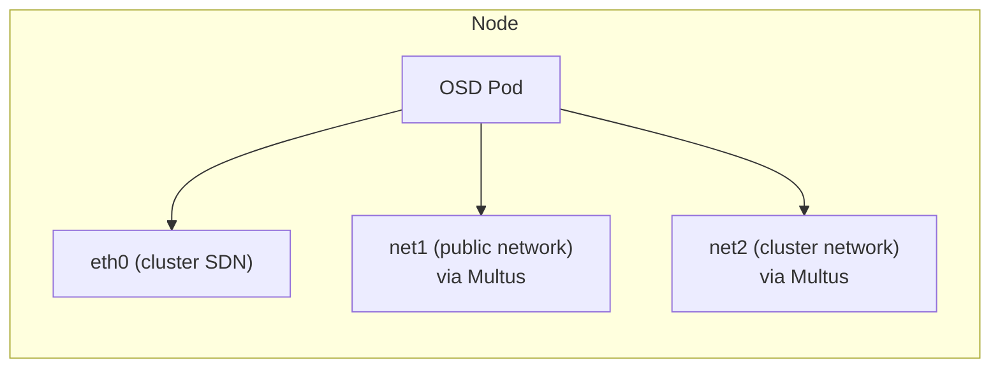

# How to Configure Rook-Ceph with Multus CNI

Author: [nawazdhandala](https://www.github.com/nawazdhandala)

Tags: Rook, Ceph, Kubernetes, Multus, CNI, Network, Storage

Description: Configure Rook-Ceph to use Multus CNI for attaching dedicated storage network interfaces to Ceph pods, separating storage traffic from the main cluster network.

---

## How Multus Works with Rook-Ceph

Multus CNI enables pods to have multiple network interfaces. For Rook-Ceph, this means attaching dedicated high-speed storage NICs directly to Ceph daemon pods, routing storage traffic (both client I/O and OSD replication) over a dedicated network segment separate from the Kubernetes pod network. This improves performance and reduces noisy-neighbor effects.



## Prerequisites

- Multus CNI installed on all cluster nodes (version 3.7+)
- A compatible secondary CNI plugin (macvlan, ipvlan, SR-IOV, or similar)
- Physical or VLAN-separated network interfaces on storage nodes
- IPAM configured for the secondary networks (static or DHCP)

Verify Multus is installed:

```bash
kubectl get pods -n kube-system | grep multus
kubectl get crd networkattachmentdefinitions.k8s.cni.cncf.io
```

## Step 1 - Create NetworkAttachmentDefinitions

Create a NetworkAttachmentDefinition (NAD) for the public network (client-facing):

```yaml
apiVersion: k8s.cni.cncf.io/v1
kind: NetworkAttachmentDefinition
metadata:
  name: public-net
  namespace: rook-ceph
spec:
  config: |
    {
      "cniVersion": "0.3.1",
      "type": "macvlan",
      "master": "eth1",
      "mode": "bridge",
      "ipam": {
        "type": "static",
        "addresses": []
      }
    }
```

Create a NetworkAttachmentDefinition for the cluster network (OSD replication):

```yaml
apiVersion: k8s.cni.cncf.io/v1
kind: NetworkAttachmentDefinition
metadata:
  name: cluster-net
  namespace: rook-ceph
spec:
  config: |
    {
      "cniVersion": "0.3.1",
      "type": "macvlan",
      "master": "eth2",
      "mode": "bridge",
      "ipam": {
        "type": "static",
        "addresses": []
      }
    }
```

Apply both NADs:

```bash
kubectl apply -f public-nad.yaml
kubectl apply -f cluster-nad.yaml
```

For DHCP-based IPAM (simpler setup when DHCP is available):

```yaml
spec:
  config: |
    {
      "cniVersion": "0.3.1",
      "type": "macvlan",
      "master": "eth1",
      "mode": "bridge",
      "ipam": {
        "type": "dhcp"
      }
    }
```

## Step 2 - Configure the CephCluster to Use Multus

Update the CephCluster spec to use the Multus provider and reference the NADs:

```yaml
apiVersion: ceph.rook.io/v1
kind: CephCluster
metadata:
  name: rook-ceph
  namespace: rook-ceph
spec:
  cephVersion:
    image: quay.io/ceph/ceph:v19.2.0
  dataDirHostPath: /var/lib/rook
  network:
    provider: multus
    selectors:
      public: rook-ceph/public-net
      cluster: rook-ceph/cluster-net
    ipFamily: IPv4
  storage:
    useAllNodes: false
    useAllDevices: false
    nodes:
      - name: storage-node-1
        devices:
          - name: sdb
      - name: storage-node-2
        devices:
          - name: sdb
      - name: storage-node-3
        devices:
          - name: sdb
```

The `selectors.public` and `selectors.cluster` values use the format `<namespace>/<nad-name>`.

## Step 3 - Verify Multus Network Attachment

After applying the CephCluster, check that OSD pods have the Multus network annotation:

```bash
kubectl -n rook-ceph get pod rook-ceph-osd-0-<hash> -o jsonpath='{.metadata.annotations}' \
  | python3 -m json.tool | grep -A5 network-attachment
```

Check that the OSD pod has the additional network interfaces:

```bash
kubectl -n rook-ceph exec -it rook-ceph-osd-0-<hash> -- ip addr
```

You should see `net1` and `net2` interfaces in addition to `eth0`.

## Step 4 - Verify Ceph is Using the Correct Networks

Check that OSD public and cluster addresses are on the Multus networks:

```bash
kubectl -n rook-ceph exec -it deploy/rook-ceph-tools -- \
  ceph osd dump | grep -E "public_addr|cluster_addr" | head -6
```

The IPs should be in the Multus CIDR ranges, not the pod network CIDR.

Check MON addresses are on the public network:

```bash
kubectl -n rook-ceph exec -it deploy/rook-ceph-tools -- ceph mon dump
```

## Troubleshooting Multus Issues

If pods fail to start with Multus, check the pod events:

```bash
kubectl -n rook-ceph describe pod rook-ceph-osd-0-<hash> | grep -A10 Events
```

Common errors:

- `failed to find network attachment definition` - The NAD namespace or name is wrong
- `failed to allocate IP address` - IPAM configuration issue
- `failed to delegate ...` - The underlying CNI plugin (macvlan, ipvlan) has a configuration error

Check the Multus CNI pod logs on the affected node:

```bash
NODE=<node-name>
MULTUS_POD=$(kubectl -n kube-system get pods -l app=multus --field-selector=spec.nodeName=$NODE -o name)
kubectl -n kube-system logs $MULTUS_POD --tail=50
```

## Network Policy Considerations

When using Multus, network policies apply to the primary interface only. For security on the secondary networks, use:

- Node-level firewall rules (iptables/nftables) on the storage network interfaces
- VLAN access control at the switch level
- SR-IOV VF-based isolation for highest security

## Summary

Rook-Ceph with Multus CNI provides dedicated storage network interfaces by creating NetworkAttachmentDefinitions for public and cluster networks, then referencing them in the CephCluster spec with `network.provider: multus`. Ceph daemon pods receive additional network interfaces at the Multus network CIDRs, routing storage traffic away from the shared Kubernetes pod network. Verify the setup by confirming OSD public and cluster addresses are on the Multus network ranges using `ceph osd dump`.
