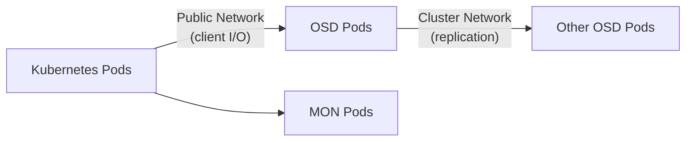

# How to Set Up Rook-Ceph Network Configuration

Author: [nawazdhandala](https://www.github.com/nawazdhandala)

Tags: Rook, Ceph, Kubernetes, Network, Storage, Configuration

Description: Configure Rook-Ceph network settings including public and cluster networks, host networking, IP version, and encryption for optimal storage performance and security.

---

## How Ceph Uses Multiple Networks

Ceph supports two distinct networks: the public network (client-facing, used by OSDs to serve data and MONs to communicate with clients) and the cluster network (used for OSD-to-OSD replication traffic). Separating these networks prevents replication traffic from competing with client I/O and improves both performance and security.



## Configuring Public and Cluster Networks

Set network ranges in the CephCluster spec under the `network` field:

```yaml
apiVersion: ceph.rook.io/v1
kind: CephCluster
metadata:
  name: rook-ceph
  namespace: rook-ceph
spec:
  network:
    provider: host
    addressRanges:
      public:
        - cidr: 10.0.0.0/24
      cluster:
        - cidr: 10.1.0.0/24
```

The `public` CIDR is for client-to-OSD and client-to-MON communication. The `cluster` CIDR is for OSD-to-OSD replication. Use separate physical or VLAN interfaces for each when possible.

## Host Networking Mode

Using `provider: host` makes Ceph daemons use the node's host network namespace directly, bypassing CNI plugins. This improves performance by reducing network overhead but requires careful firewall configuration.

```yaml
spec:
  network:
    provider: host
```

With host networking, Ceph services bind to node IP addresses. Ensure the following ports are open between nodes:

- MON: 3300, 6789
- OSD: 6800-7300
- MDS: 6800
- RGW: 80, 443 (configurable)
- MGR dashboard: 8080, 8443

## Using SDN (Default Kubernetes Network)

Without specifying `provider: host`, Rook uses the default CNI network (pods get cluster IPs). This is simpler to configure but may have higher latency for storage traffic:

```yaml
spec:
  network:
    provider: ""
```

For Kubernetes cluster networks that don't support host networking, this is the safe default.

## Multus CNI Integration

For advanced network configuration, use Multus to attach dedicated network interfaces to Ceph pods. This is covered in detail in the Multus guide. The basic configuration uses named NetworkAttachmentDefinitions:

```yaml
spec:
  network:
    provider: multus
    selectors:
      public: rook-ceph/public-net
      cluster: rook-ceph/cluster-net
```

## Requiring Msgr2 Protocol

Enable the Ceph messenger v2 protocol (msgr2) for all connections, which supports encryption and improved authentication:

```yaml
spec:
  network:
    connections:
      requireMsgr2: true
      encryption:
        enabled: true
```

This enforces TLS encryption for all Ceph daemon communication.

## Configuring IPv6

To use IPv6 for the Ceph public network:

```yaml
spec:
  network:
    ipFamily: IPv6
    provider: host
    addressRanges:
      public:
        - cidr: fd00::/64
```

Or for dual-stack:

```yaml
spec:
  network:
    dualStack: true
```

## Custom MON Service Configuration

Control how MON services are exposed:

```yaml
spec:
  mon:
    count: 3
    allowMultiplePerNode: false
```

For on-premises clusters where MONs need stable external IPs, use fixed PVC-based MON storage so MONs get predictable IP assignments via node affinity:

```yaml
spec:
  mon:
    count: 3
    volumeClaimTemplate:
      spec:
        storageClassName: local-storage
        resources:
          requests:
            storage: 10Gi
```

## Network Policy Configuration

If your cluster uses NetworkPolicies, add rules to allow Ceph pod communication.

Allow all pods in rook-ceph namespace to communicate with each other:

```yaml
apiVersion: networking.k8s.io/v1
kind: NetworkPolicy
metadata:
  name: rook-ceph-allow-internal
  namespace: rook-ceph
spec:
  podSelector: {}
  ingress:
    - from:
        - namespaceSelector:
            matchLabels:
              kubernetes.io/metadata.name: rook-ceph
  egress:
    - to:
        - namespaceSelector:
            matchLabels:
              kubernetes.io/metadata.name: rook-ceph
```

Allow application namespaces to reach Rook-Ceph CSI endpoints:

```yaml
apiVersion: networking.k8s.io/v1
kind: NetworkPolicy
metadata:
  name: allow-csi-from-apps
  namespace: rook-ceph
spec:
  podSelector:
    matchLabels:
      app: csi-rbdplugin
  ingress:
    - from:
        - namespaceSelector: {}
```

## Verifying Network Configuration

After applying the configuration, verify Ceph is using the correct networks:

```bash
kubectl -n rook-ceph exec -it deploy/rook-ceph-tools -- ceph config dump | grep network
```

Check OSD bind addresses:

```bash
kubectl -n rook-ceph exec -it deploy/rook-ceph-tools -- \
  ceph osd dump | grep -E "public_addr|cluster_addr" | head -10
```

Check MON addresses:

```bash
kubectl -n rook-ceph exec -it deploy/rook-ceph-tools -- ceph mon dump
```

## Summary

Rook-Ceph network configuration supports host networking, SDN, and Multus CNI modes. For production, separating public and cluster network CIDRs prevents replication traffic from competing with client I/O. Enabling `requireMsgr2` enforces the Ceph messenger v2 protocol with optional encryption. Use NetworkPolicies to control which namespaces can communicate with Ceph pods, and verify the configuration with `ceph config dump` and `ceph mon dump`.
