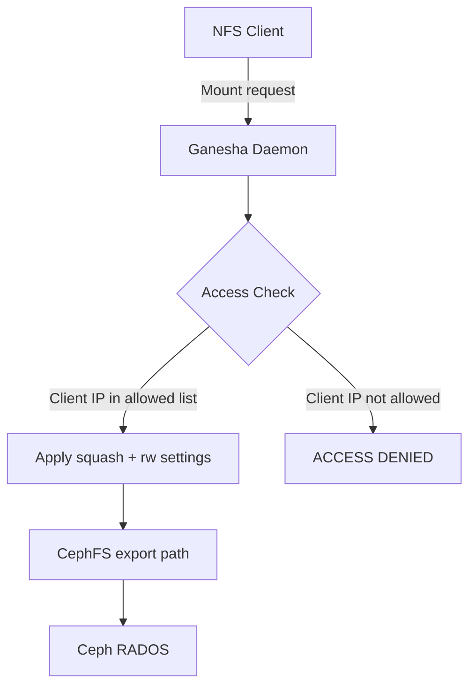

# How to Configure NFS Access Lists and Permissions in Rook

Author: [nawazdhandala](https://www.github.com/nawazdhandala)

Tags: Rook, Ceph, Kubernetes, NFS, Ganesha, Permission, AccessList, Security

Description: Learn how to configure NFS export access control lists, squash settings, and client restrictions in Rook-Ceph using CephNFS export configuration.

---

Rook's NFS Ganesha exports support fine-grained access control through client address restrictions, squash (UID/GID mapping) settings, and read/write permissions per export block.

## Access Control Architecture



## Creating an Export with Restricted Access

Rook manages NFS exports through `CephNFS` and Ceph's NFS export API. To create an export with access restrictions:

```bash
kubectl exec -n rook-ceph deploy/rook-ceph-tools -- \
  ceph nfs export create cephfs my-nfs /export1 myfs \
    --path=/exports/tenant1 \
    --squash=rootsquash
```

## Export Configuration via RADOS Object (GANESHA.CONF)

For advanced access control, create the export config directly:

```bash
kubectl exec -n rook-ceph deploy/rook-ceph-tools -- bash -c "
cat > /tmp/export.conf << 'EOF'
EXPORT {
  Export_Id = 1;
  Transports = TCP;
  Path = /;
  Pseudo = /cephfs;
  Protocols = 4;
  Access_Type = RW;
  Squash = root_squash;
  SecType = sys;

  CLIENT {
    Clients = 10.0.0.0/8;
    Access_Type = RW;
    Squash = no_root_squash;
  }

  CLIENT {
    Clients = 192.168.1.0/24;
    Access_Type = RO;
    Squash = all_squash;
    Anonymous_Uid = 65534;
    Anonymous_Gid = 65534;
  }

  FSAL {
    Name = CEPH;
    Filesystem = myfs;
    User_Id = admin;
    Secret_Access_Key = <admin-secret>;
  }
}
EOF
echo 'Export config written'
"
```

## Access Type Values

| Value | Description |
|---|---|
| `RW` | Read and write access |
| `RO` | Read-only access |
| `MDONLY` | Metadata only, no data |
| `None` | No access |

## Squash Options

| Value | Description |
|---|---|
| `no_root_squash` | Root clients keep root privileges |
| `root_squash` | Map root (uid 0) to anonymous uid |
| `all_squash` | Map all users to anonymous uid/gid |
| `no_squash` | No UID/GID mapping |

## Create Export via ceph nfs CLI

```bash
# Create export with default settings
kubectl exec -n rook-ceph deploy/rook-ceph-tools -- \
  ceph nfs export create cephfs my-nfs /cephfs-export myfs

# List exports
kubectl exec -n rook-ceph deploy/rook-ceph-tools -- \
  ceph nfs export ls my-nfs

# Get export details
kubectl exec -n rook-ceph deploy/rook-ceph-tools -- \
  ceph nfs export info my-nfs /cephfs-export

# Update export (applies new config)
kubectl exec -n rook-ceph deploy/rook-ceph-tools -- \
  ceph nfs export update --json '{
    "cluster_id": "my-nfs",
    "path": "/",
    "pseudo": "/cephfs-export",
    "access_type": "RO",
    "squash": "root_squash",
    "protocols": [4],
    "transports": ["TCP"],
    "fsal": {
      "name": "CEPH",
      "fs_name": "myfs"
    }
  }'

# Delete an export
kubectl exec -n rook-ceph deploy/rook-ceph-tools -- \
  ceph nfs export rm my-nfs /cephfs-export
```

## Per-Client Access Blocks via JSON

```bash
kubectl exec -n rook-ceph deploy/rook-ceph-tools -- \
  ceph nfs export apply my-nfs -i - << 'EOF'
{
  "cluster_id": "my-nfs",
  "path": "/",
  "pseudo": "/data",
  "access_type": "RW",
  "squash": "root_squash",
  "protocols": [4],
  "transports": ["TCP"],
  "fsal": {"name": "CEPH", "fs_name": "myfs"},
  "clients": [
    {
      "addresses": ["10.0.1.0/24"],
      "access_type": "RW",
      "squash": "no_root_squash"
    },
    {
      "addresses": ["10.0.2.0/24"],
      "access_type": "RO",
      "squash": "all_squash"
    }
  ]
}
EOF
```

## Verify and Test Access

```bash
# From a test pod in the allowed subnet
kubectl exec -n default my-pod -- \
  mount -t nfs4 rook-ceph-nfs-my-nfs-a.rook-ceph.svc:/data /mnt/nfs

# Test read/write
kubectl exec -n default my-pod -- \
  touch /mnt/nfs/testfile

# Verify permissions
kubectl exec -n default my-pod -- \
  ls -la /mnt/nfs/
```

## Summary

NFS access control in Rook-Ceph is managed through Ganesha export configurations, accessible via `ceph nfs export` CLI commands. Configure per-export `access_type` (RW/RO), `squash` mode, and `clients` blocks to restrict which IP subnets can mount and whether root privileges are preserved. Apply changes live without restarting the Ganesha daemon.
