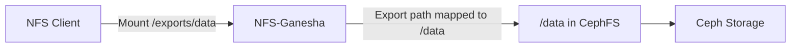

# How to Create an NFS Export in Rook-Ceph

Author: [nawazdhandala](https://www.github.com/nawazdhandala)

Tags: Rook, Ceph, Kubernetes, NFS, Export, Storage

Description: Create and manage NFS exports in Rook-Ceph using the CephNFSExport CRD and ceph CLI, with access control and path configuration examples.

---

## How NFS Exports Work in Rook-Ceph

An NFS export in Rook-Ceph maps a CephFS directory path to an NFS pseudo-path that clients can mount. Each export is defined in the NFS-Ganesha configuration and backed by a CephFS filesystem. Rook supports managing exports via the `CephNFSExport` CRD (Rook 1.13+) or directly through the Ceph CLI.



## Prerequisites

- `CephNFS` resource deployed and NFS-Ganesha pods running
- `CephFilesystem` (myfs) available
- `rook-ceph-tools` pod for CLI access

Check the NFS cluster is ready:

```bash
kubectl -n rook-ceph exec -it deploy/rook-ceph-tools -- ceph nfs cluster ls
```

## Creating an Export via the Ceph CLI

The `ceph nfs export create` command is the most direct way to create an export.

Create an export for the root of CephFS:

```bash
kubectl -n rook-ceph exec -it deploy/rook-ceph-tools -- \
  ceph nfs export create cephfs my-nfs /cephfs-root myfs path=/
```

Create an export for a specific subdirectory:

```bash
kubectl -n rook-ceph exec -it deploy/rook-ceph-tools -- \
  ceph nfs export create cephfs my-nfs /cephfs-data myfs path=/data
```

The parameters are:
- `cephfs` - filesystem type (always `cephfs` for CephFS exports)
- `my-nfs` - the CephNFS cluster name
- `/cephfs-data` - the NFS pseudo path clients will mount
- `myfs` - the CephFilesystem name
- `path=/data` - the path inside the CephFS filesystem

## Creating an Export via the CephNFSExport CRD (Rook 1.13+)

For declarative, GitOps-friendly management, use the `CephNFSExport` CRD:

```yaml
apiVersion: ceph.rook.io/v1
kind: CephNFSExport
metadata:
  name: nfs-export-data
  namespace: rook-ceph
spec:
  server:
    name: my-nfs
  export:
    pseudoPath: /cephfs-data
    accessType: RW
    squash: none
    protocols:
      - 4
    transports:
      - TCP
    fsal:
      name: CEPH
      filesystemName: myfs
      cephFsPath: /data
```

Apply the export:

```bash
kubectl apply -f cephnfsexport.yaml
```

Check the export status:

```bash
kubectl -n rook-ceph get cephnfsexport nfs-export-data
```

## Listing and Inspecting Exports

List all exports in the NFS cluster:

```bash
kubectl -n rook-ceph exec -it deploy/rook-ceph-tools -- \
  ceph nfs export ls my-nfs
```

Get detailed configuration of a specific export:

```bash
kubectl -n rook-ceph exec -it deploy/rook-ceph-tools -- \
  ceph nfs export get my-nfs /cephfs-data
```

The output shows the full Ganesha EXPORT block configuration:

```text
{
  "export_id": 1,
  "path": "/data",
  "cluster_id": "my-nfs",
  "pseudo": "/cephfs-data",
  "access_type": "RW",
  "squash": "none",
  "security_label": true,
  "protocols": [4],
  "transports": ["TCP"],
  "fsal": {
    "name": "CEPH",
    "user_id": "nfs.my-nfs.1",
    "fs_name": "myfs"
  }
}
```

## Configuring Access Control

To restrict access by client IP, modify the export to include a client list. Use the `ceph nfs export apply` command with a JSON definition:

```bash
kubectl -n rook-ceph exec -it deploy/rook-ceph-tools -- bash -c 'cat <<EOF | ceph nfs export apply my-nfs
{
  "export_id": 1,
  "path": "/data",
  "cluster_id": "my-nfs",
  "pseudo": "/cephfs-data",
  "access_type": "RW",
  "squash": "none",
  "protocols": [4],
  "transports": ["TCP"],
  "clients": [
    {
      "addresses": ["10.0.0.0/24"],
      "access_type": "RW",
      "squash": "none"
    }
  ],
  "fsal": {
    "name": "CEPH",
    "fs_name": "myfs"
  }
}
EOF'
```

## Deleting an Export

Remove an export using the CLI:

```bash
kubectl -n rook-ceph exec -it deploy/rook-ceph-tools -- \
  ceph nfs export rm my-nfs /cephfs-data
```

Or delete the CephNFSExport CRD:

```bash
kubectl -n rook-ceph delete cephnfsexport nfs-export-data
```

## Verifying the Export is Active

Check the NFS-Ganesha pod logs to confirm the export is loaded:

```bash
kubectl -n rook-ceph logs -l app=rook-ceph-nfs --tail=50 | grep -i export
```

Test the export from a client pod (see the mount guide for full instructions):

```bash
kubectl run nfs-test --rm -it --image=alpine -- \
  sh -c "apk add nfs-utils && showmount -e <nfs-service-ip>"
```

## Summary

NFS exports in Rook-Ceph map CephFS paths to NFS pseudo-paths served by NFS-Ganesha. Use `ceph nfs export create` for quick CLI-based creation or the `CephNFSExport` CRD for declarative management. Configure access control through the client list in the export definition, and verify exports by listing them with `ceph nfs export ls` and checking Ganesha pod logs.
