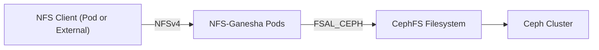

# How to Configure Rook-Ceph NFS Gateway

Author: [nawazdhandala](https://www.github.com/nawazdhandala)

Tags: Rook, Ceph, Kubernetes, NFS, Storage, Gateway

Description: Configure the Rook-Ceph NFS gateway to expose CephFS or RGW buckets as NFS shares accessible from Kubernetes pods and external clients.

---

## How the Rook-Ceph NFS Gateway Works

Rook-Ceph supports NFS exports via the `CephNFS` custom resource, which deploys NFS-Ganesha server pods backed by CephFS. NFS-Ganesha serves files from a CephFS filesystem over NFSv4, allowing both Kubernetes workloads and external clients to access the same data through a standard NFS interface.



## Prerequisites

- A running Rook-Ceph cluster with CephFS deployed
- Rook operator version 1.9 or later
- The `CephFilesystem` resource must exist before creating `CephNFS`
- The `rook-ceph-nfs` RBAC resources applied (included in Rook's common.yaml)

Verify CephFS is available:

```bash
kubectl -n rook-ceph get cephfilesystem
```

## Step 1 - Deploy the CephFilesystem

If you do not have a CephFilesystem yet, create one:

```yaml
apiVersion: ceph.rook.io/v1
kind: CephFilesystem
metadata:
  name: myfs
  namespace: rook-ceph
spec:
  metadataPool:
    replicated:
      size: 3
  dataPools:
    - name: replicated
      replicated:
        size: 3
  preserveFilesystemOnDelete: true
  metadataServer:
    activeCount: 1
    activeStandby: true
```

```bash
kubectl apply -f cephfilesystem.yaml
```

## Step 2 - Create the CephNFS Resource

The `CephNFS` resource deploys NFS-Ganesha pods:

```yaml
apiVersion: ceph.rook.io/v1
kind: CephNFS
metadata:
  name: my-nfs
  namespace: rook-ceph
spec:
  rados:
    pool: myfs-metadata
    namespace: nfs-ns
  server:
    active: 1
    placement:
      nodeAffinity:
        requiredDuringSchedulingIgnoredDuringExecution:
          nodeSelectorTerms:
            - matchExpressions:
                - key: role
                  operator: In
                  values:
                    - storage-node
    annotations:
      my-annotation: my-value
    priorityClassName: system-cluster-critical
```

Apply it:

```bash
kubectl apply -f cephnfs.yaml
```

Verify the NFS server pods are running:

```bash
kubectl -n rook-ceph get pods -l app=rook-ceph-nfs
```

## Step 3 - Create a Service for NFS Access

Expose the NFS-Ganesha pod via a Kubernetes Service so clients can reach it:

```yaml
apiVersion: v1
kind: Service
metadata:
  name: rook-ceph-nfs-my-nfs-a
  namespace: rook-ceph
spec:
  selector:
    app: rook-ceph-nfs
    ceph_nfs: my-nfs
    instance: a
  ports:
    - name: nfs
      port: 2049
      protocol: TCP
  type: ClusterIP
```

Apply it:

```bash
kubectl apply -f nfs-service.yaml
```

Get the ClusterIP:

```bash
kubectl -n rook-ceph get svc rook-ceph-nfs-my-nfs-a
```

## Step 4 - Create an NFS Export

Use the `CephNFSExport` resource (Rook 1.13+) or the Ceph CLI to create exports. Using the CLI:

```bash
kubectl -n rook-ceph exec -it deploy/rook-ceph-tools -- \
  ceph nfs export create cephfs my-nfs /export1 myfs path=/
```

List exports:

```bash
kubectl -n rook-ceph exec -it deploy/rook-ceph-tools -- \
  ceph nfs export ls my-nfs
```

## Step 5 - Configure NFS Export via ConfigMap (Optional)

For declarative management, define the Ganesha export configuration in a ConfigMap:

```yaml
apiVersion: v1
kind: ConfigMap
metadata:
  name: rook-ceph-nfs-my-nfs-config
  namespace: rook-ceph
data:
  export: |
    EXPORT {
      Export_Id = 1;
      Transports = TCP;
      Path = /;
      Pseudo = /cephfs;
      Protocols = 4;
      Access_Type = RW;
      Attr_Expiration_Time = 0;
      FSAL {
        Name = CEPH;
        Filesystem = myfs;
        User_Id = nfs.my-nfs.1;
        Secret_Access_Key = <generated-key>;
      }
    }
```

## Checking NFS Gateway Status

Check the NFS server details:

```bash
kubectl -n rook-ceph exec -it deploy/rook-ceph-tools -- \
  ceph nfs cluster ls
```

```bash
kubectl -n rook-ceph exec -it deploy/rook-ceph-tools -- \
  ceph nfs cluster info my-nfs
```

Check NFS-Ganesha pod logs for errors:

```bash
kubectl -n rook-ceph logs -l app=rook-ceph-nfs --tail=100
```

## Summary

The Rook-Ceph NFS gateway uses NFS-Ganesha pods backed by CephFS to serve NFS shares. Deploy a `CephNFS` resource to start the NFS server, expose it via a Kubernetes Service, and create exports using the `ceph nfs export create` command or the Ceph NFS Ganesha configuration. This allows both in-cluster pods and external clients to access CephFS data over standard NFSv4.
