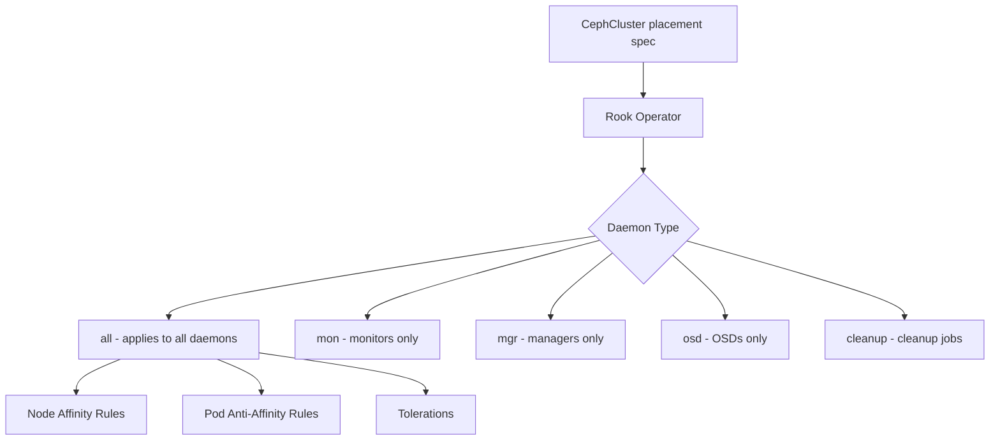

# How to Use Node Affinity and Tolerations in Rook-Ceph

Author: [nawazdhandala](https://www.github.com/nawazdhandala)

Tags: Rook, Ceph, Kubernetes, NodeAffinity, Toleration, Placement

Description: Configure node affinity rules and tolerations in Rook-Ceph to control which nodes run Ceph daemons and enable scheduling on tainted nodes.

---

## How Rook-Ceph Placement Works

Rook-Ceph uses the standard Kubernetes scheduling primitives - node affinity, pod anti-affinity, and tolerations - to control where Ceph daemons run. The `placement` section in the CephCluster CR lets you apply these constraints globally or per daemon type.



## Basic Node Affinity

Restrict all Ceph daemons to nodes labeled with `role=storage-node`:

```yaml
spec:
  placement:
    all:
      nodeAffinity:
        requiredDuringSchedulingIgnoredDuringExecution:
          nodeSelectorTerms:
            - matchExpressions:
                - key: role
                  operator: In
                  values:
                    - storage-node
```

Apply the labels to your storage nodes:

```bash
kubectl label node node1 role=storage-node
kubectl label node node2 role=storage-node
kubectl label node node3 role=storage-node
```

## Per-Daemon Placement

Override placement rules for specific daemon types. This example runs monitors on all nodes but restricts OSDs to nodes labeled as storage:

```yaml
spec:
  placement:
    # Monitors can run on any node with sufficient resources
    mon:
      nodeAffinity:
        preferredDuringSchedulingIgnoredDuringExecution:
          - weight: 100
            preference:
              matchExpressions:
                - key: role
                  operator: In
                  values:
                    - storage-node
      podAntiAffinity:
        requiredDuringSchedulingIgnoredDuringExecution:
          - labelSelector:
              matchExpressions:
                - key: app
                  operator: In
                  values:
                    - rook-ceph-mon
            topologyKey: kubernetes.io/hostname

    # OSDs must run on dedicated storage nodes
    osd:
      nodeAffinity:
        requiredDuringSchedulingIgnoredDuringExecution:
          nodeSelectorTerms:
            - matchExpressions:
                - key: role
                  operator: In
                  values:
                    - storage-node
      podAntiAffinity:
        requiredDuringSchedulingIgnoredDuringExecution:
          - labelSelector:
              matchExpressions:
                - key: app
                  operator: In
                  values:
                    - rook-ceph-osd
            topologyKey: kubernetes.io/hostname
```

## Pod Anti-Affinity for High Availability

Ensure no two monitors share the same node:

```yaml
spec:
  placement:
    mon:
      podAntiAffinity:
        requiredDuringSchedulingIgnoredDuringExecution:
          - labelSelector:
              matchExpressions:
                - key: app
                  operator: In
                  values:
                    - rook-ceph-mon
            topologyKey: kubernetes.io/hostname
```

Ensure no two OSDs with the same device class share the same node (soft constraint):

```yaml
spec:
  placement:
    osd:
      podAntiAffinity:
        preferredDuringSchedulingIgnoredDuringExecution:
          - weight: 100
            podAffinityTerm:
              labelSelector:
                matchExpressions:
                  - key: app
                    operator: In
                    values:
                      - rook-ceph-osd
              topologyKey: kubernetes.io/hostname
```

## Tolerations for Tainted Nodes

If your storage nodes have taints (for example, dedicated nodes with `NoSchedule`), add matching tolerations so Ceph pods can be scheduled on them:

### Example: Storage-Dedicated Nodes

Taint the storage nodes to prevent general workloads:

```bash
kubectl taint node node1 dedicated=storage:NoSchedule
kubectl taint node node2 dedicated=storage:NoSchedule
kubectl taint node node3 dedicated=storage:NoSchedule
```

Add matching tolerations to all Ceph daemons:

```yaml
spec:
  placement:
    all:
      tolerations:
        - key: "dedicated"
          operator: "Equal"
          value: "storage"
          effect: "NoSchedule"
      nodeAffinity:
        requiredDuringSchedulingIgnoredDuringExecution:
          nodeSelectorTerms:
            - matchExpressions:
                - key: dedicated
                  operator: In
                  values:
                    - storage
```

### Example: Control Plane Nodes

To run monitors on control plane nodes (for small clusters):

```yaml
spec:
  placement:
    mon:
      tolerations:
        - key: "node-role.kubernetes.io/control-plane"
          operator: "Exists"
          effect: "NoSchedule"
```

### Example: Nodes with Disk Failures

Prevent scheduling on nodes marked with a disk problem:

```yaml
spec:
  placement:
    osd:
      nodeAffinity:
        requiredDuringSchedulingIgnoredDuringExecution:
          nodeSelectorTerms:
            - matchExpressions:
                - key: disk-health
                  operator: NotIn
                  values:
                    - degraded
                    - failed
```

## Topology-Aware Placement

For clusters spanning availability zones, spread replicas across zones:

```yaml
spec:
  placement:
    all:
      topologySpreadConstraints:
        - maxSkew: 1
          topologyKey: topology.kubernetes.io/zone
          whenUnsatisfiable: DoNotSchedule
          labelSelector:
            matchLabels:
              app: rook-ceph-osd
```

Label nodes with zone information:

```bash
kubectl label node node1 topology.kubernetes.io/zone=zone-a
kubectl label node node2 topology.kubernetes.io/zone=zone-b
kubectl label node node3 topology.kubernetes.io/zone=zone-c
```

## Verifying Placement

After applying placement rules, verify pods are running on the correct nodes:

```bash
# Check which nodes mon pods are on
kubectl -n rook-ceph get pods -l app=rook-ceph-mon -o wide

# Check which nodes OSD pods are on
kubectl -n rook-ceph get pods -l app=rook-ceph-osd -o wide

# Check for any pods in Pending state (may indicate scheduling conflicts)
kubectl -n rook-ceph get pods | grep Pending
```

Describe a pending pod to see why it cannot be scheduled:

```bash
kubectl -n rook-ceph describe pod rook-ceph-osd-0-xxxx | grep -A 10 Events
```

## Summary

Rook-Ceph placement is controlled through the `placement` section in the CephCluster CR, which accepts `nodeAffinity`, `podAntiAffinity`, `tolerations`, and `topologySpreadConstraints`. Use `required` node affinity to restrict daemons to labeled storage nodes, `required` pod anti-affinity to prevent multiple monitors or OSDs from sharing a node, and `tolerations` to allow Ceph pods to run on tainted dedicated nodes. For multi-zone clusters, use `topologySpreadConstraints` to spread daemons across availability zones for fault tolerance.
