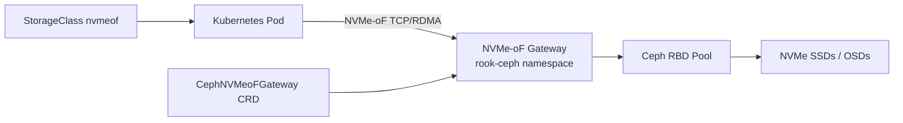

# How to Set Up NVMe-oF Block Storage with Rook

Author: [nawazdhandala](https://www.github.com/nawazdhandala)

Tags: Rook, Ceph, Kubernetes, Storage

Description: Configure Ceph NVMe-oF gateways in Rook to expose block storage with ultra-low latency for high-performance Kubernetes workloads.

---

## Introduction

NVMe-oF (NVMe over Fabrics) allows Ceph block storage to be accessed with lower latency than traditional iSCSI or RBD by using the NVMe protocol over TCP or RDMA transports. Rook supports deploying Ceph NVMe-oF gateways via the `CephNVMeoFGateway` CRD introduced in Ceph Reef (v18). This enables Kubernetes workloads with stringent IOPS and latency requirements to leverage NVMe-oF as an alternative to RBD.

## NVMe-oF Architecture



## Prerequisites

- Rook v1.13 or newer (NVMe-oF support)
- Ceph Reef (v18.2+) or newer
- Linux kernel 5.15+ on worker nodes (for NVMe-oF TCP initiator support)
- `nvme-tcp` kernel module loaded on all worker nodes
- Ceph cluster with NVMe OSDs for best performance

## Step 1: Verify NVMe-oF Kernel Support

```bash
# Check kernel version on all nodes (must be 5.15+)
kubectl get nodes -o custom-columns='NAME:.metadata.name,KERNEL:.status.nodeInfo.kernelVersion'

# Verify nvme-tcp module is available
kubectl get nodes -o name | head -1 | xargs -I{} kubectl debug {} \
  --image=busybox --profile=sysadmin -- \
  modinfo nvme-tcp

# Load the module if not loaded (run on each node or via DaemonSet)
modprobe nvme-tcp
```

## Step 2: Create a DaemonSet to Load nvme-tcp on All Nodes

```yaml
# nvme-tcp-loader.yaml
apiVersion: apps/v1
kind: DaemonSet
metadata:
  name: nvme-tcp-loader
  namespace: kube-system
spec:
  selector:
    matchLabels:
      app: nvme-tcp-loader
  template:
    metadata:
      labels:
        app: nvme-tcp-loader
    spec:
      hostNetwork: true
      hostPID: true
      tolerations:
        - operator: Exists
      initContainers:
        - name: load-module
          image: alpine
          command: ["nsenter", "--mount=/proc/1/ns/mnt", "--", "modprobe", "nvme-tcp"]
          securityContext:
            privileged: true
      containers:
        - name: pause
          image: gcr.io/google_containers/pause:3.1
```

```bash
kubectl apply -f nvme-tcp-loader.yaml
```

## Step 3: Configure a CephBlockPool for NVMe-oF

```yaml
# nvmeof-pool.yaml
apiVersion: ceph.rook.io/v1
kind: CephBlockPool
metadata:
  name: nvmeof-pool
  namespace: rook-ceph
spec:
  replicated:
    size: 3
    requireSafeReplicaSize: true
  # Use NVMe device class for best performance
  deviceClass: nvme
  enableRBDStats: true
```

```bash
kubectl apply -f nvmeof-pool.yaml
```

## Step 4: Deploy the CephNVMeoFGateway

```yaml
# nvmeof-gateway.yaml
apiVersion: ceph.rook.io/v1
kind: CephNVMeoFGateway
metadata:
  name: nvmeof-gw
  namespace: rook-ceph
spec:
  # Number of gateway instances for high availability
  gatewaySpec:
    instances: 2
  # Reference to the Ceph Rados Block Device pool
  pool: nvmeof-pool
  # Network configuration (use host network for lowest latency)
  network:
    hostNetwork: true
  # NVMe-oF service identifier
  serviceAccount: rook-ceph-default
```

```bash
kubectl apply -f nvmeof-gateway.yaml

# Check gateway pods are running
kubectl get pods -n rook-ceph -l app=ceph-nvmeof-gateway

# Check gateway status
kubectl describe cephnvmeofgateway nvmeof-gw -n rook-ceph
```

## Step 5: Create an NVMe-oF Subsystem

The subsystem defines the NVMe namespace that clients will connect to:

```bash
# Access Rook toolbox or the NVMe-oF gateway pod
kubectl -n rook-ceph exec -it deploy/rook-ceph-tools -- bash

# Create an NVMe subsystem
rbd create nvmeof-pool/nvmeof-vol-1 --size 100G

# Configure the gateway with the subsystem
# (This may also be done via the Ceph dashboard or CLI depending on Rook version)
ceph nvme-gw create nvmeof-pool nvmeof-group-1

# List NVMe gateways
ceph nvme-gw list nvmeof-pool
```

## Step 6: Connect from a Kubernetes Node (Manual Test)

```bash
# On a Kubernetes worker node with nvme-tcp loaded:
# Discover the NVMe-oF target
nvme discover -t tcp -a <gateway-ip> -s 4420

# Connect to the NVMe subsystem
nvme connect -t tcp \
  -a <gateway-ip> \
  -s 4420 \
  -n nqn.2016-06.io.spdk:cnode1

# List connected NVMe devices
nvme list

# Verify the device is accessible
nvme id-ns /dev/nvme0n1
```

## Step 7: Create a StorageClass for NVMe-oF Volumes

For Kubernetes dynamic provisioning via NVMe-oF, use the RBD CSI driver pointed at the NVMe-enabled pool:

```yaml
# storageclass-nvmeof.yaml
apiVersion: storage.k8s.io/v1
kind: StorageClass
metadata:
  name: rook-ceph-nvmeof
  annotations:
    description: "High-performance NVMe-oF backed block storage"
provisioner: rook-ceph.rbd.csi.ceph.com
parameters:
  clusterID: <ceph-cluster-fsid>
  # Use the NVMe-dedicated pool
  pool: nvmeof-pool
  imageFormat: "2"
  imageFeatures: layering,fast-diff,object-map,deep-flatten,exclusive-lock
  # Mounter: use nvme for NVMe-oF transport (where supported by CSI)
  mounter: nvme
  csi.storage.k8s.io/provisioner-secret-name: rook-csi-rbd-provisioner
  csi.storage.k8s.io/provisioner-secret-namespace: rook-ceph
  csi.storage.k8s.io/controller-expand-secret-name: rook-csi-rbd-provisioner
  csi.storage.k8s.io/controller-expand-secret-namespace: rook-ceph
  csi.storage.k8s.io/node-stage-secret-name: rook-csi-rbd-node
  csi.storage.k8s.io/node-stage-secret-namespace: rook-ceph
reclaimPolicy: Delete
allowVolumeExpansion: true
volumeBindingMode: WaitForFirstConsumer
```

## Step 8: Benchmark NVMe-oF Performance

```bash
# Run an FIO benchmark against an NVMe-oF PVC
kubectl apply -f - <<EOF
apiVersion: v1
kind: Pod
metadata:
  name: nvmeof-benchmark
spec:
  containers:
    - name: fio
      image: nixery.dev/fio
      command: [
        "fio", "--name=randwrite", "--ioengine=libaio",
        "--rw=randwrite", "--bs=4k", "--numjobs=4",
        "--iodepth=32", "--runtime=60", "--time_based",
        "--filename=/data/testfile", "--size=10g"
      ]
      volumeMounts:
        - name: nvmeof-vol
          mountPath: /data
  volumes:
    - name: nvmeof-vol
      persistentVolumeClaim:
        claimName: nvmeof-test-pvc
EOF
```

## Troubleshooting

```bash
# Gateway pods not starting
kubectl describe pod -n rook-ceph -l app=ceph-nvmeof-gateway | grep -A10 Events

# Check if SPDK service is running
kubectl -n rook-ceph exec -it <gateway-pod> -- \
  ps aux | grep spdk

# Verify gateway is reachable
nc -vz <gateway-ip> 4420

# Check Ceph NVMe-oF service status
kubectl -n rook-ceph exec -it deploy/rook-ceph-tools -- \
  ceph nvme-gw show nvmeof-pool nvmeof-group-1
```

## Summary

NVMe-oF block storage with Rook leverages the CephNVMeoFGateway CRD to deploy Ceph NVMe-oF gateway instances that expose RBD images over NVMe TCP or RDMA transports. This provides lower latency than traditional RBD kernel mapping for workloads with ultra-high IOPS requirements. The setup requires Ceph Reef or newer, Linux kernel 5.15+ with the nvme-tcp module, and a dedicated CephBlockPool targeting NVMe-class OSDs. For most Kubernetes workloads, the standard RBD CSI driver still provides the best compatibility, while NVMe-oF is reserved for latency-critical applications.
