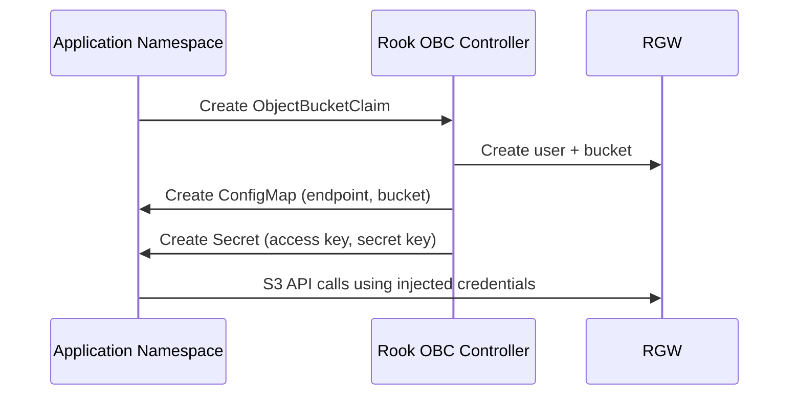

# How to Use the S3 API via OBC-Provisioned Buckets in Rook

Author: [nawazdhandala](https://www.github.com/nawazdhandala)

Tags: Rook, Ceph, Kubernetes, S3, OBC, ObjectBucketClaim, ObjectStorage

Description: Learn how to consume S3 buckets provisioned by ObjectBucketClaim in Rook using AWS CLI, boto3, and application environment variable injection.

---

When a `ObjectBucketClaim` (OBC) is created in Rook, the operator provisions a bucket and injects the endpoint, bucket name, access key, and secret key into a `ConfigMap` and `Secret` in the same namespace. Applications consume these to make S3 API calls.

## OBC Provisioning Flow



## Create the OBC

```yaml
apiVersion: objectbucket.io/v1alpha1
kind: ObjectBucketClaim
metadata:
  name: my-bucket
  namespace: default
spec:
  bucketName: my-application-bucket
  storageClassName: rook-ceph-bucket
  additionalConfig:
    maxSize: "5Gi"
    maxObjects: "100000"
```

```bash
kubectl apply -f obc.yaml
kubectl get objectbucketclaim -n default
```

## Inspect the Generated ConfigMap and Secret

```bash
# ConfigMap contains endpoint and bucket name
kubectl get configmap my-bucket -n default -o yaml

# Secret contains credentials
kubectl get secret my-bucket -n default -o yaml

# Extract values
BUCKET=$(kubectl get configmap my-bucket -n default -o jsonpath='{.data.BUCKET_NAME}')
ENDPOINT=$(kubectl get configmap my-bucket -n default -o jsonpath='{.data.BUCKET_HOST}')
PORT=$(kubectl get configmap my-bucket -n default -o jsonpath='{.data.BUCKET_PORT}')
ACCESS_KEY=$(kubectl get secret my-bucket -n default -o jsonpath='{.data.AWS_ACCESS_KEY_ID}' | base64 -d)
SECRET_KEY=$(kubectl get secret my-bucket -n default -o jsonpath='{.data.AWS_SECRET_ACCESS_KEY}' | base64 -d)

echo "Bucket: $BUCKET"
echo "Endpoint: http://$ENDPOINT:$PORT"
```

## Using AWS CLI

```bash
# Set credentials
export AWS_ACCESS_KEY_ID="$ACCESS_KEY"
export AWS_SECRET_ACCESS_KEY="$SECRET_KEY"
export AWS_DEFAULT_REGION="us-east-1"

S3_ENDPOINT="http://$ENDPOINT:$PORT"

# List buckets
aws s3 ls --endpoint-url "$S3_ENDPOINT"

# Upload a file
aws s3 cp /path/to/file.txt "s3://$BUCKET/file.txt" --endpoint-url "$S3_ENDPOINT"

# List objects
aws s3 ls "s3://$BUCKET/" --endpoint-url "$S3_ENDPOINT"

# Download a file
aws s3 cp "s3://$BUCKET/file.txt" /tmp/downloaded.txt --endpoint-url "$S3_ENDPOINT"

# Delete an object
aws s3 rm "s3://$BUCKET/file.txt" --endpoint-url "$S3_ENDPOINT"
```

## Using boto3 (Python)

```python
import boto3
import os

s3 = boto3.client(
    's3',
    endpoint_url=f"http://{os.environ['BUCKET_HOST']}:{os.environ['BUCKET_PORT']}",
    aws_access_key_id=os.environ['AWS_ACCESS_KEY_ID'],
    aws_secret_access_key=os.environ['AWS_SECRET_ACCESS_KEY'],
    region_name='us-east-1'
)

bucket_name = os.environ['BUCKET_NAME']

# Upload
s3.upload_file('/path/to/file.txt', bucket_name, 'file.txt')

# List objects
response = s3.list_objects_v2(Bucket=bucket_name)
for obj in response.get('Contents', []):
    print(obj['Key'])

# Download
s3.download_file(bucket_name, 'file.txt', '/tmp/downloaded.txt')
```

## Injecting OBC Credentials into a Pod

```yaml
apiVersion: apps/v1
kind: Deployment
metadata:
  name: my-app
  namespace: default
spec:
  replicas: 1
  selector:
    matchLabels:
      app: my-app
  template:
    metadata:
      labels:
        app: my-app
    spec:
      containers:
        - name: app
          image: my-app:latest
          envFrom:
            # Injects BUCKET_NAME, BUCKET_HOST, BUCKET_PORT
            - configMapRef:
                name: my-bucket
            # Injects AWS_ACCESS_KEY_ID, AWS_SECRET_ACCESS_KEY
            - secretRef:
                name: my-bucket
```

## Presigned URLs

Generate presigned URLs for temporary external access:

```python
url = s3.generate_presigned_url(
    'get_object',
    Params={'Bucket': bucket_name, 'Key': 'file.txt'},
    ExpiresIn=3600  # 1 hour
)
print(url)
```

## Summary

OBC-provisioned buckets in Rook inject all required S3 connection details into a `ConfigMap` and `Secret` with the same name as the OBC. Use `envFrom.configMapRef` and `envFrom.secretRef` in pod specs to automatically load credentials. The resulting environment variables work directly with AWS CLI, boto3, and any S3-compatible SDK without additional configuration.
