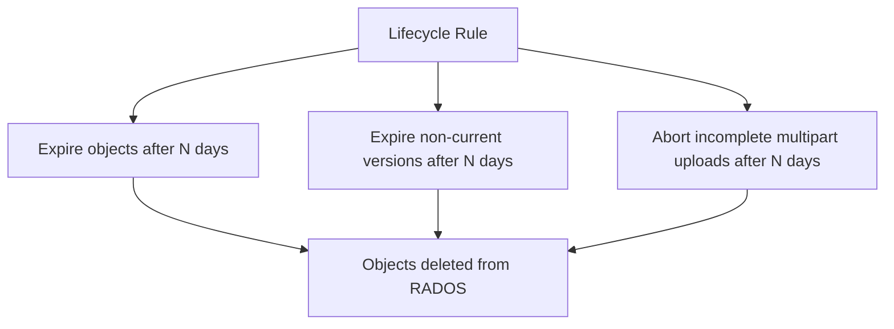

# How to Configure Object Store Lifecycle Policies in Rook-Ceph

Author: [nawazdhandala](https://www.github.com/nawazdhandala)

Tags: Rook, Ceph, Kubernetes, S3, Object Storage, Lifecycle, RGW

Description: Configure S3 lifecycle policies on Rook-Ceph object store buckets to automate object expiration, version cleanup, and incomplete multipart upload removal.

---

## How Lifecycle Policies Work in Rook-Ceph RGW

Ceph RGW implements the S3 Lifecycle API, allowing you to define rules that automatically expire objects, remove old object versions, and clean up incomplete multipart uploads on a schedule. The RGW lifecycle processor runs periodically (configurable via `rgw_lc_max_wp_worker`) to apply these policies.



## Prerequisites

- A running Rook-Ceph object store with a bucket
- AWS CLI configured to point to the RGW endpoint
- Optional: bucket versioning enabled for version-related rules

Set the RGW endpoint:

```bash
export RGW_ENDPOINT=http://$(kubectl -n rook-ceph get svc rook-ceph-rgw-my-store -o jsonpath='{.spec.clusterIP}')
```

## Lifecycle Policy JSON Format

Lifecycle policies are defined as JSON documents with one or more rules. Each rule has a `Filter` (what objects it applies to), a `Status` (Enabled/Disabled), and one or more actions.

## Example 1 - Expire All Objects After 90 Days

Create a lifecycle policy that deletes all objects after 90 days:

```bash
cat > lifecycle-expire.json << 'EOF'
{
  "Rules": [
    {
      "ID": "expire-all-after-90-days",
      "Status": "Enabled",
      "Filter": {
        "Prefix": ""
      },
      "Expiration": {
        "Days": 90
      }
    }
  ]
}
EOF

aws s3api put-bucket-lifecycle-configuration \
  --bucket my-bucket \
  --lifecycle-configuration file://lifecycle-expire.json \
  --endpoint-url $RGW_ENDPOINT \
  --profile rook
```

## Example 2 - Expire Objects by Prefix

Apply expiration only to objects under the `logs/` prefix:

```bash
cat > lifecycle-logs.json << 'EOF'
{
  "Rules": [
    {
      "ID": "expire-logs-after-30-days",
      "Status": "Enabled",
      "Filter": {
        "Prefix": "logs/"
      },
      "Expiration": {
        "Days": 30
      }
    }
  ]
}
EOF

aws s3api put-bucket-lifecycle-configuration \
  --bucket my-bucket \
  --lifecycle-configuration file://lifecycle-logs.json \
  --endpoint-url $RGW_ENDPOINT \
  --profile rook
```

## Example 3 - Clean Up Non-Current Versions

For versioned buckets, expire old (non-current) versions after 7 days:

```bash
cat > lifecycle-versions.json << 'EOF'
{
  "Rules": [
    {
      "ID": "clean-old-versions",
      "Status": "Enabled",
      "Filter": {
        "Prefix": ""
      },
      "NoncurrentVersionExpiration": {
        "NoncurrentDays": 7
      }
    }
  ]
}
EOF

aws s3api put-bucket-lifecycle-configuration \
  --bucket versioned-bucket \
  --lifecycle-configuration file://lifecycle-versions.json \
  --endpoint-url $RGW_ENDPOINT \
  --profile rook
```

## Example 4 - Abort Incomplete Multipart Uploads

Clean up incomplete multipart uploads after 3 days to reclaim storage:

```bash
cat > lifecycle-mpu.json << 'EOF'
{
  "Rules": [
    {
      "ID": "abort-incomplete-mpu",
      "Status": "Enabled",
      "Filter": {
        "Prefix": ""
      },
      "AbortIncompleteMultipartUpload": {
        "DaysAfterInitiation": 3
      }
    }
  ]
}
EOF

aws s3api put-bucket-lifecycle-configuration \
  --bucket my-bucket \
  --lifecycle-configuration file://lifecycle-mpu.json \
  --endpoint-url $RGW_ENDPOINT \
  --profile rook
```

## Example 5 - Combined Lifecycle Policy

Combine multiple rules in a single policy:

```bash
cat > lifecycle-combined.json << 'EOF'
{
  "Rules": [
    {
      "ID": "expire-logs",
      "Status": "Enabled",
      "Filter": {
        "Prefix": "logs/"
      },
      "Expiration": {
        "Days": 30
      }
    },
    {
      "ID": "clean-old-versions",
      "Status": "Enabled",
      "Filter": {
        "Prefix": ""
      },
      "NoncurrentVersionExpiration": {
        "NoncurrentDays": 14
      }
    },
    {
      "ID": "abort-incomplete-mpu",
      "Status": "Enabled",
      "Filter": {
        "Prefix": ""
      },
      "AbortIncompleteMultipartUpload": {
        "DaysAfterInitiation": 3
      }
    }
  ]
}
EOF

aws s3api put-bucket-lifecycle-configuration \
  --bucket my-bucket \
  --lifecycle-configuration file://lifecycle-combined.json \
  --endpoint-url $RGW_ENDPOINT \
  --profile rook
```

## Reading Back the Lifecycle Policy

Retrieve the current lifecycle configuration for a bucket:

```bash
aws s3api get-bucket-lifecycle-configuration \
  --bucket my-bucket \
  --endpoint-url $RGW_ENDPOINT \
  --profile rook
```

## Removing a Lifecycle Policy

Delete the lifecycle configuration entirely:

```bash
aws s3api delete-bucket-lifecycle \
  --bucket my-bucket \
  --endpoint-url $RGW_ENDPOINT \
  --profile rook
```

## Tuning the Lifecycle Processor in Rook-Ceph

The RGW lifecycle processor runs on a configurable schedule. Tune it via the CephCluster config override:

```yaml
apiVersion: ceph.rook.io/v1
kind: CephCluster
metadata:
  name: rook-ceph
  namespace: rook-ceph
spec:
  cephConfig:
    global:
      rgw_lc_max_wp_worker: "3"
      rgw_lc_debug_interval: "10"
```

`rgw_lc_max_wp_worker` controls how many worker threads process lifecycle rules. `rgw_lc_debug_interval` (in seconds) speeds up the cycle for testing purposes.

## Verifying Lifecycle Processing via Ceph CLI

Check the lifecycle processing status for a bucket:

```bash
kubectl -n rook-ceph exec -it deploy/rook-ceph-tools -- \
  radosgw-admin lc list
```

Check lifecycle info for a specific bucket:

```bash
kubectl -n rook-ceph exec -it deploy/rook-ceph-tools -- \
  radosgw-admin lc get --bucket=my-bucket
```

## Summary

Lifecycle policies in Rook-Ceph RGW use the standard S3 API to automate object expiration, version cleanup, and multipart upload abortion. Define rules with prefixes and time-based actions, apply them with `put-bucket-lifecycle-configuration`, and verify with `get-bucket-lifecycle-configuration`. Tune the RGW lifecycle processor frequency through Ceph config overrides in the CephCluster spec to control how quickly rules are applied.
