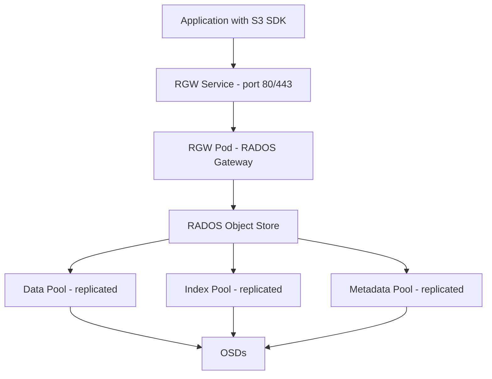

# How to Set Up Rook-Ceph Object Storage (S3-Compatible)

Author: [nawazdhandala](https://www.github.com/nawazdhandala)

Tags: Rook, Ceph, Kubernetes, ObjectStorage, S3, RGW

Description: Complete guide to setting up S3-compatible object storage with Rook-Ceph using the CephObjectStore resource and RADOS Gateway (RGW).

---

## How Ceph Object Storage Works

Ceph's RADOS Gateway (RGW) is an HTTP API server that provides S3-compatible and Swift-compatible object storage interfaces on top of the RADOS object store. When deployed with Rook, RGW runs as a Kubernetes pod and handles all object storage operations. Applications connect to RGW exactly as they would to Amazon S3, using the same API, SDKs, and tools.



## Prerequisites

- CephCluster in `HEALTH_OK` state with at least 3 OSDs
- Rook operator running
- The `rook-ceph` namespace with the CephCluster deployed

Check cluster health before proceeding:

```bash
kubectl -n rook-ceph exec deploy/rook-ceph-tools -- ceph status
```

## Step 1 - Create the CephObjectStore

Define a CephObjectStore CR that creates the RGW gateway with its pools:

```yaml
apiVersion: ceph.rook.io/v1
kind: CephObjectStore
metadata:
  name: my-store
  namespace: rook-ceph
spec:
  # Configure the metadata and data pools used by RGW
  metadataPool:
    failureDomain: host
    replicated:
      size: 3
  dataPool:
    failureDomain: host
    erasureCoded:
      dataChunks: 2
      codingChunks: 1
  # Preserve pools when the object store is deleted
  preservePoolsOnDelete: true
  gateway:
    # Use HTTP (port 80) or HTTPS (port 443 with a TLS secret)
    port: 80
    # Number of RGW instances for load balancing
    instances: 2
    resources:
      requests:
        cpu: 500m
        memory: 512Mi
      limits:
        cpu: "2"
        memory: 2Gi
    placement:
      podAntiAffinity:
        requiredDuringSchedulingIgnoredDuringExecution:
          - labelSelector:
              matchExpressions:
                - key: app
                  operator: In
                  values:
                    - rook-ceph-rgw
            topologyKey: kubernetes.io/hostname
  # Health check settings
  healthCheck:
    bucket:
      disabled: false
      interval: 60s
```

Apply the manifest:

```bash
kubectl apply -f object-store.yaml
```

## Step 2 - Monitor RGW Pod Startup

Watch the RGW pods come up (this may take 2-5 minutes while pools are created):

```bash
kubectl -n rook-ceph get pods -l app=rook-ceph-rgw -w
```

Verify the object store service was created:

```bash
kubectl -n rook-ceph get svc -l app=rook-ceph-rgw
```

You should see a service like:

```text
NAME                       TYPE        CLUSTER-IP      PORT(S)   AGE
rook-ceph-rgw-my-store-a   ClusterIP   10.96.45.200    80/TCP    2m
```

## Step 3 - Verify the Object Store in Ceph

Check that RGW is recognized and its pools were created:

```bash
kubectl -n rook-ceph exec deploy/rook-ceph-tools -- ceph status
kubectl -n rook-ceph exec deploy/rook-ceph-tools -- radosgw-admin user list
kubectl -n rook-ceph exec deploy/rook-ceph-tools -- ceph osd pool ls | grep my-store
```

## Step 4 - Create an Object Store User

Create a CephObjectStoreUser to generate S3 credentials:

```yaml
apiVersion: ceph.rook.io/v1
kind: CephObjectStoreUser
metadata:
  name: my-user
  namespace: rook-ceph
spec:
  store: my-store
  displayName: "My Object Store User"
  capabilities:
    user: "read, write, list"
    bucket: "read, write, list"
    metadata: "read, write, list"
    usage: "read, write, list"
    zone: "read, write, list"
  quotas:
    maxSize: 10Gi
    maxBuckets: 20
```

```bash
kubectl apply -f object-store-user.yaml
```

The operator creates a Kubernetes secret containing the S3 access key and secret key:

```bash
kubectl -n rook-ceph get secret rook-ceph-object-user-my-store-my-user -o yaml
```

Extract the credentials:

```bash
export AWS_ACCESS_KEY_ID=$(kubectl -n rook-ceph get secret rook-ceph-object-user-my-store-my-user \
  -o jsonpath='{.data.AccessKey}' | base64 --decode)

export AWS_SECRET_ACCESS_KEY=$(kubectl -n rook-ceph get secret rook-ceph-object-user-my-store-my-user \
  -o jsonpath='{.data.SecretKey}' | base64 --decode)

echo "Access Key: $AWS_ACCESS_KEY_ID"
echo "Secret Key: $AWS_SECRET_ACCESS_KEY"
```

## Step 5 - Access the Object Store Endpoint

Get the RGW service endpoint for use with S3 clients:

```bash
kubectl -n rook-ceph get svc rook-ceph-rgw-my-store-a \
  -o jsonpath='{.spec.clusterIP}'
```

For cluster-internal access, use the DNS name:

```text
http://rook-ceph-rgw-my-store-a.rook-ceph.svc.cluster.local
```

## Step 6 - Test with the AWS CLI

Install the AWS CLI in a test pod and create a bucket:

```bash
kubectl run s3-test --rm -it --image=amazon/aws-cli --restart=Never -- \
  --endpoint-url http://rook-ceph-rgw-my-store-a.rook-ceph.svc.cluster.local \
  --no-verify-ssl \
  s3 mb s3://my-test-bucket
```

## Summary

Setting up Rook-Ceph object storage involves creating a CephObjectStore CR (which deploys RGW pods and creates the required Ceph pools), then creating a CephObjectStoreUser to generate S3 credentials. The RGW service exposes a ClusterIP endpoint that is S3-compatible, accessible using any standard S3 client or SDK. Use `radosgw-admin` from the toolbox for advanced user and bucket management. For external access, expose the RGW service with a LoadBalancer or Ingress.
