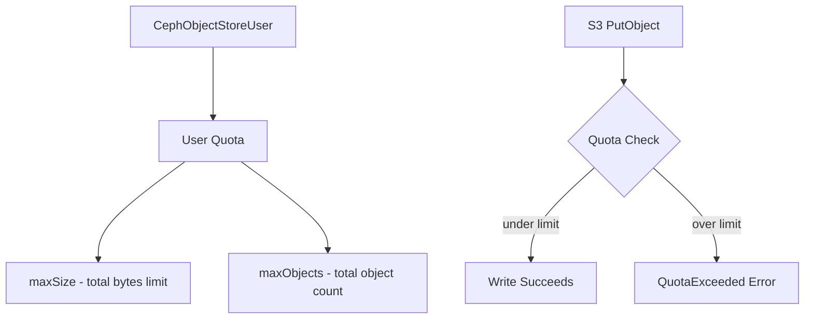

# How to Configure Quota on Object Store User in Rook

Author: [nawazdhandala](https://www.github.com/nawazdhandala)

Tags: Rook, Ceph, Kubernetes, ObjectStorage, Quota, RGW

Description: Set storage and object count quotas on Rook-Ceph object store users using CephObjectStoreUser to prevent runaway storage consumption.

---

Rook-Ceph allows you to set per-user quotas on the object store to limit total storage capacity and the number of objects a user can store. This is essential for multi-tenant deployments where multiple teams or applications share the same object store.

## Quota Architecture



## Create User with Quota

```yaml
apiVersion: ceph.rook.io/v1
kind: CephObjectStoreUser
metadata:
  name: team-a-user
  namespace: rook-ceph
spec:
  store: my-store
  displayName: "Team A Service Account"
  quotas:
    maxSize: "10Gi"          # maximum total storage
    maxObjects: 1000000      # maximum number of objects
  capabilities:
    user: ""
    bucket: ""
    metadata: ""
    usage: ""
    zone: ""
```

Apply:

```bash
kubectl apply -f objectstoreuser.yaml
kubectl get cephobjectstoreuser -n rook-ceph
```

The credentials are stored in a secret:

```bash
kubectl get secret rook-ceph-object-user-my-store-team-a-user \
  -n rook-ceph -o yaml
```

## Create User with Bucket-Level Quota

```yaml
apiVersion: ceph.rook.io/v1
kind: CephObjectStoreUser
metadata:
  name: app-user
  namespace: rook-ceph
spec:
  store: my-store
  displayName: "Application User"
  quotas:
    maxSize: "50Gi"
    maxObjects: 5000000
  # Grant additional capabilities if needed
  capabilities:
    user: "read"
    bucket: "read"
```

## View and Update Quotas via CLI

```bash
# Get RGW admin credentials from the Rook-generated secret
ADMIN_ACCESS=$(kubectl get secret rook-ceph-object-user-my-store-my-user \
  -n rook-ceph -o jsonpath='{.data.AccessKey}' | base64 -d)
ADMIN_SECRET=$(kubectl get secret rook-ceph-object-user-my-store-my-user \
  -n rook-ceph -o jsonpath='{.data.SecretKey}' | base64 -d)

RGW_ENDPOINT=http://$(kubectl get svc -n rook-ceph rook-ceph-rgw-my-store \
  -o jsonpath='{.spec.clusterIP}')

# Check current quota for a user
radosgw-admin quota get --quota-scope=user --uid=team-a-user \
  --rgw-admin-url=${RGW_ENDPOINT}

# Update quota
radosgw-admin quota set --quota-scope=user --uid=team-a-user \
  --max-size=20G --max-objects=2000000
```

Or use the toolbox:

```bash
kubectl exec -n rook-ceph deploy/rook-ceph-tools -- bash

radosgw-admin quota set --quota-scope=user \
  --uid=team-a-user \
  --max-size=20G \
  --max-objects=2000000

# Enable the quota (quotas must be explicitly enabled)
radosgw-admin quota enable --quota-scope=user --uid=team-a-user
```

## Check Quota Usage

```bash
kubectl exec -n rook-ceph deploy/rook-ceph-tools -- bash

# Check usage for a specific user
radosgw-admin user stats --uid=team-a-user

# Check usage summary
radosgw-admin usage show --uid=team-a-user --show-log-entries=false
```

Example output:

```json
{
    "quota": {
        "enabled": true,
        "check_on_raw": false,
        "max_size": 10737418240,
        "max_size_kb": 10485760,
        "max_objects": 1000000
    },
    "size": 5368709120,
    "size_actual": 5368709120,
    "num_objects": 250000
}
```

## Enable Global User Quotas

To set default quotas for all new users:

```bash
kubectl exec -n rook-ceph deploy/rook-ceph-tools -- bash

# Set default user quota
radosgw-admin global quota set --quota-scope=user \
  --max-size=10G \
  --max-objects=1000000

# Enable global quota
radosgw-admin global quota enable --quota-scope=user
```

## Set Bucket-Level Quota

Quotas can also be applied per-bucket instead of per-user:

```bash
kubectl exec -n rook-ceph deploy/rook-ceph-tools -- bash

# Set quota on a specific bucket
radosgw-admin quota set --quota-scope=bucket \
  --bucket=my-bucket \
  --max-size=5G \
  --max-objects=500000

# Enable bucket quota
radosgw-admin quota enable --quota-scope=bucket --bucket=my-bucket
```

## What Happens When Quota is Exceeded

```bash
# Attempt to upload a file exceeding quota
aws s3 cp largefile.bin s3://my-bucket/ \
  --endpoint-url http://${RGW_ENDPOINT}

# Error response:
# An error occurred (QuotaExceeded) when calling the PutObject operation:
# Quota Exceeded
```

## Summary

Object store user quotas in Rook are configured via the `quotas` field in `CephObjectStoreUser`, or managed directly via `radosgw-admin` for existing users. Always explicitly enable quotas after setting them. Use user-level quotas for per-team limits and bucket-level quotas to cap individual bucket growth. Monitor usage with `radosgw-admin user stats` to track consumption before limits are hit.
