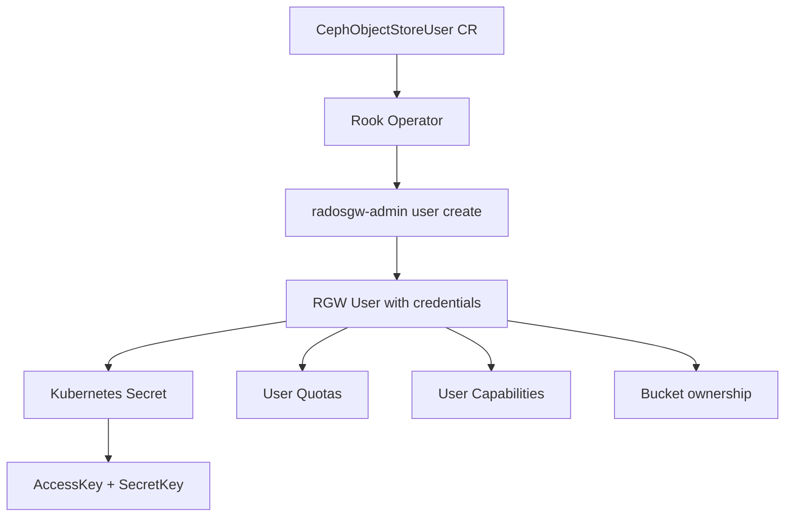

# How to Configure Rook-Ceph Object Store Users and Buckets

Author: [nawazdhandala](https://www.github.com/nawazdhandala)

Tags: Rook, Ceph, Kubernetes, ObjectStorage, RGW, User, Bucket

Description: Learn how to create and manage Rook-Ceph object store users, access keys, and buckets using CephObjectStoreUser resources and radosgw-admin.

---

## Object Store User Management Overview

Rook-Ceph manages RGW users through the CephObjectStoreUser custom resource. Each user gets an S3 access key and secret key, which are stored in a Kubernetes Secret. Users can have quota limits, capability restrictions, and multiple access keys for key rotation.



## Creating a User with CephObjectStoreUser

The recommended way to manage users in Rook is through the CephObjectStoreUser CR:

```yaml
apiVersion: ceph.rook.io/v1
kind: CephObjectStoreUser
metadata:
  name: app-user
  namespace: rook-ceph
spec:
  # Reference the CephObjectStore name
  store: my-store
  displayName: "Application Service User"
  # Optional: set capabilities (default is full access)
  capabilities:
    user: "read, write, list"
    bucket: "read, write, list"
    metadata: "read, write, list"
    usage: "read, write, list"
    zone: "read, write, list"
  # Optional: set storage quotas
  quotas:
    maxBuckets: 10
    maxSize: 20Gi
    maxObjects: 100000
```

```bash
kubectl apply -f object-store-user.yaml

# Check the user was created
kubectl -n rook-ceph get cephobjectstoreuser app-user
```

## Retrieving User Credentials

The operator creates a Secret in the `rook-ceph` namespace with the naming pattern `rook-ceph-object-user-<store>-<user>`:

```bash
# Get the secret name
kubectl -n rook-ceph get secret | grep object-user

# View the credentials
kubectl -n rook-ceph get secret rook-ceph-object-user-my-store-app-user -o yaml

# Extract keys for use
ACCESS_KEY=$(kubectl -n rook-ceph get secret rook-ceph-object-user-my-store-app-user \
  -o jsonpath='{.data.AccessKey}' | base64 --decode)

SECRET_KEY=$(kubectl -n rook-ceph get secret rook-ceph-object-user-my-store-app-user \
  -o jsonpath='{.data.SecretKey}' | base64 --decode)

ENDPOINT=$(kubectl -n rook-ceph get secret rook-ceph-object-user-my-store-app-user \
  -o jsonpath='{.data.Endpoint}' | base64 --decode)

echo "Endpoint: $ENDPOINT"
echo "Access Key: $ACCESS_KEY"
```

## Managing Users with radosgw-admin

For operations not supported by the CephObjectStoreUser CR, use `radosgw-admin` from the toolbox:

```bash
kubectl -n rook-ceph exec -it deploy/rook-ceph-tools -- bash
```

### List All Users

```bash
radosgw-admin user list
```

### Create a User Manually

```bash
radosgw-admin user create \
  --uid=manual-user \
  --display-name="Manual User" \
  --email=manual@example.com \
  --max-buckets=5
```

### Get User Info

```bash
radosgw-admin user info --uid=app-user
```

### Add an Additional Access Key

```bash
radosgw-admin key create --uid=app-user --key-type=s3
```

### Remove a Specific Access Key

```bash
radosgw-admin key rm \
  --uid=app-user \
  --key-type=s3 \
  --access-key=<OLD_ACCESS_KEY>
```

### Set User Quotas

```bash
radosgw-admin quota set \
  --uid=app-user \
  --quota-type=user \
  --max-objects=50000 \
  --max-size=10GiB

radosgw-admin quota enable --uid=app-user --quota-type=user
```

### Suspend a User (Disable Access)

```bash
radosgw-admin user suspend --uid=app-user
```

### Re-enable a User

```bash
radosgw-admin user enable --uid=app-user
```

## Bucket Management with radosgw-admin

### List Buckets for a User

```bash
radosgw-admin bucket list --uid=app-user
```

### Create a Bucket Programmatically

```bash
radosgw-admin bucket create \
  --bucket=my-app-data \
  --uid=app-user
```

### Check Bucket Statistics

```bash
radosgw-admin bucket stats --bucket=my-app-data
```

### Set a Bucket Quota

```bash
radosgw-admin quota set \
  --bucket=my-app-data \
  --quota-type=bucket \
  --max-size=5GiB \
  --max-objects=10000

radosgw-admin quota enable \
  --bucket=my-app-data \
  --quota-type=bucket
```

### Link a Bucket to a Different User

```bash
radosgw-admin bucket link \
  --bucket=my-app-data \
  --uid=new-owner
```

### Remove a Bucket

```bash
# Remove empty bucket
radosgw-admin bucket rm --bucket=my-app-data

# Remove bucket and all objects (use with caution)
radosgw-admin bucket rm --bucket=my-app-data --purge-objects
```

## Creating an Admin User

For management tasks requiring full access to all resources:

```bash
radosgw-admin user create \
  --uid=admin-user \
  --display-name="Admin User" \
  --caps="users=read,write;buckets=read,write;metadata=read,write;usage=read,write;zone=read,write"
```

## Usage Statistics

Check cluster-wide usage:

```bash
radosgw-admin usage show --show-log-entries=false
```

Check per-user usage:

```bash
radosgw-admin usage show --uid=app-user
```

Trim usage logs older than 30 days:

```bash
radosgw-admin usage trim --start-date=2026-01-01
```

## Summary

Rook-Ceph object store user management combines two tools: the CephObjectStoreUser CR for Kubernetes-native user lifecycle management (with credentials auto-stored in Secrets), and `radosgw-admin` for advanced operations like key rotation, bucket linking, and quota management. Always use CephObjectStoreUser for application service accounts so credentials live in Kubernetes Secrets and can be referenced from pods. Use `radosgw-admin` for administrative tasks like generating usage reports, adjusting quotas, and bucket ownership transfers.
