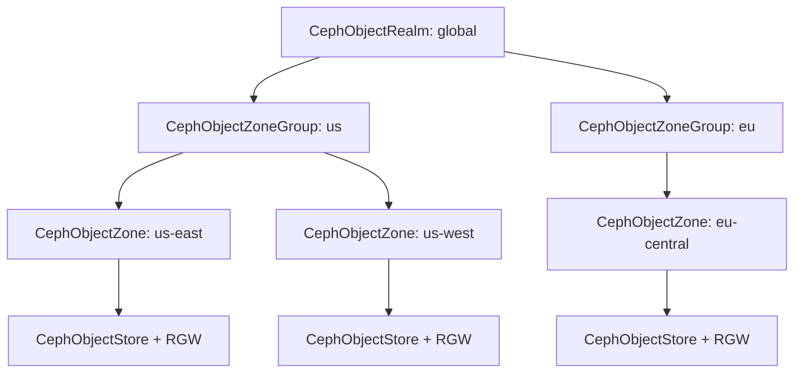

# How to Configure Object Store Zones and Zone Groups in Rook

Author: [nawazdhandala](https://www.github.com/nawazdhandala)

Tags: Rook, Ceph, Kubernetes, ObjectStore, Zone, ZoneGroup, Multisite, RGW

Description: Learn how to configure CephObjectZone and CephObjectZoneGroup CRDs in Rook to build a multi-site object storage topology with data replication.

---

Ceph multi-site object storage uses a hierarchical topology: realm -> zone group -> zone. Each zone maps to a cluster site and hosts RGW instances. Rook manages this topology through dedicated CRDs.

## Topology Hierarchy



## CephObjectZoneGroup CRD

A zone group contains one or more zones and defines the replication domain:

```yaml
apiVersion: ceph.rook.io/v1
kind: CephObjectZoneGroup
metadata:
  name: us
  namespace: rook-ceph
spec:
  realm: global
```

Multiple zone groups in a realm:

```yaml
---
apiVersion: ceph.rook.io/v1
kind: CephObjectZoneGroup
metadata:
  name: us
  namespace: rook-ceph
spec:
  realm: global
---
apiVersion: ceph.rook.io/v1
kind: CephObjectZoneGroup
metadata:
  name: eu
  namespace: rook-ceph
spec:
  realm: global
```

## CephObjectZone CRD

Each zone defines the backing storage pools for metadata and data:

```yaml
apiVersion: ceph.rook.io/v1
kind: CephObjectZone
metadata:
  name: us-east
  namespace: rook-ceph
spec:
  zoneGroup: us
  metadataPool:
    failureDomain: host
    replicated:
      size: 3
  dataPool:
    failureDomain: host
    replicated:
      size: 3
  preservePoolsOnDelete: true
```

Zone with erasure-coded data pool for storage efficiency:

```yaml
apiVersion: ceph.rook.io/v1
kind: CephObjectZone
metadata:
  name: us-west
  namespace: rook-ceph
spec:
  zoneGroup: us
  metadataPool:
    failureDomain: host
    replicated:
      size: 3
  dataPool:
    failureDomain: host
    erasureCoded:
      dataChunks: 4
      codingChunks: 2
  preservePoolsOnDelete: true
```

## Checking Zone and Zone Group Status

```bash
# Check zone group CRDs
kubectl get cephobjectzonegroup -n rook-ceph

# Check zone CRDs
kubectl get cephobjectzone -n rook-ceph

# Verify via radosgw-admin
kubectl exec -n rook-ceph deploy/rook-ceph-tools -- \
  radosgw-admin zonegroup list

kubectl exec -n rook-ceph deploy/rook-ceph-tools -- \
  radosgw-admin zone list

kubectl exec -n rook-ceph deploy/rook-ceph-tools -- \
  radosgw-admin zone get --rgw-zone=us-east
```

## Setting the Master Zone Group and Zone

In a multi-site setup, one zone group is the master. Designate it with radosgw-admin:

```bash
# Set master zone group
kubectl exec -n rook-ceph deploy/rook-ceph-tools -- \
  radosgw-admin zonegroup modify --rgw-zonegroup=us --master

# Set master zone
kubectl exec -n rook-ceph deploy/rook-ceph-tools -- \
  radosgw-admin zone modify --rgw-zone=us-east --master

# Commit the period
kubectl exec -n rook-ceph deploy/rook-ceph-tools -- \
  radosgw-admin period update --commit
```

## Checking Sync Status Between Zones

```bash
# Check data sync status
kubectl exec -n rook-ceph deploy/rook-ceph-tools -- \
  radosgw-admin sync status --rgw-zone=us-west

# Check metadata sync
kubectl exec -n rook-ceph deploy/rook-ceph-tools -- \
  radosgw-admin metadata sync status
```

## Full Multi-Site Apply Order

```bash
# 1. Realm first
kubectl apply -f realm.yaml

# 2. Zone groups (can be parallel within the same realm)
kubectl apply -f zonegroup-us.yaml
kubectl apply -f zonegroup-eu.yaml

# 3. Zones (depend on zone groups)
kubectl apply -f zone-us-east.yaml
kubectl apply -f zone-us-west.yaml
kubectl apply -f zone-eu-central.yaml

# 4. Object stores (depend on zones)
kubectl apply -f objectstore-us-east.yaml
kubectl apply -f objectstore-us-west.yaml
kubectl apply -f objectstore-eu-central.yaml
```

## Summary

`CephObjectZoneGroup` and `CephObjectZone` CRDs define the multi-site topology for Rook object storage. Zone groups group related zones within a realm, while zones define the actual storage pools and attach to `CephObjectStore` instances. Apply them in order (realm, zone group, zone, object store) and use `radosgw-admin` commands to verify sync status between sites.
