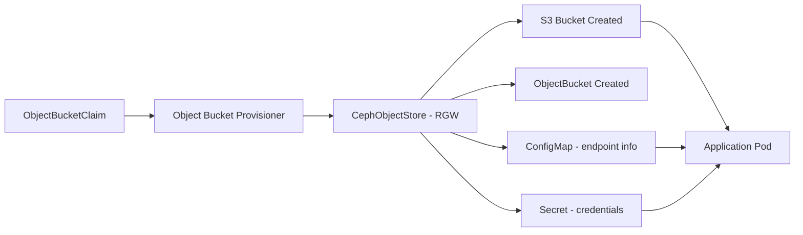

# How to Use ObjectBucketClaim to Provision S3 Buckets in Rook

Author: [nawazdhandala](https://www.github.com/nawazdhandala)

Tags: Rook, Ceph, Kubernetes, S3, ObjectBucketClaim, OBC

Description: Learn how to dynamically provision S3-compatible buckets in Rook-Ceph using ObjectBucketClaim CRD for application-native object storage.

---

`ObjectBucketClaim` (OBC) is a Kubernetes-native way to provision S3 buckets on demand. Similar to how `PersistentVolumeClaim` works for block and file storage, OBCs let applications request object storage through a declarative API without manual bucket creation.

## OBC Architecture



## Prerequisites

- CephObjectStore deployed and running
- `StoreBucketClass` configured (using the Ceph Object Bucket library)
- Object bucket provisioner enabled in Rook operator

## Create a StoreBucketClass (BucketClass)

```yaml
apiVersion: objectbucket.io/v1alpha1
kind: StoreBucketClass
metadata:
  name: rook-ceph-bucket
  namespace: rook-ceph
provisioner: rook-ceph.ceph.rook.io/bucket
reclaimPolicy: Delete
parameters:
  objectStoreNamespace: rook-ceph
  objectStoreName: my-store
  region: us-east-1
```

Apply:

```bash
kubectl apply -f storebucketclass.yaml
kubectl get storebucketclass
```

## Create an ObjectBucketClaim

```yaml
apiVersion: objectbucket.io/v1alpha1
kind: ObjectBucketClaim
metadata:
  name: my-app-bucket
  namespace: default
spec:
  generateBucketName: my-app    # generates a unique name like "my-app-xxxxxx"
  storeBucketClassName: rook-ceph-bucket
```

Or request a specific bucket name:

```yaml
apiVersion: objectbucket.io/v1alpha1
kind: ObjectBucketClaim
metadata:
  name: named-bucket-claim
  namespace: default
spec:
  bucketName: my-specific-bucket   # exact bucket name
  storeBucketClassName: rook-ceph-bucket
```

Apply:

```bash
kubectl apply -f obc.yaml
kubectl get objectbucketclaim -n default
kubectl describe objectbucketclaim my-app-bucket -n default
```

## Check Generated Resources

When an OBC is created, Rook automatically creates:

1. An `ObjectBucket` (cluster-scoped)
2. A `ConfigMap` with endpoint info (same namespace as OBC)
3. A `Secret` with credentials (same namespace as OBC)

```bash
# Check ObjectBucket
kubectl get objectbucket

# Check ConfigMap (same name as OBC)
kubectl get configmap my-app-bucket -n default -o yaml

# Check Secret (same name as OBC)
kubectl get secret my-app-bucket -n default -o yaml
```

The ConfigMap contains:

```
BUCKET_HOST: rook-ceph-rgw-my-store.rook-ceph.svc
BUCKET_PORT: "80"
BUCKET_NAME: my-app-xxxxxx
BUCKET_REGION: us-east-1
BUCKET_SSL: "false"
```

## OBC with Quota

```yaml
apiVersion: objectbucket.io/v1alpha1
kind: ObjectBucketClaim
metadata:
  name: limited-bucket
  namespace: default
spec:
  generateBucketName: limited
  storeBucketClassName: rook-ceph-bucket
  additionalConfig:
    maxSize: "5368709120"    # 5 GiB
    maxObjects: "100000"
```

## Delete an OBC

```bash
kubectl delete objectbucketclaim my-app-bucket -n default
# With reclaimPolicy: Delete, the underlying bucket is also deleted
```

## Verify Bucket in Ceph

```bash
kubectl exec -n rook-ceph deploy/rook-ceph-tools -- bash

# List all buckets
radosgw-admin bucket list

# Get bucket stats
radosgw-admin bucket stats --bucket=my-app-xxxxxx
```

## Summary

`ObjectBucketClaim` provides a Kubernetes-native API for provisioning S3 buckets in Rook-Ceph. Developers request storage with an OBC, and Rook automatically creates the bucket, injects connection info via ConfigMap, and stores credentials in a Secret. This workflow integrates cleanly with GitOps pipelines and eliminates manual bucket management for application teams.
