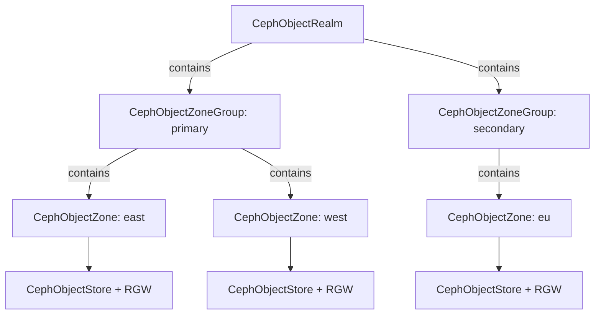

# How to Use CephObjectRealm and CephObjectZoneGroup CRDs in Rook

Author: [nawazdhandala](https://www.github.com/nawazdhandala)

Tags: Rook, Ceph, Kubernetes, ObjectStore, Realm, ZoneGroup, MultiSite, CRD

Description: A complete reference for the CephObjectRealm and CephObjectZoneGroup CRDs in Rook, covering setup, status inspection, and period management for multi-site object storage.

---

`CephObjectRealm` and `CephObjectZoneGroup` are the top two tiers in Rook's multi-site object storage hierarchy. A realm is the globally unique namespace, and zone groups partition zones by geography or policy within that realm.

## Hierarchy Overview



## CephObjectRealm CRD

The realm is the highest-level container. It generates a pull secret that secondary clusters use to join the realm.

```yaml
apiVersion: ceph.rook.io/v1
kind: CephObjectRealm
metadata:
  name: my-realm
  namespace: rook-ceph
spec: {}
```

```bash
kubectl apply -f realm.yaml
kubectl get cephobjectrealm -n rook-ceph
```

Expected output:

```text
NAME        PHASE
my-realm    Ready
```

## Realm Pull Secret

After creating the realm, Rook generates a pull secret for secondary clusters to join:

```bash
# Get the pull secret (used on secondary cluster to join the realm)
kubectl get secret realm-my-realm -n rook-ceph -o jsonpath='{.data.endpoint}' | base64 -d
kubectl get secret realm-my-realm -n rook-ceph -o jsonpath='{.data.token}' | base64 -d
```

## CephObjectZoneGroup CRD

Zone groups define routing and replication boundaries. One zone group per realm is the master.

```yaml
apiVersion: ceph.rook.io/v1
kind: CephObjectZoneGroup
metadata:
  name: us
  namespace: rook-ceph
spec:
  realm: my-realm
```

Multiple zone groups:

```yaml
---
apiVersion: ceph.rook.io/v1
kind: CephObjectZoneGroup
metadata:
  name: us
  namespace: rook-ceph
spec:
  realm: my-realm
---
apiVersion: ceph.rook.io/v1
kind: CephObjectZoneGroup
metadata:
  name: eu
  namespace: rook-ceph
spec:
  realm: my-realm
```

```bash
kubectl apply -f zonegroups.yaml
kubectl get cephobjectzonegroup -n rook-ceph
```

## Inspecting the Realm Period

```bash
# List realms
kubectl exec -n rook-ceph deploy/rook-ceph-tools -- \
  radosgw-admin realm list

# Get realm configuration
kubectl exec -n rook-ceph deploy/rook-ceph-tools -- \
  radosgw-admin realm get --rgw-realm=my-realm

# Check current period
kubectl exec -n rook-ceph deploy/rook-ceph-tools -- \
  radosgw-admin period get

# List zone groups in the realm
kubectl exec -n rook-ceph deploy/rook-ceph-tools -- \
  radosgw-admin zonegroup list
```

## Setting the Master Zone Group

```bash
# Make a zone group the master
kubectl exec -n rook-ceph deploy/rook-ceph-tools -- \
  radosgw-admin zonegroup modify \
    --rgw-realm=my-realm \
    --rgw-zonegroup=us \
    --master

# Update and commit the period
kubectl exec -n rook-ceph deploy/rook-ceph-tools -- \
  radosgw-admin period update --commit --rgw-realm=my-realm
```

## Joining a Secondary Cluster to the Realm

On the secondary cluster, use the realm pull token:

```bash
# Pull the realm from the primary
kubectl exec -n rook-ceph deploy/rook-ceph-tools -- \
  radosgw-admin realm pull \
    --url=http://primary-rgw-endpoint \
    --access-key=<access-key> \
    --secret-key=<secret-key>

# Set as default realm
kubectl exec -n rook-ceph deploy/rook-ceph-tools -- \
  radosgw-admin realm default --rgw-realm=my-realm
```

Or via Rook CRD on the secondary (referencing the pull secret):

```yaml
apiVersion: ceph.rook.io/v1
kind: CephObjectRealm
metadata:
  name: my-realm
  namespace: rook-ceph
spec:
  pull:
    endpoint: http://primary-rgw-endpoint
    secretNames:
      - realm-my-realm
```

## Deleting Realm and Zone Group

Resources must be deleted bottom-up: object stores first, then zones, then zone groups, then realm.

```bash
kubectl delete cephobjectstore -n rook-ceph --all
kubectl delete cephobjectzone -n rook-ceph --all
kubectl delete cephobjectzonegroup -n rook-ceph --all
kubectl delete cephobjectrealm my-realm -n rook-ceph
```

## Summary

`CephObjectRealm` creates the top-level namespace for multi-site object storage and generates a pull token for secondary clusters. `CephObjectZoneGroup` organizes zones within a realm by geography or policy. Together they form the foundation for Rook's multi-site RGW topology -- always apply them in order (realm first, then zone group, then zone, then object store) and commit the period after promoting a master zone group.
