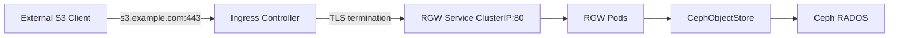

# How to Configure Object Store Ingress in Rook

Author: [nawazdhandala](https://www.github.com/nawazdhandala)

Tags: Rook, Ceph, Kubernetes, ObjectStore, Ingress, RGW, S3

Description: Learn how to expose a Rook CephObjectStore RGW externally using Kubernetes Ingress, with TLS termination and path-based routing configuration.

---

By default, the Rook RGW service is only accessible within the cluster. Use a Kubernetes Ingress to expose the S3/Swift endpoint externally with DNS-based routing and optional TLS termination.

## Ingress Architecture



## RGW Service

The Rook operator creates a ClusterIP service for RGW. Verify it exists:

```bash
kubectl get svc -n rook-ceph | grep rgw
# rook-ceph-rgw-my-store  ClusterIP  10.96.100.5  <none>  80/TCP
```

## Basic Ingress (nginx)

```yaml
apiVersion: networking.k8s.io/v1
kind: Ingress
metadata:
  name: rook-ceph-rgw
  namespace: rook-ceph
  annotations:
    nginx.ingress.kubernetes.io/proxy-body-size: "0"
    nginx.ingress.kubernetes.io/proxy-read-timeout: "600"
    nginx.ingress.kubernetes.io/proxy-send-timeout: "600"
    nginx.ingress.kubernetes.io/proxy-buffering: "off"
spec:
  ingressClassName: nginx
  rules:
    - host: s3.example.com
      http:
        paths:
          - path: /
            pathType: Prefix
            backend:
              service:
                name: rook-ceph-rgw-my-store
                port:
                  number: 80
```

## Ingress with TLS Termination

```yaml
apiVersion: networking.k8s.io/v1
kind: Ingress
metadata:
  name: rook-ceph-rgw
  namespace: rook-ceph
  annotations:
    nginx.ingress.kubernetes.io/proxy-body-size: "0"
    nginx.ingress.kubernetes.io/proxy-read-timeout: "600"
    nginx.ingress.kubernetes.io/proxy-send-timeout: "600"
    nginx.ingress.kubernetes.io/proxy-buffering: "off"
    # Rewrite Host header so RGW matches the bucket name
    nginx.ingress.kubernetes.io/configuration-snippet: |
      proxy_set_header X-Forwarded-Proto $scheme;
      proxy_set_header Host $http_host;
spec:
  ingressClassName: nginx
  tls:
    - hosts:
        - s3.example.com
      secretName: s3-tls-cert
  rules:
    - host: s3.example.com
      http:
        paths:
          - path: /
            pathType: Prefix
            backend:
              service:
                name: rook-ceph-rgw-my-store
                port:
                  number: 80
```

## cert-manager TLS Certificate

```yaml
apiVersion: cert-manager.io/v1
kind: Certificate
metadata:
  name: s3-tls-cert
  namespace: rook-ceph
spec:
  secretName: s3-tls-cert
  issuerRef:
    name: letsencrypt-prod
    kind: ClusterIssuer
  dnsNames:
    - s3.example.com
    - "*.s3.example.com"
```

## Path-Style vs Virtual-Hosted Style

S3 clients use either path-style or virtual-hosted style URLs.

Path-style (easier with Ingress):
```yaml
https://s3.example.com/my-bucket/my-object
```

Virtual-hosted style (requires wildcard DNS):
```yaml
https://my-bucket.s3.example.com/my-object
```

For virtual-hosted style, add a wildcard Ingress rule:

```yaml
spec:
  tls:
    - hosts:
        - "*.s3.example.com"
      secretName: s3-wildcard-tls-cert
  rules:
    - host: "*.s3.example.com"
      http:
        paths:
          - path: /
            pathType: Prefix
            backend:
              service:
                name: rook-ceph-rgw-my-store
                port:
                  number: 80
```

## Configure AWS CLI with Ingress Endpoint

```bash
# Configure endpoint override
aws configure set default.s3.endpoint_url https://s3.example.com

# Or use per-command flag
aws s3 ls --endpoint-url https://s3.example.com

# Test connectivity
aws s3 mb s3://test-bucket --endpoint-url https://s3.example.com
aws s3 ls --endpoint-url https://s3.example.com
```

## Verifying Ingress

```bash
# Check ingress is created
kubectl get ingress -n rook-ceph

# Describe for troubleshooting
kubectl describe ingress rook-ceph-rgw -n rook-ceph

# Test endpoint
curl -v https://s3.example.com/
```

## Important Ingress Annotations

| Annotation | Purpose |
|---|---|
| `proxy-body-size: "0"` | Disable body size limit for large uploads |
| `proxy-read-timeout: "600"` | Increase timeout for large transfers |
| `proxy-buffering: "off"` | Disable buffering for streaming uploads |

## Summary

Expose Rook RGW externally via a Kubernetes Ingress pointing to the `rook-ceph-rgw-<store>` ClusterIP service. Set `proxy-body-size: "0"` and increase timeouts to handle large S3 uploads. Use cert-manager for automated TLS. For virtual-hosted S3 bucket URLs, configure wildcard DNS and a wildcard Ingress rule.
